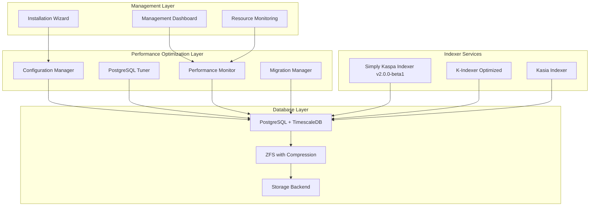

# Database Performance Optimization Design

## Overview

This design document outlines the implementation of PostgreSQL performance optimizations for Kaspa indexing services, incorporating recommendations from the Simply Kaspa Indexer developer. The solution includes memory tuning, storage compression, indexer upgrades, and automated configuration management.

## Architecture

### System Context



## Components and Interfaces

### PostgreSQL Configuration Manager

**Purpose**: Automatically generate optimized PostgreSQL configurations based on system resources.

**Implementation**:
```typescript
interface SystemResources {
  totalMemory: number;
  availableMemory: number;
  cpuCores: number;
  storageType: 'SSD' | 'HDD' | 'NVMe';
  hasZFS: boolean;
}

interface PostgreSQLConfig {
  shared_buffers: string;
  effective_cache_size: string;
  work_mem: string;
  maintenance_work_mem: string;
  max_connections: number;
  checkpoint_completion_target: number;
  wal_buffers: string;
  random_page_cost: number;
  effective_io_concurrency: number;
}

class PostgreSQLTuner {
  generateConfig(resources: SystemResources, profile: 'low-memory' | 'standard' | 'high-performance'): PostgreSQLConfig {
    const memoryMB = Math.floor(resources.totalMemory / 1024 / 1024);
    
    switch (profile) {
      case 'low-memory':
        return this.generateLowMemoryConfig(memoryMB, resources);
      case 'standard':
        return this.generateStandardConfig(memoryMB, resources);
      case 'high-performance':
        return this.generateHighPerformanceConfig(memoryMB, resources);
    }
  }
  
  private generateHighPerformanceConfig(memoryMB: number, resources: SystemResources): PostgreSQLConfig {
    return {
      // 25% of total memory for shared_buffers
      shared_buffers: `${Math.floor(memoryMB * 0.25)}MB`,
      
      // 75% of total memory for effective_cache_size
      effective_cache_size: `${Math.floor(memoryMB * 0.75)}MB`,
      
      // Work memory based on connections and available memory
      work_mem: `${Math.floor(memoryMB * 0.05)}MB`,
      
      // Maintenance work memory for index operations
      maintenance_work_mem: `${Math.floor(memoryMB * 0.1)}MB`,
      
      // Connection limit based on CPU cores and memory
      max_connections: Math.min(200, resources.cpuCores * 25),
      
      // Checkpoint settings for write-heavy workloads
      checkpoint_completion_target: 0.9,
      
      // WAL buffers for write performance
      wal_buffers: `${Math.min(64, Math.floor(memoryMB * 0.03))}MB`,
      
      // Storage type optimizations
      random_page_cost: resources.storageType === 'NVMe' ? 1.0 : 
                       resources.storageType === 'SSD' ? 1.1 : 4.0,
      
      // I/O concurrency based on storage type
      effective_io_concurrency: resources.storageType === 'NVMe' ? 200 :
                                resources.storageType === 'SSD' ? 100 : 1
    };
  }
}
```

### ZFS Configuration Manager

**Purpose**: Configure ZFS with optimal settings for PostgreSQL workloads.

**Implementation**:
```bash
#!/bin/bash
# ZFS Configuration for PostgreSQL Optimization

setup_zfs_for_postgres() {
    local pool_name="$1"
    local dataset_name="$2"
    
    # Create ZFS dataset with PostgreSQL-optimized settings
    zfs create -o compression=zstd-5 \
               -o recordsize=16k \
               -o atime=off \
               -o logbias=throughput \
               -o primarycache=all \
               -o secondarycache=all \
               "$pool_name/$dataset_name"
    
    # Create separate dataset for WAL with different compression
    zfs create -o compression=lz4 \
               -o recordsize=128k \
               -o atime=off \
               -o logbias=latency \
               -o sync=always \
               "$pool_name/${dataset_name}_wal"
    
    echo "ZFS datasets created with PostgreSQL optimizations"
    echo "Data: $pool_name/$dataset_name (ZSTD-5 compression, 16k recordsize)"
    echo "WAL: $pool_name/${dataset_name}_wal (LZ4 compression, 128k recordsize)"
}

check_zfs_performance() {
    local dataset="$1"
    
    # Check compression ratio
    local compression_ratio=$(zfs get compressratio -H -o value "$dataset")
    
    # Check I/O statistics
    zpool iostat -v 1 1
    
    echo "Compression ratio for $dataset: $compression_ratio"
}
```

### Simply Kaspa Indexer Upgrade Manager

**Purpose**: Manage upgrade to v2.0.0-beta1 and configuration optimization.

**Implementation**:
```typescript
interface IndexerConfig {
  version: string;
  disabledTables: string[];
  excludedFields: string[];
  useScriptIndexing: boolean;
  pruningEnabled: boolean;
  pruningRetention: string;
}

class IndexerUpgradeManager {
  async upgradeSimplyKaspaIndexer(currentVersion: string, targetVersion: string): Promise<void> {
    // Backup current configuration
    await this.backupConfiguration();
    
    // Check for breaking changes
    const breakingChanges = await this.checkBreakingChanges(currentVersion, targetVersion);
    
    if (breakingChanges.length > 0) {
      console.log('Breaking changes detected:', breakingChanges);
      await this.handleBreakingChanges(breakingChanges);
    }
    
    // Update Docker image
    await this.updateDockerImage(targetVersion);
    
    // Apply performance optimizations
    await this.applyPerformanceOptimizations();
    
    // Validate upgrade
    await this.validateUpgrade();
  }
  
  private async applyPerformanceOptimizations(): Promise<void> {
    const config: IndexerConfig = {
      version: 'v2.0.0-beta1',
      
      // Disable optional tables for better performance
      disabledTables: [
        'block_transactions',  // If not needed for specific use case
        'transaction_inputs',  // If not tracking input details
      ],
      
      // Exclude optional fields to reduce overhead
      excludedFields: [
        'tx_out_script_public_key_address',  // Use script indexing instead
        'block_hash',  // If not needed for queries
      ],
      
      // Use script-based indexing for 25% space savings
      useScriptIndexing: true,
      
      // Enable pruning for historical data management
      pruningEnabled: true,
      pruningRetention: '30d',  // Keep 30 days of detailed data
    };
    
    await this.writeIndexerConfig(config);
  }
}
```

### Hardware Profile Detection

**Purpose**: Automatically detect system capabilities and recommend optimal configuration.

**Implementation**:
```typescript
interface HardwareProfile {
  name: string;
  description: string;
  minMemory: number;
  minCores: number;
  storageType: string[];
  postgresConfig: PostgreSQLConfig;
  indexerConfig: IndexerConfig;
}

class HardwareProfileManager {
  private profiles: HardwareProfile[] = [
    {
      name: 'low-memory',
      description: 'Optimized for systems with 4GB or less RAM',
      minMemory: 1024 * 1024 * 1024, // 1GB
      minCores: 1,
      storageType: ['HDD', 'SSD', 'NVMe'],
      postgresConfig: {
        shared_buffers: '256MB',
        effective_cache_size: '1GB',
        work_mem: '4MB',
        maintenance_work_mem: '64MB',
        max_connections: 50,
        checkpoint_completion_target: 0.7,
        wal_buffers: '16MB',
        random_page_cost: 4.0,
        effective_io_concurrency: 1
      },
      indexerConfig: {
        version: 'v2.0.0-beta1',
        disabledTables: ['block_transactions', 'transaction_inputs', 'address_transactions'],
        excludedFields: ['tx_out_script_public_key_address', 'block_hash', 'transaction_hash'],
        useScriptIndexing: true,
        pruningEnabled: true,
        pruningRetention: '7d'
      }
    },
    {
      name: 'high-performance',
      description: 'Optimized for systems with 16GB+ RAM and NVMe storage',
      minMemory: 16 * 1024 * 1024 * 1024, // 16GB
      minCores: 8,
      storageType: ['NVMe', 'SSD'],
      postgresConfig: {
        shared_buffers: '4GB',
        effective_cache_size: '12GB',
        work_mem: '256MB',
        maintenance_work_mem: '2GB',
        max_connections: 200,
        checkpoint_completion_target: 0.9,
        wal_buffers: '64MB',
        random_page_cost: 1.0,
        effective_io_concurrency: 200
      },
      indexerConfig: {
        version: 'v2.0.0-beta1',
        disabledTables: [], // Keep all tables for full functionality
        excludedFields: ['tx_out_script_public_key_address'], // Use script indexing
        useScriptIndexing: true,
        pruningEnabled: false, // Keep full history
        pruningRetention: '0'
      }
    }
  ];
  
  detectOptimalProfile(resources: SystemResources): HardwareProfile {
    // Sort profiles by memory requirement (descending)
    const sortedProfiles = this.profiles.sort((a, b) => b.minMemory - a.minMemory);
    
    // Find the highest profile that fits the system
    for (const profile of sortedProfiles) {
      if (resources.totalMemory >= profile.minMemory && 
          resources.cpuCores >= profile.minCores &&
          profile.storageType.includes(resources.storageType)) {
        return profile;
      }
    }
    
    // Fallback to lowest profile
    return sortedProfiles[sortedProfiles.length - 1];
  }
}
```

## Data Models

### Configuration Templates

```typescript
interface DatabaseOptimizationConfig {
  profile: HardwareProfile;
  postgresConfig: PostgreSQLConfig;
  zfsConfig?: ZFSConfig;
  indexerConfigs: {
    simplyKaspa: IndexerConfig;
    kIndexer: IndexerConfig;
    kasia: IndexerConfig;
  };
  monitoringConfig: MonitoringConfig;
}

interface ZFSConfig {
  enabled: boolean;
  datasetName: string;
  compression: 'lz4' | 'zstd-1' | 'zstd-3' | 'zstd-5';
  recordsize: string;
  walCompression: 'lz4' | 'zstd-1';
  walRecordsize: string;
}

interface MonitoringConfig {
  enablePgStatStatements: boolean;
  enableSlowQueryLog: boolean;
  slowQueryThreshold: number;
  enableConnectionLogging: boolean;
  enableCheckpointLogging: boolean;
}
```

## Implementation Strategy

### Phase 1: Configuration Management
1. **Hardware Detection**: Implement system resource detection
2. **Profile Selection**: Create hardware profile matching logic
3. **Config Generation**: Build PostgreSQL configuration generator
4. **Validation**: Add configuration validation and testing

### Phase 2: Storage Optimization
1. **ZFS Detection**: Check for ZFS availability
2. **ZFS Configuration**: Implement ZFS setup automation
3. **Fallback Options**: Provide ext4/xfs optimizations when ZFS unavailable
4. **Performance Testing**: Validate compression and I/O improvements

### Phase 3: Indexer Upgrades
1. **Version Management**: Implement indexer version detection and upgrade
2. **Migration Scripts**: Create database migration procedures
3. **Performance Tuning**: Apply indexer-specific optimizations
4. **Rollback Capability**: Ensure safe upgrade/rollback procedures

### Phase 4: Integration
1. **Wizard Integration**: Add optimization options to installation wizard
2. **Dashboard Integration**: Add performance monitoring to management dashboard
3. **Automated Monitoring**: Implement performance tracking and alerting
4. **Documentation**: Create comprehensive setup and tuning guides

## Performance Monitoring

### Key Metrics to Track

```typescript
interface DatabasePerformanceMetrics {
  // PostgreSQL metrics
  cacheHitRatio: number;
  connectionsActive: number;
  connectionsMax: number;
  queryDuration: {
    avg: number;
    p95: number;
    p99: number;
  };
  
  // Indexer metrics
  indexingRate: number; // blocks per second
  syncProgress: number; // percentage
  databaseSize: number; // bytes
  compressionRatio?: number; // if ZFS enabled
  
  // System metrics
  diskIOPS: number;
  diskLatency: number;
  memoryUsage: number;
  cpuUsage: number;
}

class PerformanceMonitor {
  async collectMetrics(): Promise<DatabasePerformanceMetrics> {
    const [pgMetrics, indexerMetrics, systemMetrics] = await Promise.all([
      this.collectPostgreSQLMetrics(),
      this.collectIndexerMetrics(),
      this.collectSystemMetrics()
    ]);
    
    return {
      ...pgMetrics,
      ...indexerMetrics,
      ...systemMetrics
    };
  }
  
  private async collectPostgreSQLMetrics() {
    // Query pg_stat_database, pg_stat_statements, etc.
    const cacheHitRatio = await this.queryDatabase(`
      SELECT 
        round(
          (sum(blks_hit) * 100.0) / (sum(blks_hit) + sum(blks_read)), 2
        ) as cache_hit_ratio
      FROM pg_stat_database
    `);
    
    return { cacheHitRatio };
  }
}
```

## Migration and Safety Procedures

### Database Backup Strategy

```bash
#!/bin/bash
# Database backup before optimization

backup_databases() {
    local backup_dir="/var/backups/kaspa-aio/$(date +%Y%m%d_%H%M%S)"
    mkdir -p "$backup_dir"
    
    # Backup K-Social database
    pg_dump -h k-social-db -U k_social_user ksocial | gzip > "$backup_dir/k-social.sql.gz"
    
    # Backup Simply Kaspa database
    pg_dump -h simply-kaspa-db -U simply_kaspa_user simply_kaspa | gzip > "$backup_dir/simply-kaspa.sql.gz"
    
    # Backup PostgreSQL configurations
    docker exec k-social-db cat /var/lib/postgresql/data/postgresql.conf > "$backup_dir/k-social-postgresql.conf"
    docker exec simply-kaspa-db cat /var/lib/postgresql/data/postgresql.conf > "$backup_dir/simply-kaspa-postgresql.conf"
    
    echo "Backups created in: $backup_dir"
    return 0
}

validate_backup() {
    local backup_dir="$1"
    
    # Verify backup files exist and are not empty
    for file in "$backup_dir"/*.sql.gz; do
        if [[ ! -s "$file" ]]; then
            echo "Error: Backup file $file is empty or missing"
            return 1
        fi
    done
    
    echo "Backup validation successful"
    return 0
}
```

### Rollback Procedures

```typescript
class MigrationManager {
  async rollbackOptimizations(backupPath: string): Promise<void> {
    console.log('Starting rollback procedure...');
    
    // Stop services
    await this.stopServices();
    
    // Restore PostgreSQL configurations
    await this.restoreConfigurations(backupPath);
    
    // Restore database data if needed
    await this.restoreDatabases(backupPath);
    
    // Restart services with original configuration
    await this.startServices();
    
    // Validate rollback
    await this.validateRollback();
    
    console.log('Rollback completed successfully');
  }
  
  private async validateRollback(): Promise<void> {
    // Check database connectivity
    await this.testDatabaseConnections();
    
    // Verify indexer functionality
    await this.testIndexerServices();
    
    // Check performance metrics
    const metrics = await this.collectPerformanceMetrics();
    
    if (metrics.cacheHitRatio < 0.8) {
      console.warn('Cache hit ratio is low after rollback');
    }
  }
}
```

## Testing Strategy

### Performance Benchmarking

```typescript
interface BenchmarkResults {
  beforeOptimization: DatabasePerformanceMetrics;
  afterOptimization: DatabasePerformanceMetrics;
  improvement: {
    cacheHitRatio: number;
    queryPerformance: number;
    indexingRate: number;
    diskUsage: number;
  };
}

class PerformanceBenchmark {
  async runBenchmark(): Promise<BenchmarkResults> {
    // Collect baseline metrics
    const beforeMetrics = await this.collectMetrics();
    
    // Apply optimizations
    await this.applyOptimizations();
    
    // Wait for stabilization
    await this.waitForStabilization(300000); // 5 minutes
    
    // Collect optimized metrics
    const afterMetrics = await this.collectMetrics();
    
    // Calculate improvements
    const improvement = this.calculateImprovement(beforeMetrics, afterMetrics);
    
    return {
      beforeOptimization: beforeMetrics,
      afterOptimization: afterMetrics,
      improvement
    };
  }
  
  private calculateImprovement(before: DatabasePerformanceMetrics, after: DatabasePerformanceMetrics) {
    return {
      cacheHitRatio: ((after.cacheHitRatio - before.cacheHitRatio) / before.cacheHitRatio) * 100,
      queryPerformance: ((before.queryDuration.avg - after.queryDuration.avg) / before.queryDuration.avg) * 100,
      indexingRate: ((after.indexingRate - before.indexingRate) / before.indexingRate) * 100,
      diskUsage: after.compressionRatio ? (1 - (1 / after.compressionRatio)) * 100 : 0
    };
  }
}
```

## Integration Points

### Installation Wizard Integration

The optimization will be integrated into the installation wizard with these options:

1. **Automatic Detection**: Detect hardware and recommend optimal profile
2. **Manual Selection**: Allow advanced users to choose specific optimizations
3. **ZFS Option**: Offer ZFS setup if supported by the system
4. **Indexer Upgrades**: Automatically upgrade to latest performance versions

### Management Dashboard Integration

The dashboard will display:

1. **Performance Metrics**: Real-time database performance indicators
2. **Optimization Status**: Current configuration and applied optimizations
3. **Compression Ratios**: ZFS compression effectiveness (if enabled)
4. **Tuning Recommendations**: Suggestions for further optimization

This comprehensive design ensures that PostgreSQL databases are optimally configured for Kaspa indexing workloads, with automatic hardware detection, safe migration procedures, and integrated monitoring.