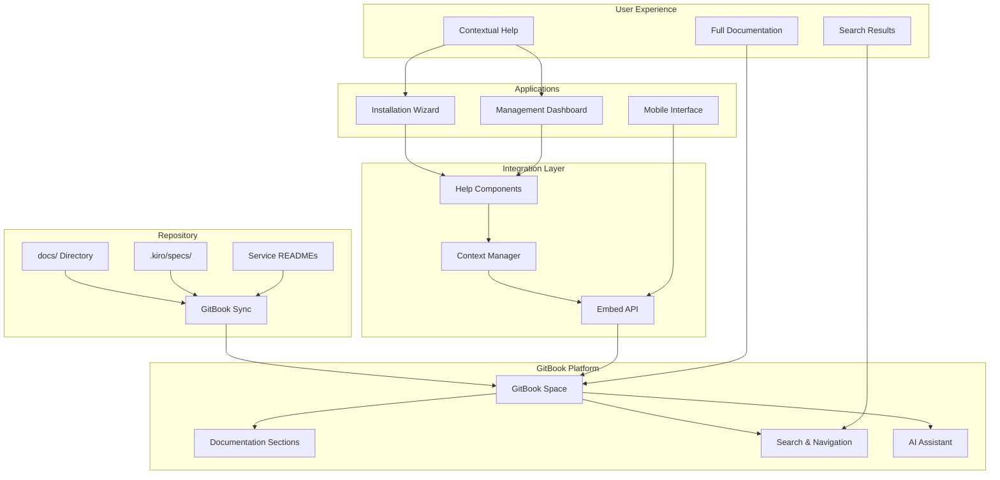

# Design Document

## Overview

The GitBook Documentation Portal will transform the Kaspa All-in-One project's documentation experience by creating a professional, searchable, and contextually integrated documentation system. The solution leverages GitBook's powerful platform for hosting and presentation while providing seamless integration points within both the Installation Wizard and Management Dashboard.

The design follows a hybrid approach: GitBook serves as the authoritative documentation platform with automated synchronization from the repository, while custom integration components provide contextual access within the applications. This ensures users can access comprehensive help without leaving their workflow while maintaining a single source of truth for all documentation.

## Architecture

### High-Level Architecture



### Component Architecture

The system consists of four main architectural layers:

1. **Content Layer**: Repository documentation synchronized with GitBook
2. **Platform Layer**: GitBook hosting with professional features
3. **Integration Layer**: Custom components for embedding and context management
4. **Application Layer**: Wizard and Dashboard with integrated help systems

## Components and Interfaces

### GitBook Space Configuration

**Primary GitBook Space**: `kaspa-all-in-one-docs`

**Section Structure**:
```
├── Getting Started
│   ├── Quick Start Guide
│   ├── System Requirements
│   ├── Installation Overview
│   └── First Steps
├── Installation Wizard
│   ├── Profile Selection Guide
│   ├── Configuration Options
│   ├── Installation Process
│   └── Troubleshooting
├── Management Dashboard
│   ├── Dashboard Overview
│   ├── Service Monitoring
│   ├── Configuration Management
│   └── Maintenance Tasks
├── Architecture & Technical
│   ├── System Architecture
│   ├── Service Dependencies
│   ├── Database Design
│   └── API Documentation
├── Quick References
│   ├── Command Reference
│   ├── Configuration Templates
│   ├── Troubleshooting Checklist
│   └── Best Practices
└── Advanced Topics
    ├── Custom Configurations
    ├── Development Mode
    ├── Integration Guides
    └── Contributing
```

### Synchronization System

**Git Sync Configuration**:
- **Source Repository**: Current Kaspa AIO repository
- **Sync Method**: Bidirectional GitHub Sync
- **Sync Triggers**: Push to main branch, manual sync
- **Content Mapping**: Automated based on file location and naming conventions

**Content Mapping Rules**:
```javascript
const contentMapping = {
  'docs/guides/': 'Getting Started',
  'docs/quick-references/': 'Quick References',
  'docs/architecture/': 'Architecture & Technical',
  'services/wizard/': 'Installation Wizard',
  'services/dashboard/': 'Management Dashboard',
  '.kiro/specs/': 'Advanced Topics/Development'
};
```

### Integration Components

#### 1. Help Button Component

**Location**: Both Wizard and Dashboard headers
**Functionality**: Context-aware help access

```javascript
class HelpButton {
  constructor(context) {
    this.context = context; // Current page/step context
    this.gitbookConfig = {
      spaceId: 'kaspa-all-in-one-docs',
      embedMode: 'modal'
    };
  }
  
  openContextualHelp() {
    const section = this.mapContextToSection(this.context);
    this.openGitBookEmbed(section);
  }
}
```

#### 2. Context Manager

**Purpose**: Maps application states to relevant documentation sections

```javascript
const contextMapping = {
  // Wizard contexts
  'wizard.profile-selection': 'installation-wizard/profile-selection-guide',
  'wizard.configuration': 'installation-wizard/configuration-options',
  'wizard.installation': 'installation-wizard/installation-process',
  'wizard.error': 'installation-wizard/troubleshooting',
  
  // Dashboard contexts
  'dashboard.overview': 'management-dashboard/dashboard-overview',
  'dashboard.services': 'management-dashboard/service-monitoring',
  'dashboard.config': 'management-dashboard/configuration-management',
  'dashboard.maintenance': 'management-dashboard/maintenance-tasks'
};
```

#### 3. GitBook Embed Integration

**Implementation**: Using GitBook's official embed package

```javascript
import { createFrame } from '@gitbook/embed';

class GitBookIntegration {
  constructor() {
    this.frame = createFrame({
      spaceId: 'kaspa-all-in-one-docs',
      tabs: ['docs', 'assistant'],
      greeting: {
        title: 'Kaspa All-in-One Help',
        subtitle: 'How can I help you today?'
      },
      actions: [
        {
          icon: 'circle-question',
          label: 'Contact Support',
          onClick: () => this.openSupportChannel()
        }
      ]
    });
  }
  
  openSection(sectionPath) {
    this.frame.open({ initialPath: sectionPath });
  }
}
```

### Mobile Integration

**Responsive Design**: GitBook's native mobile optimization
**Touch Interface**: Optimized for mobile wizard/dashboard usage
**Offline Capability**: Critical sections cached for offline access

## Data Models

### Documentation Structure Model

```javascript
const DocumentationStructure = {
  sections: [
    {
      id: 'getting-started',
      title: 'Getting Started',
      path: '/getting-started',
      subsections: [
        {
          id: 'quick-start',
          title: 'Quick Start Guide',
          path: '/getting-started/quick-start',
          contextTriggers: ['wizard.welcome', 'dashboard.first-visit']
        }
      ]
    }
  ],
  contextMappings: {
    'wizard.profile-selection': 'installation-wizard/profile-selection-guide',
    'dashboard.services': 'management-dashboard/service-monitoring'
  }
};
```

### Content Synchronization Model

```javascript
const SyncConfiguration = {
  repository: {
    owner: 'kaspa-community',
    repo: 'kaspa-aio',
    branch: 'main'
  },
  mappings: [
    {
      sourcePath: 'docs/guides/',
      targetSection: 'getting-started',
      autoSync: true
    },
    {
      sourcePath: 'docs/quick-references/',
      targetSection: 'quick-references',
      autoSync: true
    }
  ],
  syncTriggers: ['push', 'manual', 'scheduled']
};
```

### User Context Model

```javascript
const UserContext = {
  application: 'wizard' | 'dashboard',
  currentPage: string,
  userRole: 'installer' | 'administrator' | 'developer',
  installationState: object,
  previousHelpSections: array,
  preferences: {
    helpDisplayMode: 'modal' | 'sidebar' | 'new-tab',
    language: 'en',
    theme: 'light' | 'dark'
  }
};
```

Now I need to use the prework tool to analyze the acceptance criteria before writing the Correctness Properties section:

## Correctness Properties

*A property is a characteristic or behavior that should hold true across all valid executions of a system-essentially, a formal statement about what the system should do. Properties serve as the bridge between human-readable specifications and machine-verifiable correctness guarantees.*

### Property 1: Documentation Categorization Consistency
*For any* documentation file added to the repository, the system should categorize it into the appropriate GitBook section based on its file path and content type, ensuring consistent organization across all content.
**Validates: Requirements 1.2**

### Property 2: Synchronization Reliability
*For any* documentation update in the repository, the GitBook should reflect the changes within the expected timeframe, maintaining content consistency between source and destination.
**Validates: Requirements 1.4, 6.1**

### Property 3: Contextual Help Availability
*For any* wizard step or dashboard section, the system should provide accessible help functionality that opens relevant documentation without disrupting the user's workflow.
**Validates: Requirements 2.1, 3.1**

### Property 4: Help Content Relevance
*For any* help request triggered from a specific application context, the system should display documentation content that is directly relevant to the user's current task or location.
**Validates: Requirements 2.2, 2.4, 2.5, 3.2, 3.3, 3.4**

### Property 5: Error-Triggered Help Links
*For any* error condition that occurs in the wizard or dashboard, the system should provide direct links to relevant troubleshooting documentation that addresses the specific error type.
**Validates: Requirements 2.3, 3.5**

### Property 6: Search Result Accuracy
*For any* search query performed in the documentation, the system should return relevant results quickly and rank them appropriately based on content relevance and user context.
**Validates: Requirements 5.1**

### Property 7: Interactive Content Functionality
*For any* procedural documentation, the system should provide interactive elements (checklists, code blocks, downloads) that enhance the user experience and support task completion.
**Validates: Requirements 5.2, 5.3, 5.4, 5.5**

### Property 8: Content Synchronization Integrity
*For any* synchronization operation, the system should maintain proper cross-references and internal links, ensuring that document relationships remain intact after sync.
**Validates: Requirements 6.2, 6.3, 6.5**

### Property 9: Sync Error Handling
*For any* synchronization error that occurs, the system should provide clear error messages and actionable recovery procedures to restore proper sync functionality.
**Validates: Requirements 6.4**

### Property 10: Mobile Responsiveness
*For any* mobile device or screen size, the documentation should display properly with responsive design, ensuring readability and functionality across all devices.
**Validates: Requirements 7.1, 7.4**

### Property 11: Offline Content Availability
*For any* critical troubleshooting guide, the system should ensure availability through browser caching when users are offline, providing essential help when network connectivity is unavailable.
**Validates: Requirements 7.2**

### Property 12: Touch Interface Usability
*For any* touch-enabled device, navigation and search functionality should work intuitively, providing a seamless user experience on mobile interfaces.
**Validates: Requirements 7.3, 7.5**

### Property 13: Analytics Data Collection
*For any* user interaction with the documentation (viewing, searching, providing feedback), the system should accurately track and collect analytics data for content optimization purposes.
**Validates: Requirements 8.1, 8.2, 8.3, 8.4, 8.5**

## Error Handling

### Synchronization Errors

**Git Sync Failures**:
- **Detection**: Monitor sync status via GitBook API
- **Recovery**: Automatic retry with exponential backoff
- **Notification**: Alert maintainers via configured channels
- **Fallback**: Manual sync trigger with detailed error reporting

**Content Validation Errors**:
- **Markdown Parsing**: Validate markdown syntax before sync
- **Link Validation**: Check internal and external links
- **Image Validation**: Verify image paths and accessibility
- **Recovery**: Provide detailed error reports with line numbers and suggestions

### Integration Errors

**Embed Loading Failures**:
- **Detection**: Monitor embed iframe load status
- **Fallback**: Direct link to GitBook with error message
- **Recovery**: Retry mechanism with connection testing
- **User Experience**: Graceful degradation to basic help links

**Context Mapping Errors**:
- **Detection**: Validate context-to-documentation mappings
- **Fallback**: Default to general help section
- **Recovery**: Log unmapped contexts for future configuration
- **Maintenance**: Regular audit of context mappings

### User Experience Errors

**Search Failures**:
- **Detection**: Monitor search API response times and errors
- **Fallback**: Basic text search within cached content
- **Recovery**: Retry with simplified query terms
- **User Feedback**: Clear messaging about search limitations

**Mobile Display Issues**:
- **Detection**: Responsive design testing across devices
- **Fallback**: Desktop version with zoom controls
- **Recovery**: Progressive enhancement approach
- **Monitoring**: User agent analysis for compatibility issues

## Testing Strategy

### Dual Testing Approach

The GitBook Documentation Portal requires both **unit testing** and **property-based testing** to ensure comprehensive coverage:

**Unit Tests** focus on:
- Specific GitBook API integration examples
- Context mapping for known wizard/dashboard states
- Sync configuration validation
- Error handling for specific failure scenarios
- Mobile responsive design at standard breakpoints

**Property-Based Tests** focus on:
- Universal properties across all documentation content
- Synchronization behavior with various file types and structures
- Context-to-help mapping across all possible application states
- Search functionality with diverse query patterns
- Mobile compatibility across device specifications

### Property-Based Testing Configuration

**Testing Framework**: Jest with fast-check for property-based testing
**Minimum Iterations**: 100 per property test
**Test Environment**: Node.js with GitBook API mocking for integration tests

**Property Test Tags**:
- **Feature: gitbook-documentation-portal, Property 1**: Documentation categorization consistency
- **Feature: gitbook-documentation-portal, Property 2**: Synchronization reliability
- **Feature: gitbook-documentation-portal, Property 3**: Contextual help availability
- **Feature: gitbook-documentation-portal, Property 4**: Help content relevance
- **Feature: gitbook-documentation-portal, Property 5**: Error-triggered help links
- **Feature: gitbook-documentation-portal, Property 6**: Search result accuracy
- **Feature: gitbook-documentation-portal, Property 7**: Interactive content functionality
- **Feature: gitbook-documentation-portal, Property 8**: Content synchronization integrity
- **Feature: gitbook-documentation-portal, Property 9**: Sync error handling
- **Feature: gitbook-documentation-portal, Property 10**: Mobile responsiveness
- **Feature: gitbook-documentation-portal, Property 11**: Offline content availability
- **Feature: gitbook-documentation-portal, Property 12**: Touch interface usability
- **Feature: gitbook-documentation-portal, Property 13**: Analytics data collection

### Integration Testing Strategy

**GitBook API Testing**:
- Mock GitBook API responses for consistent testing
- Test sync operations with various content types
- Validate embed functionality across different contexts
- Test error scenarios and recovery mechanisms

**Application Integration Testing**:
- Test help button functionality in wizard and dashboard
- Validate context mapping accuracy
- Test mobile integration across different screen sizes
- Verify offline functionality with service worker testing

**End-to-End Testing**:
- Complete user workflows with documentation access
- Cross-browser compatibility testing
- Performance testing for large documentation sets
- Accessibility testing for screen readers and keyboard navigation

### Performance Testing

**Sync Performance**:
- Test sync times with various documentation sizes
- Monitor API rate limits and throttling
- Test concurrent sync operations
- Validate incremental sync efficiency

**Embed Performance**:
- Test embed loading times across different network conditions
- Monitor memory usage with multiple embeds
- Test search response times
- Validate mobile performance on slower devices

**Content Delivery**:
- Test CDN performance for global access
- Monitor cache effectiveness
- Test offline content availability
- Validate progressive loading for large documents