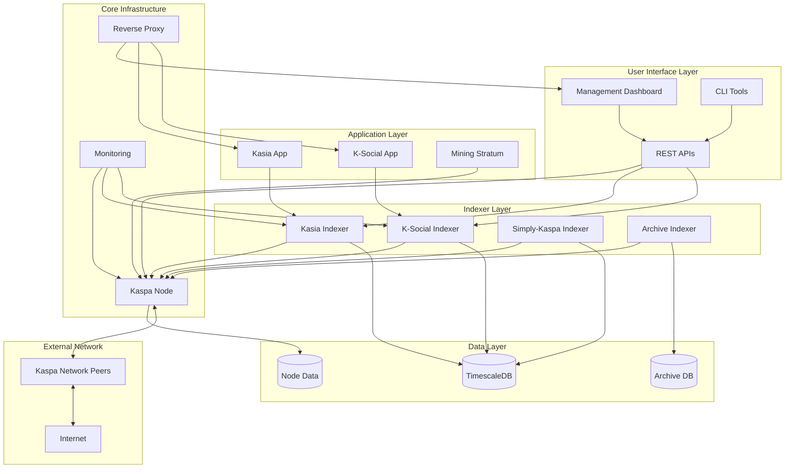

# Kaspa All-in-One Project Design

## Overview

The Kaspa All-in-One project is designed as a modular, profile-based system that provides comprehensive Kaspa blockchain infrastructure through Docker containers. The architecture supports multiple deployment scenarios from development environments to production nodes, with integrated monitoring, testing, and management capabilities.

## Architecture

### System Architecture



### Profile-Based Deployment

The system uses Docker Compose profiles to enable different deployment configurations:

- **Core**: Essential services (Kaspa node, dashboard, nginx)
- **Production**: User-facing applications (Kasia, K-Social, Stratum)
- **Explorer**: Indexing services with TimescaleDB
- **Archive**: Long-term data retention with separate database
- **Development**: Development tools (Portainer, pgAdmin)
- **Mining**: Mining-specific services and optimizations

## Components and Interfaces

### Core Infrastructure Components

#### Kaspa Node
- **Purpose**: Core blockchain node providing P2P and RPC services
- **Image**: `kaspanet/rusty-kaspad:latest`
- **Ports**: 16110 (P2P), 16111 (RPC)
- **Configuration**: UTXO indexing enabled, optimized for local access
- **Health Check**: RPC ping endpoint validation

#### Management Dashboard
- **Purpose**: Web-based monitoring and control interface
- **Technology**: Node.js/Express with real-time WebSocket updates
- **Features**: Service status, logs, configuration management
- **API Endpoints**: `/health`, `/services`, `/logs`, `/config`

#### Reverse Proxy (Nginx)
- **Purpose**: SSL termination, load balancing, security headers
- **Configuration**: Automatic service discovery, rate limiting
- **Security**: HTTPS enforcement, security headers, request filtering

### Indexer Services

#### Kasia Indexer
- **Purpose**: Processes Kaspa transactions for messaging applications
- **Technology**: Rust-based with embedded database
- **Data Storage**: Local file system with optional TimescaleDB integration
- **API**: RESTful endpoints for message retrieval and search

#### K-Social Indexer
- **Purpose**: Indexes social media interactions on Kaspa blockchain
- **Technology**: Node.js with PostgreSQL/TimescaleDB
- **Features**: Social graph analysis, content indexing, user profiles

#### Simply-Kaspa Indexer
- **Purpose**: General-purpose blockchain data indexing
- **Technology**: Configurable indexing modes (full, light, archive)
- **Storage**: TimescaleDB with optimized schemas and compression

### Data Management

#### TimescaleDB Integration
- **Hypertables**: Automatic partitioning by time for blockchain data
- **Compression**: Automated compression policies for historical data
- **Continuous Aggregates**: Pre-computed metrics and analytics
- **Retention Policies**: Automated data lifecycle management

#### Database Schemas
```sql
-- Example hypertable for transactions
CREATE TABLE transactions (
    time TIMESTAMPTZ NOT NULL,
    block_hash TEXT NOT NULL,
    tx_hash TEXT NOT NULL,
    inputs JSONB,
    outputs JSONB,
    fee BIGINT
);

SELECT create_hypertable('transactions', 'time');
```

## Error Handling

### Service Failure Recovery
- **Health Checks**: Comprehensive health monitoring for all services
- **Restart Policies**: Automatic restart with exponential backoff
- **Circuit Breakers**: Prevent cascade failures between services
- **Graceful Degradation**: Continue operation with reduced functionality

### Data Consistency
- **Transaction Integrity**: ACID compliance for critical operations
- **Backup Strategies**: Automated backups with point-in-time recovery
- **Conflict Resolution**: Handling of blockchain reorganizations
- **Sync Recovery**: Automatic resynchronization after network issues

### Network Resilience
- **Connection Pooling**: Efficient database connection management
- **Retry Logic**: Exponential backoff for failed operations
- **Timeout Handling**: Configurable timeouts for all network operations
- **Fallback Mechanisms**: Alternative data sources during outages

## Testing Strategy

### Test Pyramid Structure

#### Unit Tests
- **Scope**: Individual functions and components
- **Framework**: Jest for JavaScript/TypeScript, Cargo test for Rust
- **Coverage**: Minimum 80% code coverage requirement
- **Mocking**: External dependencies mocked for isolation

#### Integration Tests
- **Scope**: Service-to-service interactions
- **Framework**: Testcontainers for Docker-based testing
- **Scenarios**: Database connections, API integrations, message passing
- **Data**: Realistic test data sets and edge cases

#### End-to-End Tests
- **Scope**: Complete user workflows
- **Framework**: Playwright for browser automation
- **Scenarios**: Installation, configuration, monitoring, troubleshooting
- **Environments**: Multiple OS and hardware configurations

#### Performance Tests
- **Scope**: Load testing and benchmarking
- **Framework**: Artillery for load generation
- **Metrics**: Response times, throughput, resource utilization
- **Baselines**: Performance regression detection

### Continuous Integration

#### Pipeline Stages
1. **Code Quality**: Linting, formatting, static analysis
2. **Security Scanning**: Dependency vulnerabilities, container scanning
3. **Unit Testing**: Fast feedback on code changes
4. **Integration Testing**: Service interaction validation
5. **Performance Testing**: Benchmark comparison
6. **E2E Testing**: Full system validation
7. **Release Preparation**: Artifact signing and publishing

#### Quality Gates
- **Code Coverage**: Minimum 80% for new code
- **Security**: Zero critical vulnerabilities
- **Performance**: No regression beyond 5% baseline
- **Documentation**: All public APIs documented

## Security Considerations

### Container Security
- **Base Images**: Minimal, regularly updated base images
- **Vulnerability Scanning**: Automated scanning with Trivy
- **Runtime Security**: Non-root containers, read-only filesystems
- **Network Policies**: Restricted inter-container communication

### Data Protection
- **Encryption**: TLS for all network communication
- **Access Control**: Role-based access with least privilege
- **Audit Logging**: Comprehensive logging of security events
- **Backup Security**: Encrypted backups with secure key management

### Network Security
- **Firewall Rules**: Minimal exposed ports and services
- **Rate Limiting**: Protection against DoS attacks
- **Input Validation**: Sanitization of all user inputs
- **Security Headers**: HTTPS enforcement and security headers

## Deployment Considerations

### Hardware Requirements
- **Minimum**: 4GB RAM, 100GB storage, 2 CPU cores
- **Recommended**: 8GB RAM, 500GB SSD, 4 CPU cores
- **Network**: Stable internet connection with port forwarding capability

### Operating System Support
- **Primary**: Ubuntu 22.04 LTS, Ubuntu 24.04 LTS
- **Secondary**: Debian 12, CentOS Stream 9
- **Container Runtime**: Docker 24.0+, Docker Compose 2.0+

### Scaling Strategies
- **Vertical Scaling**: Resource allocation based on workload
- **Horizontal Scaling**: Multiple indexer instances with load balancing
- **Database Scaling**: Read replicas and connection pooling
- **Caching**: Redis for frequently accessed data

### Monitoring and Observability
- **Metrics**: Prometheus-compatible metrics export
- **Logging**: Structured logging with centralized collection
- **Tracing**: Distributed tracing for complex operations
- **Alerting**: Configurable alerts for critical conditions