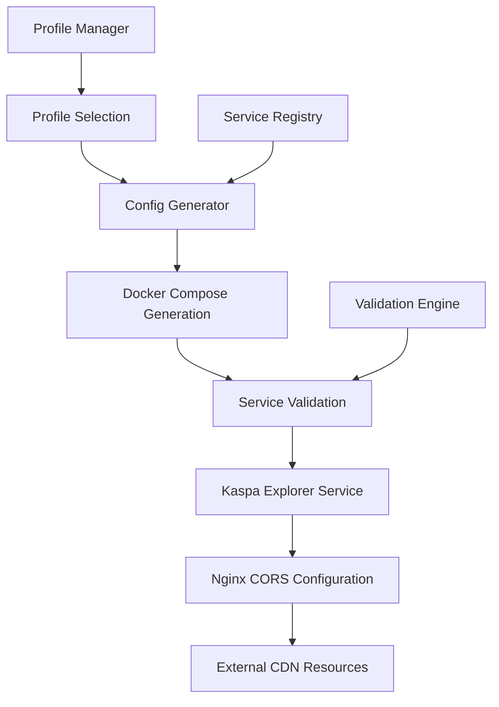

# Kaspa Explorer CORS Fix Design

## Overview

This design addresses the missing Kaspa Explorer service configuration that causes CORS errors when users attempt to access the blockchain explorer. The issue stems from a profile configuration mismatch where the kaspa-explorer service is not being included in the generated docker-compose.yml file despite being defined in the configuration generator.

The solution involves fixing the profile mapping, ensuring proper service inclusion, and implementing robust validation to prevent similar issues in the future.

## Architecture

### Current State Analysis

The system currently has:
- Kaspa Explorer service definition in the config generator
- Profile system that should include the service in kaspa-user-applications
- Missing service in the actual generated docker-compose.yml
- Profile mismatch (prod vs kaspa-user-applications)

### Target Architecture



## Components and Interfaces

### 1. Profile Configuration Manager
**Purpose**: Ensure correct profile mapping and service inclusion
**Interface**: 
- `validateProfileMapping(profiles: string[]): ValidationResult`
- `resolveServiceInclusion(profile: string): Service[]`
- `detectProfileMismatches(): ProfileMismatch[]`

### 2. Docker Compose Generator Enhancement
**Purpose**: Fix service inclusion logic and add validation
**Interface**:
- `generateServiceConfig(service: string, profile: string): ServiceConfig`
- `validateGeneratedConfig(config: DockerComposeConfig): ValidationResult`
- `includeKaspaExplorer(profiles: string[]): boolean`

### 3. CORS Configuration Manager
**Purpose**: Ensure proper CORS headers for external resources
**Interface**:
- `generateCORSHeaders(): CORSConfig`
- `validateExternalResources(urls: string[]): ValidationResult`
- `configureCDNAccess(): NginxConfig`

## Data Models

### ServiceConfig
```typescript
interface ServiceConfig {
  name: string;
  build: BuildConfig;
  container_name: string;
  restart: string;
  ports: string[];
  environment: Record<string, string>;
  networks: string[];
  profiles: string[];
}
```

### ValidationResult
```typescript
interface ValidationResult {
  valid: boolean;
  errors: ValidationError[];
  warnings: ValidationWarning[];
  suggestions: string[];
}
```

### ProfileMismatch
```typescript
interface ProfileMismatch {
  expectedProfile: string;
  actualProfile: string;
  affectedServices: string[];
  severity: 'error' | 'warning';
}
```
## Correctness Properties

*A property is a characteristic or behavior that should hold true across all valid executions of a system-essentially, a formal statement about what the system should do. Properties serve as the bridge between human-readable specifications and machine-verifiable correctness guarantees.*

### Property Reflection

After reviewing all properties identified in the prework, several can be consolidated:
- Properties 1.1, 1.3, and 1.4 all test service inclusion and can be combined into a comprehensive service inclusion property
- Properties 3.1, 3.2, 3.4 all test CORS functionality and can be combined into a comprehensive CORS property
- Properties 2.1, 2.2, 2.4, 2.5 all test validation and error handling and can be combined

### Core Properties

**Property 1: Service Inclusion Consistency**
*For any* profile configuration that includes kaspa-user-applications, the generated docker-compose.yml should contain the kaspa-explorer service with correct configuration
**Validates: Requirements 1.1, 1.3, 1.4**

**Property 2: CORS Resource Loading**
*For any* external resource (CDN scripts, fonts, stylesheets), the Kaspa Explorer should load them without CORS errors when properly configured
**Validates: Requirements 1.2, 1.5, 3.1, 3.2, 3.4**

**Property 3: Validation and Error Reporting**
*For any* configuration with missing or misconfigured services, the system should detect and report the issues with clear diagnostic information
**Validates: Requirements 2.1, 2.2, 2.4, 2.5**

**Property 4: API CORS Compliance**
*For any* API call made by the Kaspa Explorer, the CORS policy should permit the request without blocking
**Validates: Requirements 3.3**

**Property 5: Dependency Validation**
*For any* application initialization, all external dependencies should be validated and accessible before the service reports as healthy
**Validates: Requirements 2.3, 3.5**

## Error Handling

### Configuration Errors
- **Profile Mismatch**: Detect when .env profile doesn't match expected profiles
- **Missing Services**: Identify when expected services are not in generated config
- **Invalid Configuration**: Validate service configuration parameters

### Runtime Errors
- **CORS Failures**: Detect and provide guidance for CORS-related issues
- **Service Startup Failures**: Comprehensive logging and diagnostic information
- **External Dependency Failures**: Graceful handling of CDN/external resource issues

### Recovery Strategies
- **Automatic Profile Correction**: Suggest correct profile based on selected services
- **Configuration Regeneration**: Ability to regenerate docker-compose.yml with fixes
- **Fallback Configurations**: Provide working configurations when external resources fail

## Testing Strategy

### Unit Testing
- Profile mapping logic validation
- Service configuration generation
- CORS header generation
- Error detection and reporting

### Property-Based Testing
Using **fast-check** for JavaScript property-based testing:
- Generate random profile combinations and verify service inclusion
- Test CORS configuration with various external resource URLs
- Validate error handling with malformed configurations
- Test dependency validation with various network conditions

Each property-based test will run a minimum of 100 iterations to ensure comprehensive coverage.

### Integration Testing
- End-to-end profile selection to service deployment
- CORS functionality testing with real browser environments
- External resource loading validation
- Service health check validation

### Manual Testing Scenarios
- Verify Kaspa Explorer loads at localhost:3004 without errors
- Test external CDN resource loading in browser
- Validate error messages for common misconfigurations
- Confirm diagnostic information quality during failures