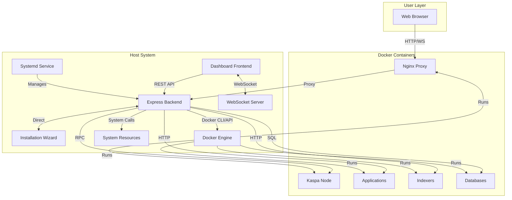

# Management Dashboard Design

## Overview

The Management Dashboard is a **host-based** web application that provides real-time monitoring, operational management, and user access to the Kaspa All-in-One system. Built with Node.js/Express backend and vanilla JavaScript frontend, it runs directly on the host system (not in a container) alongside the Installation Wizard. This architecture enables full system access, independent operation from Docker, and seamless integration with the wizard.

## Related Specifications

- **Kaspa All-in-One Project**: System architecture and service definitions (`.kiro/specs/kaspa-all-in-one-project/`)
- **Web Installation Wizard**: Configuration and setup interface (`.kiro/specs/web-installation-wizard/`)

**Last Cross-Reference Review**: 2024-11-29

## Architecture Decision: Host-Based vs Containerized

The Dashboard uses a **host-based architecture** for these key reasons:

1. **Self-Monitoring Paradox**: A containerized dashboard cannot monitor Docker issues - it goes down when Docker has problems
2. **Full System Access**: Direct access to Docker daemon, host filesystem, and system resources
3. **Wizard Integration**: Both dashboard and wizard run on host, simplifying communication
4. **Independent Operation**: Can report Docker daemon issues and restart Docker if needed
5. **Security**: No need to mount Docker socket into a container (security risk)
6. **Reliability**: Managed by systemd, survives Docker restarts

## Architecture

### System Context



### Component Architecture

The dashboard follows a three-tier architecture running on the host system:

1. **Presentation Layer** (Frontend)
   - Vanilla JavaScript SPA
   - Real-time UI updates via WebSocket
   - Responsive CSS layout
   - Modal dialogs for detailed views
   - Served by Express static middleware

2. **Application Layer** (Backend - Host-Based)
   - Express.js REST API running on host
   - WebSocket server for real-time updates
   - Service health monitoring via Docker CLI/API
   - Docker container management with full privileges
   - System resource monitoring with direct access
   - Managed by systemd for auto-start and recovery

3. **Integration Layer**
   - Docker CLI/API for container management (direct host access)
   - Kaspa Node RPC for blockchain data (via container network)
   - System calls for resource metrics (direct host access)
   - File system for configuration access (full host filesystem)
   - Direct communication with Installation Wizard (both on host)

### Host-Based Advantages

```
┌─────────────────────────────────────────────────────────────┐
│                    Host System                               │
├─────────────────────────────────────────────────────────────┤
│  ┌─────────────────┐    ┌─────────────────┐                │
│  │ Installation    │◄──►│ Management      │                │
│  │ Wizard          │    │ Dashboard       │                │
│  │ (Node.js)       │    │ (Node.js)       │                │
│  │ Port: 3000      │    │ Port: 8080      │                │
│  └────────┬────────┘    └────────┬────────┘                │
│           │                      │                          │
│           │    Direct Access     │                          │
│           ▼                      ▼                          │
│  ┌─────────────────────────────────────────┐               │
│  │  • Docker CLI/API (no socket mounting)  │               │
│  │  • Host filesystem (configs, backups)   │               │
│  │  • System resources (CPU, RAM, disk)    │               │
│  │  • Systemd (service management)         │               │
│  │  • Network interfaces                   │               │
│  └─────────────────────────────────────────┘               │
│                         │                                   │
│                         ▼                                   │
│  ┌─────────────────────────────────────────┐               │
│  │           Docker Engine                  │               │
│  │  ┌──────┐ ┌──────┐ ┌──────┐ ┌──────┐   │               │
│  │  │Kaspa │ │Kasia │ │K-Soc │ │Nginx │   │               │
│  │  │Node  │ │App   │ │ial   │ │Proxy │   │               │
│  │  └──────┘ └──────┘ └──────┘ └──────┘   │               │
│  └─────────────────────────────────────────┘               │
└─────────────────────────────────────────────────────────────┘
```


## Components and Interfaces

### Frontend Components

#### Dashboard Main View
- **Purpose**: Primary interface showing system overview
- **Components**:
  - Header with navigation and connection status
  - Service status grid with health indicators
  - Kaspa node statistics panel
  - System resource monitors
  - Application quick links
  - Alert notifications panel

#### Service Management Panel
- **Purpose**: Detailed service control and monitoring
- **Features**:
  - Service cards with status, actions, and dependencies
  - Start/stop/restart controls
  - Log viewer modal
  - Health check history
  - Profile-based filtering

#### Wallet Management Interface
- **Purpose**: Web-based wallet operations
- **Features**:
  - Wallet balance display
  - Address management with QR codes
  - Send transaction form with validation
  - Transaction history table
  - Wallet creation wizard


#### Update Management Panel
- **Purpose**: Service update notifications and management
- **Features**:
  - Update notification badges
  - Available updates list with version info
  - Changelog viewer
  - Update wizard launcher
  - Update history timeline

#### Application Access Panel
- **Purpose**: Quick access to deployed applications
- **Features**:
  - Application cards with status and links
  - Service health indicators
  - URL display with copy functionality
  - Application descriptions
  - Developer tools section (when enabled)

### Backend Components

#### Express API Server
- **Technology**: Node.js with Express.js
- **Port**: 8080 (internal), exposed via Nginx
- **Endpoints**:
  - `GET /health` - Health check
  - `GET /api/status` - All services status
  - `GET /api/profiles` - Active profiles
  - `POST /api/services/:name/start` - Start service
  - `POST /api/services/:name/stop` - Stop service
  - `POST /api/services/:name/restart` - Restart service
  - `GET /api/services/:name/logs` - Service logs
  - `GET /api/system/resources` - System metrics
  - `GET /api/kaspa/info` - Node information
  - `GET /api/kaspa/stats` - Network statistics
  - `GET /api/kaspa/wallet` - Wallet information
  - `POST /api/kaspa/wallet/create` - Create wallet
  - `POST /api/kaspa/wallet/send` - Send transaction
  - `GET /api/updates/check` - Check for updates
  - `GET /api/updates/available` - List available updates
  - `POST /api/wizard/launch` - Launch reconfiguration wizard
  - `GET /api/config` - Current configuration
  - `POST /api/backup` - Create backup
  - `GET /api/dependencies` - Service dependencies


#### WebSocket Server
- **Purpose**: Real-time bidirectional communication
- **Protocol**: WebSocket (ws:// or wss://)
- **Message Types**:
  - `update` - Periodic status updates (every 5s)
  - `log` - Real-time log streaming
  - `alert` - System alerts and notifications
  - `resource` - Resource metric updates
  - `subscribe_logs` - Client request to stream logs
  - `unsubscribe_logs` - Stop log streaming

**WebSocket Message Format**:
```typescript
interface WebSocketMessage {
  type: 'update' | 'log' | 'alert' | 'resource';
  data: any;
  timestamp: string;
}

interface UpdateMessage {
  type: 'update';
  data: {
    services: ServiceStatus[];
    resources: ResourceMetrics;
    timestamp: string;
  };
}

interface LogMessage {
  type: 'log';
  serviceName: string;
  data: string;
}

interface AlertMessage {
  type: 'alert';
  severity: 'info' | 'warning' | 'critical';
  message: string;
  timestamp: string;
}
```


#### Service Monitor
- **Purpose**: Continuous health checking and status tracking
- **Implementation**:
```typescript
class ServiceMonitor {
  private services: ServiceDefinition[];
  private checkInterval: number = 5000; // 5 seconds
  
  async checkAllServices(): Promise<ServiceStatus[]> {
    const dockerServices = await this.getDockerServices();
    const results = await Promise.allSettled(
      this.services.map(service => this.checkService(service, dockerServices))
    );
    return results.map(r => r.status === 'fulfilled' ? r.value : r.reason);
  }
  
  async checkService(service: ServiceDefinition, dockerInfo: Map): Promise<ServiceStatus> {
    const containerInfo = dockerInfo.get(service.name);
    
    if (!containerInfo) {
      return { ...service, status: 'stopped', state: 'not_running' };
    }
    
    try {
      await this.healthCheck(service);
      return { ...service, status: 'healthy', state: containerInfo.state };
    } catch (error) {
      return { 
        ...service, 
        status: containerInfo.state === 'running' ? 'unhealthy' : 'stopped',
        error: error.message 
      };
    }
  }
  
  async healthCheck(service: ServiceDefinition): Promise<void> {
    if (service.type === 'rpc') {
      await axios.post(service.url, { method: 'ping' }, { timeout: 5000 });
    } else if (service.type === 'http') {
      await axios.get(`${service.url}/health`, { timeout: 5000 });
    }
  }
}
```


#### Kaspa Node Interface
- **Purpose**: Interact with Kaspa node RPC API
- **Implementation**:
```typescript
class KaspaNodeClient {
  private rpcUrl: string;
  
  async getNodeInfo(): Promise<NodeInfo> {
    const response = await axios.post(this.rpcUrl, {
      method: 'getInfo',
      params: {}
    });
    return response.data;
  }
  
  async getBlockDagInfo(): Promise<BlockDagInfo> {
    const response = await axios.post(this.rpcUrl, {
      method: 'getBlockDagInfo',
      params: {}
    });
    return response.data;
  }
  
  async getSyncStatus(): Promise<SyncStatus> {
    const info = await this.getNodeInfo();
    const blockDag = await this.getBlockDagInfo();
    
    return {
      isSynced: info.isSynced,
      currentHeight: blockDag.virtualSelectedParentBlueScore,
      networkHeight: blockDag.tipHashes.length,
      progress: this.calculateSyncProgress(blockDag)
    };
  }
  
  async getWalletBalance(address: string): Promise<WalletBalance> {
    const response = await axios.post(this.rpcUrl, {
      method: 'getBalance',
      params: { address }
    });
    return response.data;
  }
  
  async sendTransaction(params: SendTransactionParams): Promise<TransactionResult> {
    const response = await axios.post(this.rpcUrl, {
      method: 'send',
      params
    });
    return response.data;
  }
}
```


#### Update Monitor
- **Purpose**: Check for service updates and notify users
- **Implementation**:
```typescript
class UpdateMonitor {
  private serviceRepositories: Map<string, string>;
  private checkInterval: number = 86400000; // 24 hours
  
  async checkForUpdates(): Promise<ServiceUpdate[]> {
    const currentVersions = await this.getCurrentVersions();
    const updates: ServiceUpdate[] = [];
    
    for (const [service, repo] of this.serviceRepositories) {
      const latestRelease = await this.getLatestGitHubRelease(repo);
      const currentVersion = currentVersions.get(service);
      
      if (this.isNewer(latestRelease.version, currentVersion)) {
        updates.push({
          service,
          currentVersion,
          availableVersion: latestRelease.version,
          changelog: latestRelease.changelog,
          breaking: this.detectBreakingChanges(latestRelease),
          releaseDate: latestRelease.publishedAt,
          downloadUrl: latestRelease.downloadUrl
        });
      }
    }
    
    return updates;
  }
  
  async getLatestGitHubRelease(repo: string): Promise<GitHubRelease> {
    const response = await axios.get(
      `https://api.github.com/repos/${repo}/releases/latest`
    );
    return {
      version: response.data.tag_name,
      changelog: response.data.body,
      publishedAt: response.data.published_at,
      downloadUrl: response.data.assets[0]?.browser_download_url
    };
  }
  
  scheduleUpdateChecks(): void {
    setInterval(async () => {
      const updates = await this.checkForUpdates();
      if (updates.length > 0) {
        this.notifyDashboard(updates);
      }
    }, this.checkInterval);
  }
}
```


#### System Resource Monitor
- **Purpose**: Track CPU, memory, and disk usage
- **Implementation**:
```typescript
class ResourceMonitor {
  async getSystemResources(): Promise<ResourceMetrics> {
    const [cpu, memory, disk] = await Promise.all([
      this.getCpuUsage(),
      this.getMemoryUsage(),
      this.getDiskUsage()
    ]);
    
    return { cpu, memory, disk, timestamp: new Date().toISOString() };
  }
  
  async getCpuUsage(): Promise<number> {
    const { stdout } = await execAsync(
      "top -bn1 | grep 'Cpu(s)' | awk '{print $2}' | cut -d'%' -f1"
    );
    return parseFloat(stdout.trim()) || 0;
  }
  
  async getMemoryUsage(): Promise<number> {
    const { stdout } = await execAsync(
      "free | grep Mem | awk '{print ($3/$2) * 100.0}'"
    );
    return parseFloat(stdout.trim()) || 0;
  }
  
  async getDiskUsage(): Promise<number> {
    const { stdout } = await execAsync(
      "df -h / | tail -1 | awk '{print $5}' | cut -d'%' -f1"
    );
    return parseFloat(stdout.trim()) || 0;
  }
  
  async getPerServiceResources(): Promise<Map<string, ServiceResources>> {
    const { stdout } = await execAsync(
      "docker stats --no-stream --format '{{.Name}}\t{{.CPUPerc}}\t{{.MemPerc}}'"
    );
    
    const resources = new Map();
    stdout.trim().split('\n').forEach(line => {
      const [name, cpu, mem] = line.split('\t');
      resources.set(name, {
        cpu: parseFloat(cpu.replace('%', '')),
        memory: parseFloat(mem.replace('%', ''))
      });
    });
    
    return resources;
  }
}
```


## Data Models

### Service Status
```typescript
interface ServiceStatus {
  name: string;
  displayName: string;
  url: string;
  type: 'rpc' | 'http' | 'tcp' | 'postgres';
  profile: string;
  status: 'healthy' | 'unhealthy' | 'stopped' | 'starting';
  state: string;
  dockerStatus?: string;
  error?: string;
  lastCheck: string;
  uptime?: number;
  version?: string;
}

interface ServiceDefinition {
  name: string;
  displayName: string;
  url: string;
  type: 'rpc' | 'http' | 'tcp' | 'postgres';
  profile: string;
  healthCheckPath?: string;
  dependencies?: string[];
}
```

### Kaspa Node Information
```typescript
interface NodeInfo {
  serverVersion: string;
  isSynced: boolean;
  peerCount: number;
  networkName: string;
  mempoolSize: number;
}

interface BlockDagInfo {
  virtualSelectedParentBlueScore: number;
  difficulty: number;
  tipHashes: string[];
  virtualDaaScore: number;
}

interface SyncStatus {
  isSynced: boolean;
  currentHeight: number;
  networkHeight: number;
  progress: number;
  estimatedTimeRemaining?: number;
}
```


### Wallet Information
```typescript
interface WalletInfo {
  address: string;
  balance: number;
  pendingBalance: number;
  transactions: Transaction[];
}

interface Transaction {
  txId: string;
  timestamp: string;
  amount: number;
  fee: number;
  from: string[];
  to: string[];
  confirmations: number;
  status: 'pending' | 'confirmed' | 'failed';
}

interface SendTransactionParams {
  from: string;
  to: string;
  amount: number;
  fee?: number;
  password: string;
}
```

### Update Information
```typescript
interface ServiceUpdate {
  service: string;
  currentVersion: string;
  availableVersion: string;
  changelog: string;
  breaking: boolean;
  releaseDate: string;
  downloadUrl: string;
}

interface UpdateHistory {
  timestamp: string;
  service: string;
  fromVersion: string;
  toVersion: string;
  success: boolean;
  error?: string;
}
```

### Resource Metrics
```typescript
interface ResourceMetrics {
  cpu: number;
  memory: number;
  disk: number;
  timestamp: string;
}

interface ServiceResources {
  cpu: number;
  memory: number;
  disk?: number;
}
```


### Alert Information
```typescript
interface Alert {
  id: string;
  severity: 'info' | 'warning' | 'critical';
  message: string;
  timestamp: string;
  acknowledged: boolean;
  source: string;
  details?: any;
}

interface AlertRule {
  id: string;
  condition: (data: any) => boolean;
  severity: 'info' | 'warning' | 'critical';
  message: string;
  enabled: boolean;
}
```

## User Interface Design

### Layout Structure

```
┌─────────────────────────────────────────────────────────────┐
│ Header                                                       │
│ ⚡ Kaspa All-in-One Dashboard    [Profile ▼] [⚙️] [●Connected]│
├─────────────────────────────────────────────────────────────┤
│ Alerts Bar (when active)                                    │
│ ⚠️ 2 services unhealthy | ℹ️ 3 updates available           │
├─────────────────────────────────────────────────────────────┤
│ Overview Section                                            │
│ ┌──────────────────────┐ ┌──────────────────────┐          │
│ │ Kaspa Network        │ │ Local Node Status    │          │
│ │ Block: 12,345,678    │ │ Status: Synced ✓     │          │
│ │ Difficulty: 1.2M     │ │ Version: 0.14.0      │          │
│ │ Peers: 42            │ │ Uptime: 2d 5h        │          │
│ └──────────────────────┘ └──────────────────────┘          │
├─────────────────────────────────────────────────────────────┤
│ Services Status                                             │
│ ┌──────┐ ┌──────┐ ┌──────┐ ┌──────┐                       │
│ │Kaspa │ │Kasia │ │K-Soc │ │Index │                       │
│ │Node  │ │App   │ │ial   │ │er DB │                       │
│ │✓ Run │ │✓ Run │ │✗ Stop│ │✓ Run │                       │
│ └──────┘ └──────┘ └──────┘ └──────┘                       │
├─────────────────────────────────────────────────────────────┤
│ Quick Actions                                               │
│ [🔄 Restart All] [⬆️ Updates] [💾 Backup] [⚙️ Reconfigure] │
├─────────────────────────────────────────────────────────────┤
│ System Resources                                            │
│ CPU:    [████████░░] 80%                                    │
│ Memory: [██████░░░░] 60%                                    │
│ Disk:   [████░░░░░░] 40%                                    │
└─────────────────────────────────────────────────────────────┘
```


### Color Scheme and Visual Design

**Status Colors:**
- Healthy/Success: `#10b981` (green)
- Warning: `#f59e0b` (amber)
- Critical/Error: `#ef4444` (red)
- Info: `#3b82f6` (blue)
- Stopped/Inactive: `#6b7280` (gray)

**Theme:**
- Primary: `#4f46e5` (indigo)
- Background: `#f9fafb` (light gray)
- Card Background: `#ffffff` (white)
- Text Primary: `#111827` (dark gray)
- Text Secondary: `#6b7280` (medium gray)
- Border: `#e5e7eb` (light gray)

**Typography:**
- Font Family: System fonts (sans-serif)
- Headings: 600 weight
- Body: 400 weight
- Monospace (logs): Courier, monospace

### Responsive Breakpoints

- **Desktop**: 1024px and above (full layout)
- **Tablet**: 768px - 1023px (adapted grid)
- **Mobile**: Below 768px (not supported, redirect to desktop message)

## Error Handling

### Service Health Check Failures

**Strategy**: Graceful degradation with clear user feedback

```typescript
async function handleHealthCheckFailure(service: ServiceStatus): Promise<void> {
  // Log the failure
  logger.warn(`Health check failed for ${service.name}`, { error: service.error });
  
  // Update UI with error state
  updateServiceCard(service.name, {
    status: 'unhealthy',
    error: service.error,
    troubleshooting: getTroubleshootingSteps(service)
  });
  
  // Create alert if critical service
  if (isCriticalService(service.name)) {
    createAlert({
      severity: 'critical',
      message: `Critical service ${service.displayName} is unhealthy`,
      source: service.name
    });
  }
  
  // Attempt automatic recovery for transient failures
  if (isTransientFailure(service.error)) {
    scheduleRetry(service.name, 30000); // Retry in 30s
  }
}
```


### WebSocket Connection Failures

**Strategy**: Automatic reconnection with exponential backoff

```typescript
class WebSocketManager {
  private reconnectAttempts: number = 0;
  private maxReconnectAttempts: number = 10;
  private baseDelay: number = 1000;
  
  handleDisconnection(): void {
    this.updateConnectionStatus('disconnected');
    this.scheduleReconnect();
  }
  
  scheduleReconnect(): void {
    if (this.reconnectAttempts >= this.maxReconnectAttempts) {
      this.showPermanentDisconnectionMessage();
      return;
    }
    
    const delay = Math.min(
      this.baseDelay * Math.pow(2, this.reconnectAttempts),
      30000 // Max 30 seconds
    );
    
    setTimeout(() => {
      this.reconnectAttempts++;
      this.connect();
    }, delay);
  }
  
  handleReconnection(): void {
    this.reconnectAttempts = 0;
    this.updateConnectionStatus('connected');
    this.refreshAllData();
  }
}
```

### API Request Failures

**Strategy**: Retry with timeout and user notification

```typescript
async function apiRequest<T>(
  endpoint: string, 
  options: RequestOptions = {}
): Promise<T> {
  const maxRetries = options.retries || 3;
  const timeout = options.timeout || 10000;
  
  for (let attempt = 0; attempt < maxRetries; attempt++) {
    try {
      const response = await fetch(endpoint, {
        ...options,
        signal: AbortSignal.timeout(timeout)
      });
      
      if (!response.ok) {
        throw new Error(`HTTP ${response.status}: ${response.statusText}`);
      }
      
      return await response.json();
    } catch (error) {
      if (attempt === maxRetries - 1) {
        showNotification('error', `Failed to ${options.method || 'GET'} ${endpoint}`);
        throw error;
      }
      
      await delay(1000 * (attempt + 1));
    }
  }
}
```


### Wallet Operation Errors

**Strategy**: Validation before submission and clear error messages

```typescript
async function sendTransaction(params: SendTransactionParams): Promise<void> {
  // Pre-validation
  const validationErrors = validateTransaction(params);
  if (validationErrors.length > 0) {
    showValidationErrors(validationErrors);
    return;
  }
  
  try {
    // Check balance
    const balance = await getWalletBalance(params.from);
    if (balance < params.amount + (params.fee || 0)) {
      throw new Error('Insufficient balance');
    }
    
    // Validate address
    const isValid = await validateKaspaAddress(params.to);
    if (!isValid) {
      throw new Error('Invalid recipient address');
    }
    
    // Send transaction
    const result = await kaspaClient.sendTransaction(params);
    
    showNotification('success', `Transaction sent: ${result.txId}`);
    refreshWalletInfo();
    
  } catch (error) {
    const userMessage = getUserFriendlyError(error);
    showNotification('error', userMessage);
    logError('Transaction failed', { error, params: sanitize(params) });
  }
}

function getUserFriendlyError(error: Error): string {
  const errorMap = {
    'Insufficient balance': 'You don\'t have enough KAS for this transaction',
    'Invalid recipient address': 'The recipient address is not valid',
    'Network error': 'Unable to connect to Kaspa node. Please try again.',
    'Timeout': 'Transaction timed out. Please check node status.'
  };
  
  return errorMap[error.message] || 'Transaction failed. Please try again.';
}
```

## Testing Strategy

### Unit Tests

**Scope**: Individual functions and components
**Framework**: Jest for JavaScript/TypeScript
**Coverage Target**: 80% minimum

**Test Categories**:
1. API endpoint handlers
2. Service health check logic
3. Resource monitoring calculations
4. WebSocket message handling
5. Data transformation functions
6. Validation functions

**Example Test**:
```typescript
describe('ServiceMonitor', () => {
  describe('checkService', () => {
    it('should return healthy status for running service with successful health check', async () => {
      const service = { name: 'kaspa-node', type: 'rpc', url: 'http://localhost:16111' };
      const dockerInfo = new Map([['kaspa-node', { state: 'running' }]]);
      
      mockAxios.post.mockResolvedValue({ data: { result: 'pong' } });
      
      const result = await monitor.checkService(service, dockerInfo);
      
      expect(result.status).toBe('healthy');
      expect(result.state).toBe('running');
    });
  });
});
```


### Integration Tests

**Scope**: API endpoints and service interactions
**Framework**: Supertest for API testing
**Environment**: Test containers with mock services

**Test Categories**:
1. REST API endpoint responses
2. WebSocket connection and messaging
3. Docker API interactions
4. Kaspa node RPC calls
5. File system operations

**Example Test**:
```typescript
describe('Dashboard API', () => {
  describe('GET /api/status', () => {
    it('should return status for all services', async () => {
      const response = await request(app)
        .get('/api/status')
        .expect(200);
      
      expect(response.body).toBeInstanceOf(Array);
      expect(response.body[0]).toHaveProperty('name');
      expect(response.body[0]).toHaveProperty('status');
      expect(response.body[0]).toHaveProperty('lastCheck');
    });
  });
  
  describe('POST /api/services/:name/restart', () => {
    it('should restart service and return success', async () => {
      const response = await request(app)
        .post('/api/services/kaspa-node/restart')
        .expect(200);
      
      expect(response.body.success).toBe(true);
      expect(response.body.message).toContain('restarted');
    });
  });
});
```

### End-to-End Tests

**Scope**: Complete user workflows
**Framework**: Playwright for browser automation
**Environment**: Full system deployment

**Test Scenarios**:
1. Dashboard loads and displays service status
2. User views service logs
3. User starts/stops services
4. User creates wallet and sends transaction
5. User checks for updates
6. User launches reconfiguration wizard
7. WebSocket updates reflect in UI
8. Alert notifications appear for critical events

**Example Test**:
```typescript
test('user can view service logs', async ({ page }) => {
  await page.goto('http://localhost:8080');
  
  // Wait for services to load
  await page.waitForSelector('.service-card');
  
  // Click logs button for kaspa-node
  await page.click('[data-service="kaspa-node"] .btn-logs');
  
  // Verify modal opens
  await expect(page.locator('#logs-modal')).toBeVisible();
  await expect(page.locator('#logs-title')).toContainText('kaspa-node');
  
  // Verify logs content
  await expect(page.locator('#logs-content')).not.toBeEmpty();
  
  // Close modal
  await page.click('.close');
  await expect(page.locator('#logs-modal')).not.toBeVisible();
});
```


### Performance Tests

**Scope**: Load testing and response times
**Framework**: Artillery for load generation
**Metrics**: Response times, throughput, resource usage

**Test Scenarios**:
1. Concurrent WebSocket connections (100+ clients)
2. Rapid API requests (1000 req/min)
3. Large log file streaming
4. Multiple service status checks
5. Resource monitoring under load

**Example Configuration**:
```yaml
config:
  target: 'http://localhost:8080'
  phases:
    - duration: 60
      arrivalRate: 10
      name: Warm up
    - duration: 120
      arrivalRate: 50
      name: Sustained load
  processor: "./test-processor.js"

scenarios:
  - name: Dashboard monitoring
    flow:
      - get:
          url: "/api/status"
          expect:
            - statusCode: 200
            - contentType: json
      - get:
          url: "/api/system/resources"
          expect:
            - statusCode: 200
      - think: 5
```

## Security Considerations

### Authentication and Authorization

**Current State**: No authentication (single-user system)
**Future Enhancement**: Optional authentication for multi-user deployments

```typescript
// Future authentication middleware
function authMiddleware(req: Request, res: Response, next: NextFunction) {
  const token = req.headers.authorization?.split(' ')[1];
  
  if (!token) {
    return res.status(401).json({ error: 'Authentication required' });
  }
  
  try {
    const decoded = jwt.verify(token, process.env.JWT_SECRET);
    req.user = decoded;
    next();
  } catch (error) {
    return res.status(401).json({ error: 'Invalid token' });
  }
}
```


### Input Validation

**Strategy**: Validate all user inputs before processing

```typescript
function validateServiceName(name: string): boolean {
  // Only allow alphanumeric, hyphens, and underscores
  return /^[a-zA-Z0-9_-]+$/.test(name);
}

function validateWalletAddress(address: string): boolean {
  // Kaspa address validation (simplified)
  return /^kaspa:[a-z0-9]{61,63}$/.test(address);
}

function validateAmount(amount: number): boolean {
  return amount > 0 && amount <= Number.MAX_SAFE_INTEGER && 
         Number.isFinite(amount);
}

function sanitizeLogQuery(query: string): string {
  // Remove potentially dangerous characters
  return query.replace(/[;&|`$()]/g, '');
}
```

### CORS Configuration

**Strategy**: Restrict cross-origin requests

```typescript
const corsOptions = {
  origin: (origin, callback) => {
    // Allow same-origin and configured origins
    const allowedOrigins = [
      process.env.DASHBOARD_URL,
      'http://localhost:8080',
      'https://localhost:8080'
    ];
    
    if (!origin || allowedOrigins.includes(origin)) {
      callback(null, true);
    } else {
      callback(new Error('Not allowed by CORS'));
    }
  },
  credentials: true,
  optionsSuccessStatus: 200
};

app.use(cors(corsOptions));
```

### Rate Limiting

**Strategy**: Prevent abuse and DoS attacks

```typescript
import rateLimit from 'express-rate-limit';

const apiLimiter = rateLimit({
  windowMs: 15 * 60 * 1000, // 15 minutes
  max: 100, // Limit each IP to 100 requests per windowMs
  message: 'Too many requests from this IP, please try again later'
});

const walletLimiter = rateLimit({
  windowMs: 60 * 1000, // 1 minute
  max: 5, // Limit wallet operations to 5 per minute
  message: 'Too many wallet operations, please try again later'
});

app.use('/api/', apiLimiter);
app.use('/api/kaspa/wallet/', walletLimiter);
```


### Sensitive Data Handling

**Strategy**: Mask and protect sensitive information

```typescript
function sanitizeConfig(config: Record<string, string>): Record<string, string> {
  const sensitiveKeys = [
    'PASSWORD', 'SECRET', 'KEY', 'TOKEN', 'PRIVATE',
    'POSTGRES_PASSWORD', 'JWT_SECRET', 'WALLET_PASSWORD'
  ];
  
  const sanitized = { ...config };
  
  for (const [key, value] of Object.entries(sanitized)) {
    if (sensitiveKeys.some(sensitive => key.includes(sensitive))) {
      sanitized[key] = '********';
    }
  }
  
  return sanitized;
}

function sanitizeWalletInfo(wallet: WalletInfo): WalletInfo {
  return {
    ...wallet,
    // Mask middle portion of address
    address: wallet.address.slice(0, 10) + '...' + wallet.address.slice(-10),
    // Don't include private keys or seeds
    privateKey: undefined,
    seed: undefined
  };
}
```

### HTTPS/WSS Configuration

**Strategy**: Enforce secure connections in production

```typescript
// Redirect HTTP to HTTPS in production
if (process.env.NODE_ENV === 'production') {
  app.use((req, res, next) => {
    if (req.header('x-forwarded-proto') !== 'https') {
      res.redirect(`https://${req.header('host')}${req.url}`);
    } else {
      next();
    }
  });
}

// WebSocket secure connection
const wsProtocol = process.env.NODE_ENV === 'production' ? 'wss' : 'ws';
const wsUrl = `${wsProtocol}://${window.location.host}`;
```

## Deployment Considerations

### Host-Based Installation

The dashboard runs directly on the host system, not in a container. This requires Node.js to be installed on the host.

**Installation Script** (`install-dashboard.sh`):
```bash
#!/bin/bash
set -e

INSTALL_DIR="${KASPA_AIO_DIR:-$HOME/kaspa-aio}"
DASHBOARD_DIR="$INSTALL_DIR/services/dashboard"

echo "Installing Management Dashboard..."

# Check Node.js
if ! command -v node &> /dev/null; then
    echo "Node.js is required. Installing..."
    curl -fsSL https://deb.nodesource.com/setup_18.x | sudo -E bash -
    sudo apt-get install -y nodejs
fi

# Install dependencies
cd "$DASHBOARD_DIR"
npm ci --only=production

# Create systemd service
sudo tee /etc/systemd/system/kaspa-dashboard.service > /dev/null << EOF
[Unit]
Description=Kaspa All-in-One Management Dashboard
After=network.target docker.service
Wants=docker.service

[Service]
Type=simple
User=$USER
WorkingDirectory=$DASHBOARD_DIR
Environment=NODE_ENV=production
Environment=PORT=8080
Environment=KASPA_AIO_DIR=$INSTALL_DIR
ExecStart=/usr/bin/node server.js
Restart=always
RestartSec=10

[Install]
WantedBy=multi-user.target
EOF

# Enable and start service
sudo systemctl daemon-reload
sudo systemctl enable kaspa-dashboard
sudo systemctl start kaspa-dashboard

echo "Dashboard installed and running on port 8080"
```

### Systemd Service Configuration

**Service File** (`/etc/systemd/system/kaspa-dashboard.service`):
```ini
[Unit]
Description=Kaspa All-in-One Management Dashboard
Documentation=https://github.com/user/kaspa-aio
After=network.target docker.service
Wants=docker.service

[Service]
Type=simple
User=kaspa
Group=kaspa
WorkingDirectory=/home/kaspa/kaspa-aio/services/dashboard
Environment=NODE_ENV=production
Environment=PORT=8080
Environment=KASPA_AIO_DIR=/home/kaspa/kaspa-aio
Environment=LOG_LEVEL=info
ExecStart=/usr/bin/node server.js
ExecReload=/bin/kill -HUP $MAINPID
Restart=always
RestartSec=10
StandardOutput=journal
StandardError=journal
SyslogIdentifier=kaspa-dashboard

# Security hardening (optional)
NoNewPrivileges=false
ProtectSystem=false
ProtectHome=false
# Note: Cannot use strict security as dashboard needs Docker access

[Install]
WantedBy=multi-user.target
```

### Service Management Commands

```bash
# Start dashboard
sudo systemctl start kaspa-dashboard

# Stop dashboard
sudo systemctl stop kaspa-dashboard

# Restart dashboard
sudo systemctl restart kaspa-dashboard

# View status
sudo systemctl status kaspa-dashboard

# View logs
sudo journalctl -u kaspa-dashboard -f

# Enable auto-start on boot
sudo systemctl enable kaspa-dashboard

# Disable auto-start
sudo systemctl disable kaspa-dashboard
```

### Nginx Proxy Configuration (Container)

The Nginx container proxies requests to the host-based dashboard:

```nginx
upstream dashboard {
    # Host machine from container perspective
    server host.docker.internal:8080;
    # Fallback for Linux without host.docker.internal
    server 172.17.0.1:8080 backup;
}

server {
    listen 80;
    server_name _;
    
    location /dashboard {
        proxy_pass http://dashboard;
        proxy_http_version 1.1;
        proxy_set_header Upgrade $http_upgrade;
        proxy_set_header Connection "upgrade";
        proxy_set_header Host $host;
        proxy_set_header X-Real-IP $remote_addr;
        proxy_set_header X-Forwarded-For $proxy_add_x_forwarded_for;
        proxy_set_header X-Forwarded-Proto $scheme;
        
        # WebSocket support
        proxy_read_timeout 86400;
    }
    
    # Security headers
    add_header X-Frame-Options "SAMEORIGIN" always;
    add_header X-Content-Type-Options "nosniff" always;
    add_header X-XSS-Protection "1; mode=block" always;
}
```

### Docker Compose Integration

The dashboard is NOT a Docker service, but docker-compose can reference it:

```yaml
# docker-compose.yml
services:
  nginx:
    image: nginx:alpine
    ports:
      - "80:80"
      - "443:443"
    volumes:
      - ./config/nginx/nginx.conf:/etc/nginx/nginx.conf:ro
    extra_hosts:
      - "host.docker.internal:host-gateway"
    networks:
      - kaspa-network
    # Note: Dashboard runs on host, not as a container
    # Nginx proxies to host.docker.internal:8080
```

### Environment Variables

**Required**:
- `PORT` - Dashboard server port (default: 8080)
- `KASPA_NODE_URL` - Kaspa node RPC URL
- `NODE_ENV` - Environment (development/production)

**Optional**:
- `LOG_LEVEL` - Logging level (debug/info/warn/error)
- `UPDATE_CHECK_INTERVAL` - Update check frequency in ms
- `WEBSOCKET_PING_INTERVAL` - WebSocket keepalive interval
- `MAX_LOG_LINES` - Maximum log lines to display
- `RESOURCE_CHECK_INTERVAL` - Resource monitoring frequency

### Resource Requirements

**Minimum**:
- CPU: 0.5 cores
- Memory: 256 MB
- Disk: 100 MB

**Recommended**:
- CPU: 1 core
- Memory: 512 MB
- Disk: 500 MB (with logs)

### Nginx Reverse Proxy Configuration

```nginx
upstream dashboard {
    server dashboard:8080;
}

server {
    listen 80;
    server_name _;
    
    location / {
        proxy_pass http://dashboard;
        proxy_http_version 1.1;
        proxy_set_header Upgrade $http_upgrade;
        proxy_set_header Connection "upgrade";
        proxy_set_header Host $host;
        proxy_set_header X-Real-IP $remote_addr;
        proxy_set_header X-Forwarded-For $proxy_add_x_forwarded_for;
        proxy_set_header X-Forwarded-Proto $scheme;
        
        # WebSocket support
        proxy_read_timeout 86400;
    }
    
    # Security headers
    add_header X-Frame-Options "SAMEORIGIN" always;
    add_header X-Content-Type-Options "nosniff" always;
    add_header X-XSS-Protection "1; mode=block" always;
}
```

## Monitoring and Observability

### Logging Strategy

**Log Levels**:
- `debug` - Detailed diagnostic information
- `info` - General informational messages
- `warn` - Warning messages for potential issues
- `error` - Error messages for failures

**Log Format**:
```typescript
interface LogEntry {
  timestamp: string;
  level: 'debug' | 'info' | 'warn' | 'error';
  message: string;
  context?: Record<string, any>;
  error?: Error;
}
```

**Implementation**:
```typescript
class Logger {
  log(level: string, message: string, context?: any): void {
    const entry: LogEntry = {
      timestamp: new Date().toISOString(),
      level,
      message,
      context: this.sanitizeContext(context)
    };
    
    console.log(JSON.stringify(entry));
    
    if (level === 'error') {
      this.writeToFile(entry);
    }
  }
  
  private sanitizeContext(context: any): any {
    // Remove sensitive data from logs
    if (!context) return context;
    
    const sanitized = { ...context };
    const sensitiveKeys = ['password', 'token', 'secret', 'key'];
    
    for (const key of Object.keys(sanitized)) {
      if (sensitiveKeys.some(s => key.toLowerCase().includes(s))) {
        sanitized[key] = '[REDACTED]';
      }
    }
    
    return sanitized;
  }
}
```

### Metrics Collection

**Key Metrics**:
- Request count and response times
- WebSocket connection count
- Service health check success rate
- Error rate by endpoint
- Resource usage trends

**Implementation** (future enhancement with Prometheus):
```typescript
import { Counter, Histogram, Gauge } from 'prom-client';

const httpRequestDuration = new Histogram({
  name: 'http_request_duration_seconds',
  help: 'Duration of HTTP requests in seconds',
  labelNames: ['method', 'route', 'status']
});

const activeWebSocketConnections = new Gauge({
  name: 'websocket_connections_active',
  help: 'Number of active WebSocket connections'
});

const serviceHealthChecks = new Counter({
  name: 'service_health_checks_total',
  help: 'Total number of service health checks',
  labelNames: ['service', 'status']
});
```

## Integration with Installation Wizard

### Wizard Launch Mechanism

**From Dashboard**:
```typescript
async function launchReconfigurationWizard(): Promise<void> {
  try {
    // Call backend to start wizard
    const response = await fetch('/api/wizard/launch', {
      method: 'POST',
      headers: { 'Content-Type': 'application/json' },
      body: JSON.stringify({
        mode: 'reconfigure',
        currentConfig: await getCurrentConfig()
      })
    });
    
    if (response.ok) {
      const { wizardUrl } = await response.json();
      
      // Show notification
      showNotification('info', 'Opening reconfiguration wizard...');
      
      // Open wizard in new window
      window.open(wizardUrl, '_blank', 'width=1200,height=800');
      
      // Poll for wizard completion
      pollWizardStatus();
    }
  } catch (error) {
    showNotification('error', 'Failed to launch wizard');
  }
}
```

**Backend Implementation**:
```typescript
app.post('/api/wizard/launch', async (req, res) => {
  try {
    const { mode, currentConfig } = req.body;
    
    // Write current config to temp file for wizard
    await fs.writeFile(
      '/tmp/wizard-config.json',
      JSON.stringify(currentConfig)
    );
    
    // Start wizard process on host
    const scriptPath = path.join(__dirname, '../../wizard/start-wizard.sh');
    await execAsync(`${scriptPath} --mode=${mode}`);
    
    // Return wizard URL
    res.json({
      success: true,
      wizardUrl: 'http://localhost:3000'
    });
  } catch (error) {
    res.status(500).json({
      success: false,
      error: error.message
    });
  }
});
```

### Configuration Synchronization

**After Wizard Completion**:
```typescript
async function handleWizardCompletion(): Promise<void> {
  // Reload configuration
  const newConfig = await loadConfiguration();
  
  // Restart affected services
  await restartServices(getChangedServices(oldConfig, newConfig));
  
  // Refresh dashboard
  await refreshAllData();
  
  // Show success notification
  showNotification('success', 'Configuration updated successfully');
}
```

## Future Enhancements

### Phase 2 Features

1. **Historical Metrics Dashboard**
   - Time-series graphs for resource usage
   - Service uptime history
   - Transaction volume charts

2. **Advanced Alerting**
   - Email/SMS notifications
   - Webhook integrations
   - Custom alert rules

3. **Multi-Node Management**
   - Manage multiple Kaspa nodes
   - Cluster overview
   - Load balancing configuration

4. **Advanced Wallet Features**
   - Multi-signature wallets
   - Transaction scheduling
   - Address book management

5. **Backup Automation**
   - Scheduled backups
   - Cloud storage integration
   - Automated restore testing

6. **Performance Analytics**
   - Service performance trends
   - Bottleneck identification
   - Optimization recommendations

7. **Mobile Application**
   - Native iOS/Android apps
   - Push notifications
   - Simplified monitoring interface
