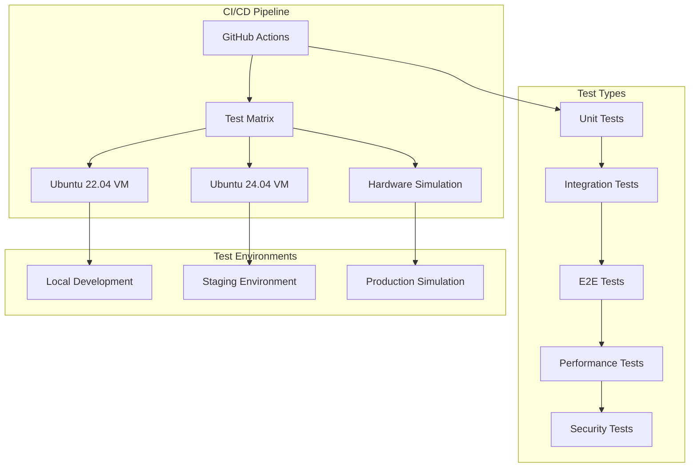
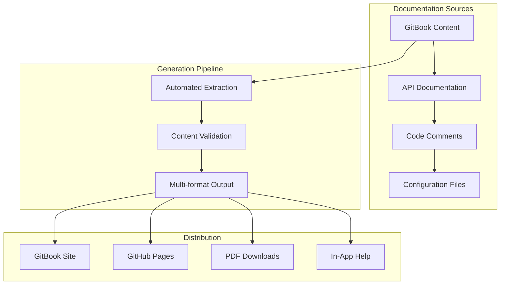

# Testing and Documentation Framework Design

## Overview

This design document outlines the architecture and implementation approach for a comprehensive testing and documentation framework for the Kaspa All-in-One package. The framework will ensure reliable installations, provide excellent user experience through documentation, and maintain high code quality through automated testing.

## Architecture

### Testing Architecture



### Documentation Architecture



## Components and Interfaces

### 1. CI/CD Pipeline Component

**Purpose:** Automate testing, building, and deployment processes

**Key Files:**
- `.github/workflows/ci.yml` - Main CI pipeline
- `.github/workflows/release.yml` - Release automation
- `.github/workflows/docs.yml` - Documentation deployment

**Interfaces:**
- GitHub Actions API for workflow management
- Docker Hub API for image publishing
- GitBook API for documentation updates

### 2. Test Suite Component

**Purpose:** Comprehensive testing across multiple dimensions

**Structure:**
```
tests/
├── unit/                 # Unit tests for individual components
├── integration/          # Service integration tests
├── e2e/                 # End-to-end user scenarios
├── performance/         # Load and performance tests
├── security/            # Security and vulnerability tests
└── fixtures/            # Test data and configurations
```

**Key Technologies:**
- **Jest** for unit testing
- **Testcontainers** for integration testing
- **Playwright** for E2E testing
- **Artillery** for performance testing
- **OWASP ZAP** for security testing

### 3. Documentation System Component

**Purpose:** Multi-format, version-aware documentation

**Structure:**
```
docs/
├── gitbook/
│   ├── user-guide/      # End-user documentation
│   ├── admin-guide/     # System administration
│   ├── developer/       # Developer documentation
│   └── api/            # API reference
├── templates/           # Documentation templates
├── assets/             # Images, diagrams, videos
└── scripts/            # Documentation build scripts
```

**Content Management:**
- **GitBook** for primary documentation hosting
- **Markdown** for source content
- **Mermaid** for diagrams
- **OpenAPI** for API documentation

### 4. Quality Assurance Component

**Purpose:** Automated quality checks and monitoring

**Tools Integration:**
- **SonarQube** for code quality analysis
- **Snyk** for security vulnerability scanning
- **Hadolint** for Dockerfile linting
- **Trivy** for container security scanning

## Data Models

### Test Result Schema
```typescript
interface TestResult {
  id: string;
  timestamp: Date;
  environment: 'local' | 'staging' | 'production';
  testType: 'unit' | 'integration' | 'e2e' | 'performance' | 'security';
  status: 'passed' | 'failed' | 'skipped';
  duration: number;
  coverage?: number;
  artifacts: string[];
  metadata: Record<string, any>;
}
```

### Documentation Metadata Schema
```typescript
interface DocumentationPage {
  id: string;
  title: string;
  version: string;
  lastUpdated: Date;
  category: 'user' | 'admin' | 'developer' | 'api';
  tags: string[];
  dependencies: string[];
  reviewStatus: 'draft' | 'review' | 'approved' | 'published';
}
```

### Performance Benchmark Schema
```typescript
interface PerformanceBenchmark {
  id: string;
  timestamp: Date;
  hardwareConfig: HardwareSpec;
  metrics: {
    cpuUsage: number;
    memoryUsage: number;
    diskUsage: number;
    networkThroughput: number;
    syncTime: number;
  };
  services: ServiceMetrics[];
}
```

## Error Handling

### Test Failure Management
1. **Immediate Notification:** Failed tests trigger Slack/email notifications
2. **Artifact Collection:** Logs, screenshots, and dumps are automatically collected
3. **Retry Logic:** Flaky tests are retried with exponential backoff
4. **Failure Analysis:** AI-powered failure categorization and suggested fixes

### Documentation Issues
1. **Link Validation:** Automated checking for broken links and references
2. **Content Freshness:** Alerts when documentation becomes outdated
3. **User Feedback:** Integration with feedback systems for continuous improvement
4. **Version Conflicts:** Automated detection of version-specific content issues

## Testing Strategy

### 1. Installation Testing Matrix

| Test Scenario | Ubuntu 22.04 | Ubuntu 24.04 | Hardware Variants |
|---------------|---------------|---------------|-------------------|
| Fresh Install | ✓ | ✓ | Min/Recommended/High |
| Upgrade Path | ✓ | ✓ | Recommended |
| Network Variations | ✓ | ✓ | Slow/Fast/Intermittent |
| Resource Constraints | ✓ | ✓ | Low RAM/Disk |

### 2. Service Integration Testing

**Test Scenarios:**
- Kaspa node synchronization and API availability
- Indexer services connecting to node and processing data
- Dashboard displaying real-time data from all services
- Service restart and recovery scenarios
- Inter-service communication validation

### 3. Performance Testing Strategy

**Baseline Measurements:**
- Resource usage during idle state
- Sync time from genesis to current block
- API response times under load
- Concurrent user handling capacity

**Load Testing Scenarios:**
- Gradual load increase to find breaking points
- Sustained load over extended periods
- Spike testing for sudden traffic increases
- Resource exhaustion recovery testing

### 4. Security Testing Approach

**Automated Scans:**
- Container vulnerability scanning
- Dependency security analysis
- Network port and service exposure
- Configuration security validation

**Manual Security Reviews:**
- API endpoint security assessment
- Data privacy and protection review
- Access control and authentication
- Secure communication protocols

## Documentation Strategy

### 1. User Documentation Structure

**Hardware Guide:**
- Recommended mini-PC specifications
- Price/performance analysis
- Compatibility matrices
- Purchasing recommendations

**Installation Guide:**
- Pre-installation requirements
- Step-by-step installation with screenshots
- Configuration options explanation
- Post-installation verification

**Operation Guide:**
- Daily operation procedures
- Monitoring and maintenance
- Troubleshooting common issues
- Performance optimization

### 2. Developer Documentation Structure

**Architecture Documentation:**
- System overview and component relationships
- Service communication patterns
- Data flow diagrams
- Security architecture

**API Documentation:**
- RESTful API endpoints
- WebSocket connections
- Authentication and authorization
- Rate limiting and error handling

**Contribution Guide:**
- Development environment setup
- Coding standards and conventions
- Testing requirements
- Pull request process

### 3. Documentation Automation

**Content Generation:**
- API documentation from OpenAPI specs
- Configuration documentation from schema files
- Code examples from test files
- Performance metrics from benchmark results

**Quality Assurance:**
- Automated spell checking and grammar validation
- Link verification and maintenance
- Screenshot and diagram updates
- Version synchronization checks

## Implementation Phases

### Phase 1: Foundation (Weeks 1-2)
- Set up GitHub Actions CI/CD pipeline
- Create basic test structure and frameworks
- Establish GitBook documentation site
- Implement core quality gates

### Phase 2: Testing Infrastructure (Weeks 3-4)
- Develop installation test suite
- Create integration test scenarios
- Implement performance benchmarking
- Set up security scanning tools

### Phase 3: Documentation System (Weeks 5-6)
- Create comprehensive user guides
- Develop developer documentation
- Implement automated content generation
- Set up feedback and improvement processes

### Phase 4: Advanced Features (Weeks 7-8)
- Add advanced monitoring and alerting
- Implement automated documentation updates
- Create interactive troubleshooting tools
- Optimize performance and reliability

## Success Metrics

### Testing Metrics
- **Test Coverage:** >90% code coverage across all components
- **Test Reliability:** <1% flaky test rate
- **Build Success Rate:** >95% successful builds
- **Mean Time to Detection:** <30 minutes for critical issues

### Documentation Metrics
- **User Satisfaction:** >4.5/5 rating on documentation helpfulness
- **Content Freshness:** <7 days average age of outdated content
- **Search Success Rate:** >80% of searches find relevant results
- **Completion Rate:** >70% of users complete installation successfully

### Quality Metrics
- **Security Vulnerabilities:** Zero high/critical vulnerabilities in releases
- **Performance Regression:** <5% performance degradation between releases
- **User-Reported Issues:** <10 critical issues per release
- **Time to Resolution:** <48 hours for critical documentation issues