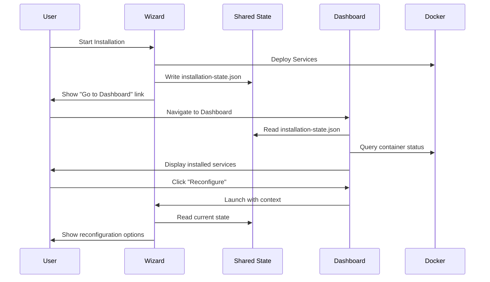

# Wizard-Dashboard Unification Design Document

## Overview

This design document describes the architecture and implementation approach for unifying the Installation Wizard and Management Dashboard into a cohesive, integrated system. The solution maintains both as separate services while sharing state, visual identity, and providing seamless navigation between them.

### Design Goals

1. **Shared State**: Single source of truth for installation configuration
2. **Visual Consistency**: Identical look and feel using shared CSS design system
3. **Seamless Navigation**: Cross-launch between services with context preservation
4. **Accurate Detection**: Reliable service and node detection with port fallback
5. **Host-Based Operation**: Both services run on host for Docker access
6. **Non-Breaking Changes**: Preserve working Wizard template installation flow

## Architecture

### High-Level Architecture

```
┌─────────────────────────────────────────────────────────────────────┐
│                         Host System                                  │
├─────────────────────────────────────────────────────────────────────┤
│                                                                      │
│  ┌──────────────────┐              ┌──────────────────┐             │
│  │  Installation    │              │   Management     │             │
│  │     Wizard       │◄────────────►│    Dashboard     │             │
│  │   (Port 3000)    │   Cross-     │   (Port 8080)    │             │
│  │                  │   Launch     │                  │             │
│  └────────┬─────────┘              └────────┬─────────┘             │
│           │                                  │                       │
│           │         ┌──────────────┐        │                       │
│           └────────►│ Shared State │◄───────┘                       │
│                     │   (.kaspa-aio/                                │
│                     │ installation-                                 │
│                     │   state.json)│                                │
│                     └──────────────┘                                │
│                                                                      │
│  ┌──────────────────────────────────────────────────────────────┐   │
│  │                    Shared Design System                       │   │
│  │  (services/shared/styles/ - CSS variables, components)        │   │
│  └──────────────────────────────────────────────────────────────┘   │
│                                                                      │
│  ┌──────────────────────────────────────────────────────────────┐   │
│  │                      Docker Engine                            │   │
│  │  ┌─────────┐ ┌─────────┐ ┌─────────┐ ┌─────────┐            │   │
│  │  │ kaspa-  │ │ kaspa-  │ │ k-      │ │ timescale│            │   │
│  │  │  node   │ │explorer │ │ indexer │ │   db    │            │   │
│  │  └─────────┘ └─────────┘ └─────────┘ └─────────┘            │   │
│  └──────────────────────────────────────────────────────────────┘   │
│                                                                      │
└─────────────────────────────────────────────────────────────────────┘
```

### Component Interaction Flow



## Components and Interfaces

### 1. Shared State Manager

The shared state manager handles reading and writing the installation state file.

**Location**: `services/shared/lib/state-manager.js`

```javascript
/**
 * SharedStateManager - Manages installation state shared between Wizard and Dashboard
 */
class SharedStateManager {
  constructor(statePath = '.kaspa-aio/installation-state.json') {
    this.statePath = statePath;
    this.watchers = [];
  }

  /**
   * Read current installation state
   * @returns {InstallationState|null} Current state or null if not exists
   */
  async readState() { }

  /**
   * Write installation state
   * @param {InstallationState} state - State to write
   */
  async writeState(state) { }

  /**
   * Watch for state file changes
   * @param {Function} callback - Called when state changes
   * @returns {Function} Unsubscribe function
   */
  watchState(callback) { }

  /**
   * Check if installation exists
   * @returns {boolean} True if state file exists
   */
  async hasInstallation() { }

  /**
   * Update specific fields in state
   * @param {Partial<InstallationState>} updates - Fields to update
   */
  async updateState(updates) { }
}
```

### 2. Port Fallback Service

Handles Kaspa node connection with automatic port fallback.

**Location**: `services/shared/lib/port-fallback.js`

```javascript
/**
 * PortFallbackService - Manages Kaspa node connection with port fallback
 */
class PortFallbackService {
  constructor(options = {}) {
    this.configuredPort = options.configuredPort || 16110;
    this.fallbackPorts = [16110, 16111];
    this.cachedPort = null;
    this.retryInterval = 30000; // 30 seconds
  }

  /**
   * Connect to Kaspa node, trying ports in order
   * @returns {ConnectionResult} Connection result with port used
   */
  async connect() { }

  /**
   * Get current working port
   * @returns {number|null} Cached working port or null
   */
  getWorkingPort() { }

  /**
   * Clear cached port (force re-detection)
   */
  clearCache() { }

  /**
   * Start automatic retry when disconnected
   * @param {Function} onConnect - Called when connection established
   */
  startRetry(onConnect) { }
}
```

### 3. Service Detection Module

Detects Docker container status for installed services.

**Location**: `services/shared/lib/service-detector.js`

```javascript
/**
 * ServiceDetector - Detects Docker container status
 */
class ServiceDetector {
  /**
   * Get status of all installed services
   * @param {string[]} serviceNames - Names of services to check
   * @returns {ServiceStatus[]} Status of each service
   */
  async getServiceStatus(serviceNames) { }

  /**
   * Get detailed status of a single service
   * @param {string} serviceName - Service name
   * @returns {ServiceStatus} Detailed status
   */
  async getServiceDetail(serviceName) { }

  /**
   * Check if Docker is available
   * @returns {boolean} True if Docker is accessible
   */
  async isDockerAvailable() { }
}
```

### 4. Cross-Launch Navigator

Handles navigation between Wizard and Dashboard with context.

**Location**: `services/shared/lib/cross-launch.js`

```javascript
/**
 * CrossLaunchNavigator - Manages navigation between Wizard and Dashboard
 */
class CrossLaunchNavigator {
  /**
   * Generate URL to launch Wizard with context
   * @param {LaunchContext} context - Context to pass
   * @returns {string} URL with encoded context
   */
  getWizardUrl(context) { }

  /**
   * Generate URL to Dashboard
   * @returns {string} Dashboard URL
   */
  getDashboardUrl() { }

  /**
   * Parse context from URL parameters
   * @returns {LaunchContext|null} Parsed context or null
   */
  parseContext() { }
}
```

## Data Models

### Installation State Schema

```typescript
interface InstallationState {
  version: string;           // Schema version (e.g., "1.0.0")
  installedAt: string;       // ISO timestamp of initial installation
  lastModified: string;      // ISO timestamp of last modification
  phase: 'pending' | 'installing' | 'complete' | 'error';
  
  profiles: {
    selected: string[];      // Array of installed profile IDs
    count: number;           // Number of installed profiles
  };
  
  configuration: {
    network: 'mainnet' | 'testnet';
    publicNode: boolean;
    hasIndexers: boolean;
    hasArchive: boolean;
    hasMining: boolean;
    kaspaNodePort?: number;  // Configured Kaspa node port
  };
  
  services: ServiceEntry[];
  
  summary: {
    total: number;
    running: number;
    stopped: number;
    missing: number;
  };
  
  wizardRunning?: boolean;   // True when Wizard is actively configuring
}

interface ServiceEntry {
  name: string;              // Service identifier (e.g., "kaspa-node")
  displayName?: string;      // Human-readable name
  profile: string;           // Profile this service belongs to
  running: boolean;          // Current running status
  exists: boolean;           // Whether container exists
  containerName?: string;    // Docker container name
  ports?: number[];          // Exposed ports
}

interface LaunchContext {
  action: 'add' | 'modify' | 'remove' | 'view';
  profile?: string;          // Target profile for action
  service?: string;          // Target service for action
  returnUrl?: string;        // URL to return to after action
}

interface ServiceStatus {
  name: string;
  status: 'healthy' | 'unhealthy' | 'stopped' | 'starting' | 'not_found';
  containerName: string;
  uptime?: string;
  healthCheck?: boolean;     // Whether service has health check
  lastChecked: string;       // ISO timestamp
}

interface ConnectionResult {
  connected: boolean;
  port: number;
  error?: string;
}
```

## Correctness Properties

*A property is a characteristic or behavior that should hold true across all valid executions of a system—essentially, a formal statement about what the system should do. Properties serve as the bridge between human-readable specifications and machine-verifiable correctness guarantees.*

### Property 1: Installation State Schema Validity

*For any* installation state file written by the Wizard, the file SHALL contain all required fields: version, installedAt, lastModified, phase, profiles (with selected array and count), configuration, services array, and summary.

**Validates: Requirements 1.6**

### Property 2: State File Write Consistency

*For any* installation or modification operation completed by the Wizard, the installation state file SHALL be updated to reflect the current configuration, and the lastModified timestamp SHALL be updated.

**Validates: Requirements 1.2, 1.7, 5.8, 10.1**

### Property 3: Dashboard Service Display Consistency

*For any* installation state, the Dashboard SHALL display exactly the services listed in the installation state's services array—no more, no less.

**Validates: Requirements 1.3, 1.4, 4.1, 4.2**

### Property 4: State Change Detection and Refresh

*For any* modification to the installation state file, the Dashboard SHALL detect the change and refresh its display within 5 seconds.

**Validates: Requirements 1.8, 10.2, 10.3, 10.8**

### Property 5: CSS Variable Consistency

*For any* CSS variable defined in the shared design system, both the Wizard and Dashboard SHALL use the same value for that variable.

**Validates: Requirements 2.1, 2.4**

### Property 6: Port Fallback Chain

*For any* Kaspa node connection attempt, the Dashboard SHALL try ports in order: configured port → 16110 → 16111, stopping at the first successful connection.

**Validates: Requirements 3.1, 3.2, 3.3**

### Property 7: Port Caching After Success

*For any* successful Kaspa node connection, subsequent connection attempts SHALL use the cached working port until explicitly cleared or connection fails.

**Validates: Requirements 3.4**

### Property 8: Retry on Unavailability

*For any* period when the Kaspa node is unavailable, the Dashboard SHALL re-attempt connection every 30 seconds, and when the node becomes available, status SHALL update within 5 seconds.

**Validates: Requirements 3.7, 3.8**

### Property 9: Service Filtering Consistency

*For any* service filter selection, the Dashboard SHALL display only services matching the selected filter criteria, and the filter dropdown SHALL contain accurate service counts for each filter option.

**Validates: Requirements 4.3, 4.4, 4.5, 4.6, 4.7, 4.8**

### Property 10: Reconfiguration Mode Detection

*For any* Wizard load when an installation state exists, the Wizard SHALL enter reconfiguration mode, display installed profiles with badges, and show available profiles separately.

**Validates: Requirements 5.1, 5.3, 5.4, 5.5**

### Property 11: Data Preservation During Modification

*For any* configuration modification that doesn't explicitly remove a service, existing service data SHALL be preserved.

**Validates: Requirements 5.6**

### Property 12: Cross-Launch Context Preservation

*For any* cross-launch from Dashboard to Wizard, the context (action, target profile/service) SHALL be passed via URL parameters and correctly parsed by the receiving service.

**Validates: Requirements 6.2, 6.6, 6.7**

### Property 13: Service Status Detection Accuracy

*For any* installed service, the Dashboard SHALL accurately report its Docker container status (healthy, unhealthy, stopped, starting, or not_found) based on Docker health checks when available, or container running state otherwise.

**Validates: Requirements 7.1, 7.2, 7.3, 7.4, 7.5**

### Property 14: Status Refresh Timing

*For any* Dashboard session, service status SHALL be refreshed every 10 seconds.

**Validates: Requirements 7.7**

### Property 15: Graceful Error Handling

*For any* error condition (service unavailable, Docker unavailable, API failure), the Dashboard SHALL display a user-friendly message, log detailed error to console, and continue operating without crashing.

**Validates: Requirements 9.1, 9.4, 9.5, 9.6, 9.7**

### Property 16: Wizard Running Indicator

*For any* period when the Wizard is actively configuring, the Dashboard SHALL display a "Configuration in progress" indicator and disable service control operations.

**Validates: Requirements 10.6, 10.7**

### Property 17: Configuration Change Notification

*For any* configuration change detected, the Dashboard SHALL display a notification to the user.

**Validates: Requirements 10.4**

## Error Handling

### Error Categories and Responses

| Error Category | User Message | Console Log | Recovery Action |
|---------------|--------------|-------------|-----------------|
| No Installation | "No installation detected. Click here to launch the Installation Wizard." | Info: No state file found | Show Wizard link |
| Docker Unavailable | "Docker is not accessible. Please ensure Docker is running." | Error: Docker socket connection failed | Retry every 30s |
| Kaspa Node Unavailable | "Kaspa Node: Not Available. Check if the container is running." | Warn: All ports failed | Retry with fallback |
| Service Not Found | "Service not found in Docker" | Warn: Container not found | Show "Not Found" status |
| State File Corrupt | "Configuration file is corrupted. Please reconfigure." | Error: JSON parse failed | Offer reconfiguration |
| API Error | "Unable to fetch data. Retrying..." | Error: API request failed | Auto-retry with backoff |

### Error Display Component

```javascript
/**
 * ErrorDisplay - Consistent error display across both services
 */
class ErrorDisplay {
  /**
   * Show user-friendly error with optional action
   * @param {ErrorInfo} error - Error information
   */
  show(error) { }

  /**
   * Show service unavailable placeholder
   * @param {string} serviceName - Name of unavailable service
   */
  showServiceUnavailable(serviceName) { }

  /**
   * Show Docker unavailable message
   */
  showDockerUnavailable() { }
}
```

## Testing Strategy

### Unit Tests

Unit tests verify specific examples and edge cases:

1. **State Manager Tests**
   - Read existing state file
   - Write new state file
   - Handle missing state file
   - Handle corrupted state file
   - Update partial state

2. **Port Fallback Tests**
   - Connect on first port
   - Fallback to second port
   - Fallback to third port
   - All ports fail
   - Cache working port
   - Clear cache on failure

3. **Service Detector Tests**
   - Detect healthy container
   - Detect unhealthy container
   - Detect stopped container
   - Handle missing container
   - Docker unavailable

4. **Cross-Launch Tests**
   - Generate Wizard URL with context
   - Parse context from URL
   - Handle missing context

### Property-Based Tests

Property-based tests verify universal properties across many generated inputs. Each test runs minimum 100 iterations.

**Testing Framework**: Jest with fast-check for property-based testing

1. **Property Test: State Schema Validity**
   - Generate random installation configurations
   - Verify all required fields present
   - **Feature: wizard-dashboard-unification, Property 1: Installation State Schema Validity**

2. **Property Test: Service Display Consistency**
   - Generate random service lists
   - Verify Dashboard displays exactly those services
   - **Feature: wizard-dashboard-unification, Property 3: Dashboard Service Display Consistency**

3. **Property Test: Port Fallback Chain**
   - Generate random port availability scenarios
   - Verify correct fallback order
   - **Feature: wizard-dashboard-unification, Property 6: Port Fallback Chain**

4. **Property Test: Service Filtering**
   - Generate random service/filter combinations
   - Verify filter shows correct services
   - **Feature: wizard-dashboard-unification, Property 9: Service Filtering Consistency**

5. **Property Test: Cross-Launch Context**
   - Generate random launch contexts
   - Verify round-trip encoding/decoding
   - **Feature: wizard-dashboard-unification, Property 12: Cross-Launch Context Preservation**

6. **Property Test: Error Handling Resilience**
   - Generate random error conditions
   - Verify graceful handling without crash
   - **Feature: wizard-dashboard-unification, Property 15: Graceful Error Handling**

### Integration Tests

1. **Wizard → State → Dashboard Flow**
   - Complete installation via Wizard
   - Verify state file written
   - Verify Dashboard reads and displays correctly

2. **Dashboard → Wizard Cross-Launch**
   - Click reconfigure in Dashboard
   - Verify Wizard receives context
   - Complete reconfiguration
   - Verify Dashboard updates

3. **State File Watch**
   - Modify state file externally
   - Verify Dashboard detects and refreshes

## Implementation Notes

### Shared CSS Strategy

The shared design system will be located at `services/shared/styles/` with the following structure:

```
services/shared/styles/
├── variables.css      # CSS custom properties (colors, spacing, typography)
├── base.css          # Reset and base styles
├── buttons.css       # Button component styles
├── cards.css         # Card component styles
├── forms.css         # Form element styles
├── status.css        # Status indicator styles
└── index.css         # Main entry point that imports all
```

Both Wizard and Dashboard will import from this shared location. During build/start, the shared styles are symlinked or copied to each service's public directory.

### State File Location

The state file is located at `.kaspa-aio/installation-state.json` relative to the project root. This location:
- Is outside both service directories
- Is accessible to both services
- Persists across service restarts
- Can be backed up easily

### Port Configuration

Default ports:
- Wizard: 3000
- Dashboard: 8080
- Kaspa Node RPC (local): 16110
- Kaspa Node RPC (public): 16111

### Non-Breaking Changes Approach

To preserve the working Wizard template installation flow:
1. All changes are additive (new features, not replacements)
2. Existing API endpoints remain unchanged
3. State file format is backward compatible
4. CSS changes use new class names, don't modify existing
5. Reconfiguration mode is a new flow, not a modification of fresh install flow
