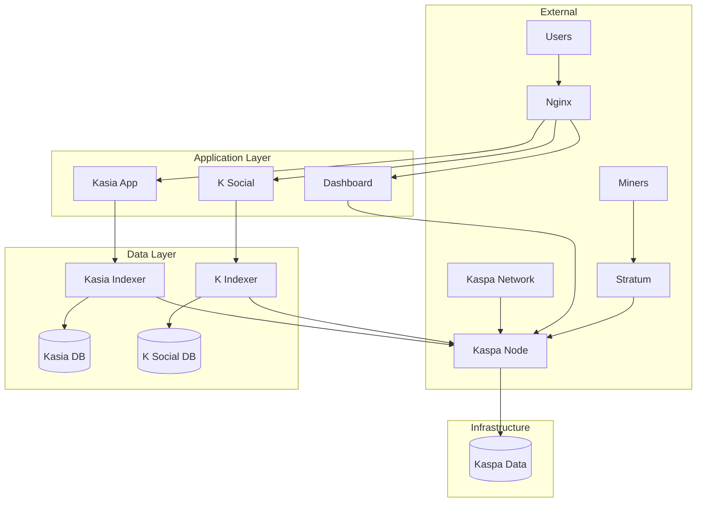

# Kaspa All-in-One Project Structure

This document provides an overview of the project structure and explains the purpose of each component.

## 📁 Root Directory Structure

```
kaspa-aio/
├── README.md                    # Main project documentation
├── PROJECT_STRUCTURE.md         # This file
├── LICENSE                      # MIT License
├── .env.example                 # Environment configuration template
├── docker-compose.yml           # Main service definitions
├── docker-compose.override.yml  # Development overrides
├── install.sh                   # Interactive installer script
├── .gitignore                   # Git ignore rules
├── .kiro/                       # Kiro IDE specifications
│   └── specs/                   # Feature specifications
├── config/                      # Configuration files
├── services/                    # Service-specific files
├── scripts/                     # Management and utility scripts
└── docs/                        # Documentation
```

## 🐳 Docker Configuration

### docker-compose.yml
Main service orchestration file defining:
- **kaspa-node**: Official Kaspa node container
- **kaspa-stratum**: Mining stratum bridge (optional)
- **kasia-app**: Messaging application
- **kasia-indexer**: Message indexing service
- **k-social**: Social media platform
- **k-indexer**: Social content indexer
- **dashboard**: Management web interface
- **nginx**: Reverse proxy and load balancer
- **Databases**: PostgreSQL instances for indexers

### docker-compose.override.yml
Development-specific overrides:
- Debug logging enabled
- Volume mounts for logs
- Portainer for container management
- Development environment variables

## 🔧 Configuration Directory

```
config/
├── nginx.conf                   # Nginx reverse proxy configuration
└── ssl/                         # SSL certificates (optional)
    ├── cert.pem
    └── key.pem
```

### nginx.conf Features
- Rate limiting for API endpoints
- WebSocket support for real-time features
- Security headers and HTTPS redirect
- Service routing and load balancing
- Health check endpoints

## 🚀 Services Directory

```
services/
├── dashboard/                   # Management dashboard
│   ├── Dockerfile
│   ├── package.json
│   ├── server.js               # Express.js backend
│   └── public/                 # Frontend assets
│       ├── index.html
│       ├── styles.css
│       └── script.js
├── kaspa-stratum/              # Mining stratum bridge
│   └── Dockerfile
├── kasia/                      # Messaging application
│   └── Dockerfile
├── kasia-indexer/              # Message indexer
│   ├── Dockerfile
│   └── wait-for-db.sh
├── k-social/                   # Social platform
│   └── Dockerfile
└── k-indexer/                  # Social indexer
    ├── Dockerfile
    └── wait-for-db.sh
```

### Service Architecture
- **Multi-stage builds** for optimized container sizes
- **Non-root users** for security
- **Health checks** for monitoring
- **Wait scripts** for database dependencies
- **Signal handling** with dumb-init

## 📜 Scripts Directory

```
scripts/
├── health-check.sh             # Comprehensive health monitoring
└── manage.sh                   # Service management utility
```

### health-check.sh Features
- Docker container status verification
- HTTP endpoint health checks
- System resource monitoring
- JSON and text output formats
- Configurable timeouts and verbosity

### manage.sh Features
- Service lifecycle management (start/stop/restart)
- Log viewing and following
- Backup and restore operations
- System updates and cleanup
- Health check integration

## 📚 Documentation Structure

```
docs/
├── user-guide.md               # End-user documentation
├── admin-guide.md              # System administration
├── api.md                      # API reference
├── troubleshooting.md          # Common issues and solutions
├── contributing.md             # Contribution guidelines
└── architecture.md             # Technical architecture
```

## 🔍 Kiro IDE Specifications

```
.kiro/
└── specs/
    └── testing-documentation-framework/
        ├── requirements.md      # Testing framework requirements
        ├── design.md           # Architecture and design
        └── tasks.md            # Implementation tasks
```

### Specification Features
- Comprehensive testing strategy
- CI/CD pipeline design
- Documentation automation
- Open source governance
- Security and compliance

## 🔐 Security Considerations

### Container Security
- Non-root user execution
- Minimal base images (Alpine Linux)
- Security scanning integration
- Signed image verification

### Network Security
- Service isolation with Docker networks
- Rate limiting on public endpoints
- HTTPS/TLS encryption support
- Firewall-friendly port configuration

### Data Security
- Encrypted data volumes
- Secure database connections
- Backup encryption support
- Audit logging capabilities

## 🔄 Data Flow Architecture



## 📊 Monitoring and Observability

### Health Monitoring
- Container health checks
- Service endpoint monitoring
- Database connectivity verification
- System resource tracking

### Logging Strategy
- Centralized log collection
- Structured logging format
- Log rotation and retention
- Error alerting and notification

### Metrics Collection
- Performance metrics
- Resource utilization
- Network statistics
- Business metrics (transactions, users)

## 🚀 Deployment Strategies

### Single Node Deployment
- All services on one mini PC
- Docker Compose orchestration
- Local data persistence
- Suitable for home/small office use

### High Availability Setup
- Multiple node deployment
- Load balancing and failover
- Distributed data storage
- Enterprise-grade reliability

## 🔧 Development Workflow

### Local Development
1. Clone repository
2. Copy `.env.example` to `.env`
3. Run `docker-compose up -d`
4. Access services via localhost

### Testing
1. Unit tests for individual components
2. Integration tests for service communication
3. End-to-end tests for user workflows
4. Performance and load testing

### Deployment
1. Automated CI/CD pipeline
2. Security scanning and validation
3. Staged deployment process
4. Rollback capabilities

## 📈 Scalability Considerations

### Horizontal Scaling
- Service replication support
- Load balancer configuration
- Database clustering options
- Cache layer integration

### Vertical Scaling
- Resource limit configuration
- Performance optimization
- Memory and CPU tuning
- Storage optimization

## 🔮 Future Enhancements

### Planned Features
- Kubernetes deployment support
- Advanced monitoring dashboards
- Mobile application support
- Multi-language documentation

### Community Contributions
- Plugin architecture
- Custom service integration
- Theme and UI customization
- Additional blockchain support

---

This structure provides a solid foundation for a production-ready, scalable, and maintainable Kaspa ecosystem deployment.