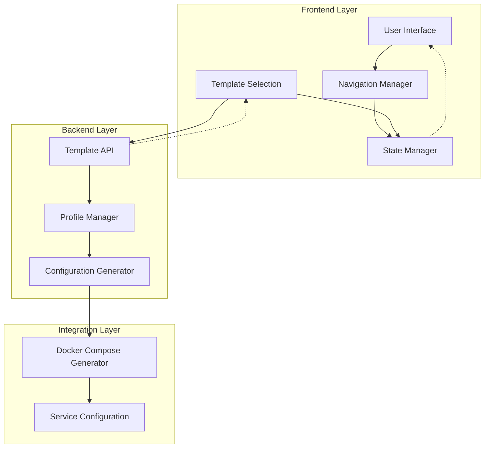
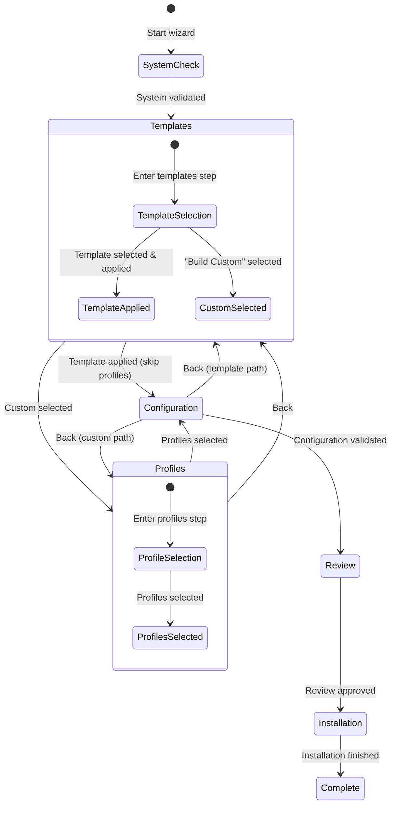
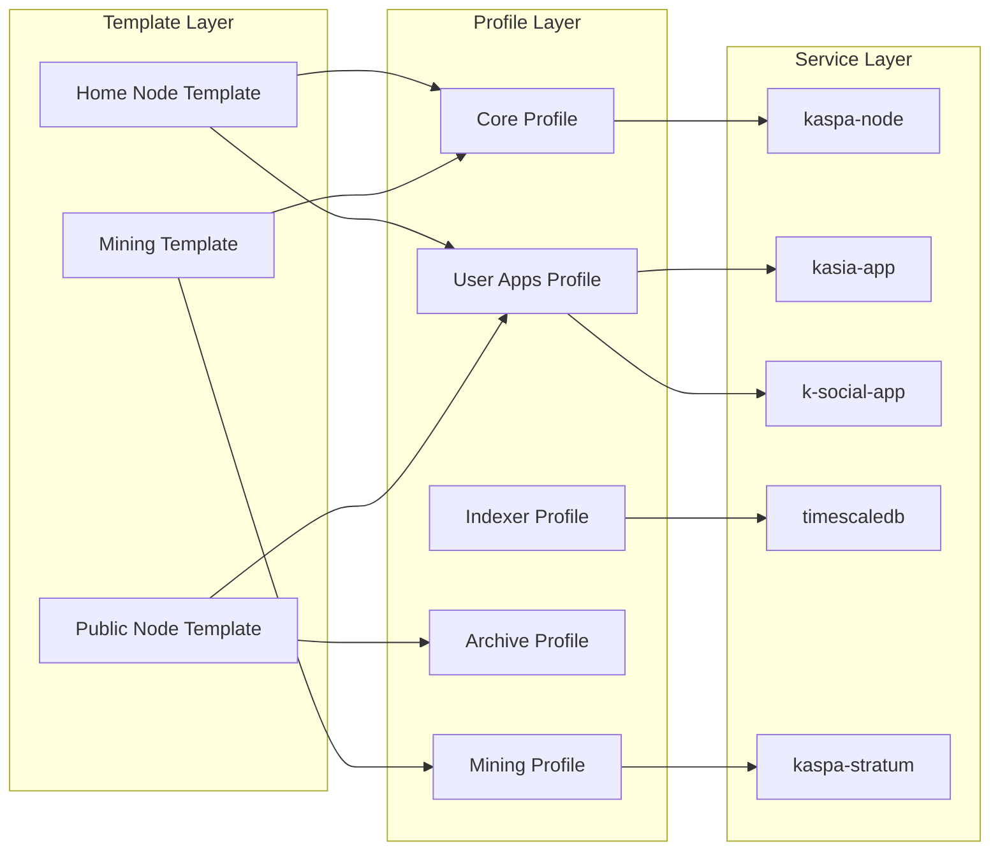
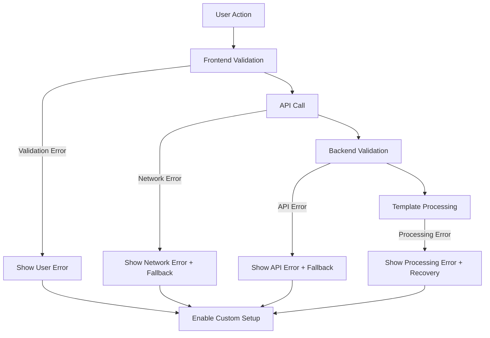

# Wizard Template Navigation Architecture

## Overview

This document describes the technical architecture of the wizard template-profile navigation system, focusing on the navigation flow patterns, state management architecture, and integration with existing systems.

## System Architecture

### High-Level Architecture



### Component Responsibilities

| Component | Responsibility | Key Functions |
|-----------|---------------|---------------|
| **Navigation Manager** | Step flow control and routing | `nextStep()`, `previousStep()`, `goToStep()` |
| **State Manager** | Centralized state with validation | `validateStateConsistency()`, `setNavigationPath()` |
| **Template Selection** | Template operations and UI | `applyTemplate()`, `buildCustomTemplate()` |
| **Template API** | Backend template services | Template validation, application, recommendations |
| **Profile Manager** | Profile system integration | Profile definitions, dependencies, conflicts |

## Navigation Flow Architecture

### State Machine Design

The navigation system implements a finite state machine with clear transitions:



### Navigation Path Types

#### Template Path (Primary)
- **Flow**: System Check → Templates → Configuration → Review → Install → Complete
- **State**: `navigationPath: 'template'`
- **Characteristics**:
  - Skips profile selection step
  - Profiles determined by template
  - Faster user experience
  - Recommended for most users

#### Custom Path (Advanced)
- **Flow**: System Check → Templates → Profiles → Configuration → Review → Install → Complete
- **State**: `navigationPath: 'custom'`
- **Characteristics**:
  - Includes manual profile selection
  - Full control over service selection
  - Advanced user workflow
  - Backward compatible with legacy approach

### Step Visibility Management

The system dynamically controls step visibility based on navigation path:

```javascript
// Step visibility logic
function updateStepNumbering() {
  const navigationPath = stateManager.get('navigationPath');
  
  if (navigationPath === 'template') {
    // Template path: Steps 1,2,3,4,6,7,8,9 (skip 5)
    hideProfilesStep();
    updateStepNumbers([1, 2, 3, 4, 6, 7, 8, 9]);
  } else if (navigationPath === 'custom') {
    // Custom path: Steps 1,2,3,4,5,6,7,8,9 (include all)
    showProfilesStep();
    updateStepNumbers([1, 2, 3, 4, 5, 6, 7, 8, 9]);
  } else {
    // Default: Template-first approach
    hideProfilesStep();
    updateStepNumbers([1, 2, 3, 4, 6, 7, 8, 9]);
  }
}
```

## State Management Architecture

### State Structure

The state manager maintains a hierarchical state structure:

```typescript
interface WizardState {
  // Core navigation
  currentStep: number;
  navigationPath: 'template' | 'custom' | null;
  navigationHistory: number[];
  
  // Template state
  selectedTemplate: string | null;
  templateApplied: boolean;
  
  // Profile state
  selectedProfiles: string[];
  
  // Configuration state
  configuration: {
    // Base configuration
    externalIp?: string;
    publicNode?: boolean;
    dbPassword?: string;
    
    // Template-specific
    templateId?: string;
    templateName?: string;
    templateProfiles?: string[];
    
    // Service configuration
    [key: string]: any;
  };
  
  // System state
  systemCheck: object;
  checklist: object;
  installationProgress: object;
}
```

### State Validation Rules

The system enforces strict state consistency rules:

```typescript
interface StateValidationRules {
  // Single path rule
  onlyOneNavigationPathActive: boolean;
  
  // Template path requirements
  templatePathRequirements: {
    selectedTemplateRequired: boolean;
    templateAppliedRequired: boolean;
    profilesFromTemplate: boolean;
  };
  
  // Custom path requirements
  customPathRequirements: {
    manualProfileSelection: boolean;
    noTemplateApplied: boolean;
  };
  
  // Conflict resolution
  conflictResolution: {
    clearConflictingStateOnPathSwitch: boolean;
    automaticRecoveryEnabled: boolean;
  };
}
```

### State Consistency Validation

```javascript
validateStateConsistency() {
  const errors = [];
  const warnings = [];
  
  // Rule 1: Single path active
  if (this.navigationPath === 'template') {
    if (!this.selectedTemplate) {
      errors.push('Template path requires selected template');
    }
    if (!this.templateApplied && this.selectedTemplate) {
      warnings.push('Template selected but not applied');
    }
    if (this.selectedProfiles.length > 0 && !this.templateApplied) {
      errors.push('Template path conflicts with manual profile selection');
    }
  }
  
  // Rule 2: Custom path validation
  if (this.navigationPath === 'custom') {
    if (this.templateApplied) {
      errors.push('Custom path conflicts with applied template');
    }
    if (this.selectedProfiles.length === 0) {
      warnings.push('Custom path requires profile selection');
    }
  }
  
  return { valid: errors.length === 0, errors, warnings };
}
```

## Template Integration Architecture

### Template-Profile Mapping

Templates integrate with the existing profile system through a mapping layer:



### Configuration Merging Strategy

Templates provide configuration that merges with existing profile configurations:

```javascript
function mergeConfigurations(baseConfig, templateConfig, template) {
  // Priority order: template > base > defaults
  const merged = {
    // Base configuration (user settings)
    ...baseConfig,
    
    // Template configuration (template-specific)
    ...templateConfig,
    
    // Template metadata
    templateId: template.id,
    templateName: template.name,
    templateProfiles: template.profiles,
    configurationSource: 'template',
    
    // Preserve critical base settings
    externalIp: baseConfig.externalIp || templateConfig.externalIp,
    dbPassword: baseConfig.dbPassword || generateSecurePassword(),
  };
  
  return merged;
}
```

### Profile Dependency Resolution

The system validates and resolves profile dependencies:

```javascript
const PROFILE_DEPENDENCIES = {
  'mining': ['core', 'archive-node'] // Mining requires node
};

const PROFILE_CONFLICTS = {
  'archive-node': ['core'], // Archive conflicts with core
  'core': ['archive-node']  // Core conflicts with archive
};

function validateProfileDependencies(profiles) {
  const errors = [];
  
  for (const profile of profiles) {
    if (PROFILE_DEPENDENCIES[profile]) {
      const hasRequiredDep = PROFILE_DEPENDENCIES[profile]
        .some(dep => profiles.includes(dep));
      
      if (!hasRequiredDep) {
        errors.push(`${profile} requires: ${PROFILE_DEPENDENCIES[profile].join(' or ')}`);
      }
    }
  }
  
  return errors;
}
```

## API Architecture

### Template API Design

The backend provides a RESTful API for template operations:

```typescript
interface TemplateAPI {
  // Template discovery
  'GET /api/simple-templates/all': {
    response: { templates: Template[] };
  };
  
  // Template validation
  'POST /api/simple-templates/:id/validate': {
    request: { systemResources?: SystemResources };
    response: ValidationResult;
  };
  
  // Template application
  'POST /api/simple-templates/:id/apply': {
    request: { baseConfig: Configuration };
    response: ApplicationResult;
  };
  
  // Recommendations
  'POST /api/simple-templates/recommendations': {
    request: { systemResources: SystemResources; useCase: string };
    response: { recommendations: Recommendation[] };
  };
}
```

### Error Handling Architecture

The system implements layered error handling:



### Fallback Strategy

Multiple fallback levels ensure system reliability:

1. **Template Loading Failure**: Use offline fallback templates
2. **Template Application Failure**: Enable "Build Custom" option
3. **API Unavailability**: Provide basic templates with manual configuration
4. **State Corruption**: Automatic state recovery with user notification

## Integration Patterns

### Existing System Integration

The template system integrates with existing components without breaking changes:

#### Profile Manager Integration
```javascript
// Templates map to existing profiles
const template = {
  id: 'home-node',
  profiles: ['core', 'kaspa-user-applications'] // Existing profile IDs
};

// Profile Manager processes template profiles normally
const profileManager = new ProfileManager();
const serviceConfig = profileManager.generateServiceConfiguration(template.profiles);
```

#### Configuration System Integration
```javascript
// Template configuration merges with existing configuration
const existingConfig = loadExistingConfiguration();
const templateConfig = template.config;
const mergedConfig = mergeConfigurations(existingConfig, templateConfig, template);

// Configuration system processes merged config normally
const configurationManager = new ConfigurationManager();
configurationManager.applyConfiguration(mergedConfig);
```

#### Docker Compose Integration
```javascript
// Template profiles generate docker-compose like manual selection
const dockerComposeGenerator = new DockerComposeGenerator();
const composeConfig = dockerComposeGenerator.generate({
  profiles: template.profiles,
  configuration: mergedConfig
});
```

### Backward Compatibility

The system maintains full backward compatibility:

1. **Existing Installations**: Continue to work without modification
2. **Legacy Configuration**: Automatically detected and supported
3. **Profile Selection**: Available through "Build Custom" option
4. **API Compatibility**: All existing endpoints remain functional

## Performance Architecture

### Lazy Loading Strategy

Components are loaded on-demand to improve initial load time:

```javascript
// Navigation manager loads modules dynamically
async function handleStepEntry(stepNumber) {
  switch (getStepId(stepNumber)) {
    case 'templates':
      const { default: TemplateSelection } = await import('./template-selection.js');
      window.templateSelection = new TemplateSelection();
      break;
      
    case 'configure':
      const { loadConfigurationForm } = await import('./configure.js');
      await loadConfigurationForm();
      break;
  }
}
```

### State Persistence Optimization

State is persisted efficiently with selective updates:

```javascript
// Only persist changed state keys
set(key, value) {
  if (this.state[key] !== value) {
    this.state[key] = value;
    this.persistKey(key, value); // Selective persistence
    this.notify(key, value);
  }
}
```

### Caching Strategy

Templates and configuration are cached to reduce API calls:

```javascript
class TemplateCache {
  constructor() {
    this.cache = new Map();
    this.ttl = 5 * 60 * 1000; // 5 minutes
  }
  
  get(key) {
    const entry = this.cache.get(key);
    if (entry && Date.now() - entry.timestamp < this.ttl) {
      return entry.data;
    }
    return null;
  }
  
  set(key, data) {
    this.cache.set(key, {
      data,
      timestamp: Date.now()
    });
  }
}
```

## Security Architecture

### Input Validation

All user inputs are validated at multiple layers:

1. **Frontend Validation**: Immediate feedback and basic validation
2. **API Validation**: Server-side validation of all requests
3. **Template Validation**: Comprehensive template structure validation
4. **Configuration Validation**: Security validation of configuration values

### State Security

State management includes security considerations:

```javascript
// Sanitize sensitive data before persistence
sanitizeForPersistence(state) {
  const sanitized = { ...state };
  
  // Remove sensitive data
  if (sanitized.configuration) {
    delete sanitized.configuration.dbPassword;
    delete sanitized.configuration.privateKeys;
  }
  
  return sanitized;
}
```

## Monitoring and Observability

### Logging Architecture

Structured logging provides visibility into system behavior:

```javascript
class WizardLogger {
  static log(level, component, message, data = {}) {
    const logEntry = {
      timestamp: new Date().toISOString(),
      level,
      component,
      message,
      data,
      sessionId: this.getSessionId(),
      wizardStep: stateManager.get('currentStep'),
      navigationPath: stateManager.get('navigationPath')
    };
    
    console.log(`[${level.toUpperCase()}] ${component}: ${message}`, logEntry);
  }
}
```

### Metrics Collection

Key metrics are collected for system monitoring:

- Navigation flow completion rates
- Template selection patterns
- Error rates by component
- Performance metrics (navigation timing)
- User behavior patterns

## Deployment Architecture

### Build Configuration

The system supports different build configurations:

```javascript
// Build-time feature flags
const buildConfig = {
  features: {
    templateSystem: true,
    legacyProfiles: true, // Backward compatibility
    debugMode: process.env.NODE_ENV === 'development',
    autoEnableContinueButtons: process.env.NODE_ENV === 'test'
  }
};
```

### Environment Configuration

Different environments have specific configurations:

- **Development**: Full debugging, mock APIs available
- **Testing**: Automated testing features enabled
- **Production**: Optimized builds, error reporting enabled

## Future Architecture Considerations

### Extensibility

The architecture supports future enhancements:

1. **Custom Template Creation**: User-defined templates
2. **Template Marketplace**: Community-contributed templates
3. **Advanced Validation**: Machine learning-based recommendations
4. **Multi-tenant Support**: Organization-specific templates

### Scalability

The system is designed to scale:

1. **Template Storage**: Database-backed template storage
2. **Caching Layer**: Redis-based caching for high-traffic scenarios
3. **API Gateway**: Rate limiting and load balancing
4. **Microservices**: Template service can be extracted as microservice

This architecture provides a solid foundation for the current template-first navigation system while maintaining flexibility for future enhancements and ensuring seamless integration with existing systems.