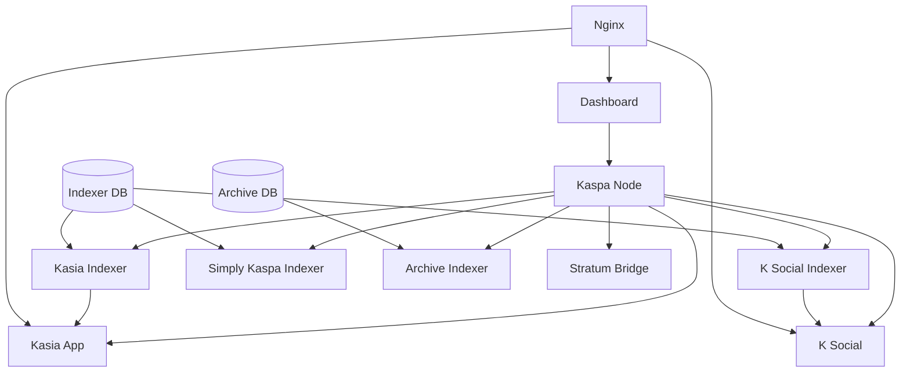

# Kaspa All-in-One Component Matrix

This document provides a comprehensive overview of all components in the Kaspa All-in-One package, their profile assignments, and implementation status.

## 📊 Component Overview

| Component | Profile | Repository | Status | Port | Description |
|-----------|---------|------------|--------|------|-------------|
| **Kaspa Node** | Core | [kaspanet/rusty-kaspad](https://hub.docker.com/r/kaspanet/rusty-kaspad) | ✅ Complete | 16110/16111 | Official Kaspa blockchain node |
| **Dashboard** | Core | Built-in | ✅ Complete | 8080 | Web management interface |
| **Nginx** | Core | [nginx:alpine](https://hub.docker.com/_/nginx) | ✅ Complete | 80/443 | Reverse proxy and load balancer |
| **Kasia App** | prod | [K-Kluster/Kasia](https://github.com/K-Kluster/Kasia) | 🔄 Integration | 3001 | Decentralized messaging app |
| **K Social** | prod | [thesheepcat/K](https://github.com/thesheepcat/K) | 🔄 Integration | 3003 | Social media platform |
| **Kasia Indexer** | explorer | [K-Kluster/kasia-indexer](https://github.com/K-Kluster/kasia-indexer) | ✅ Ready | 3002 | Message indexing service |
| **K Social Indexer** | explorer | [thesheepcat/K-indexer](https://github.com/thesheepcat/K-indexer) | 🔄 Integration | 3004 | Social content indexer |
| **Simply Kaspa Indexer** | explorer | [supertypo/simply-kaspa-indexer](https://github.com/supertypo/simply-kaspa-indexer) | 🔄 Integration | 3005 | General blockchain indexer |
| **Indexer Database** | explorer | [timescale/timescaledb](https://hub.docker.com/r/timescale/timescaledb) | ✅ Complete | 5432 | Shared TimescaleDB for indexers |
| **Archive Indexer** | archive | [supertypo/simply-kaspa-indexer](https://github.com/supertypo/simply-kaspa-indexer) | 🔄 Integration | 3006 | Historical data preservation |
| **Archive Database** | archive | [timescale/timescaledb](https://hub.docker.com/r/timescale/timescaledb) | ✅ Complete | 5433 | Long-term storage TimescaleDB |
| **Kaspa Stratum** | mining | [aglov413/kaspa-stratum-bridge](https://github.com/aglov413/kaspa-stratum-bridge) | 🔄 Integration | 5555 | Solo mining stratum bridge |
| **Portainer** | development | [portainer/portainer-ce](https://hub.docker.com/r/portainer/portainer-ce) | ✅ Complete | 9000 | Container management |
| **pgAdmin** | development | [dpage/pgadmin4](https://hub.docker.com/r/dpage/pgadmin4) | ✅ Complete | 9001 | Database administration |

## 🏗️ Profile Architecture

### Core Infrastructure (Always Active)
These services are essential and run with any profile combination:

```yaml
kaspa-node:
  image: kaspanet/rusty-kaspad:latest
  ports: ["16110:16110", "16111:16111"]
  
dashboard:
  build: ./services/dashboard
  ports: ["8080:8080"]
  
nginx:
  image: nginx:alpine
  ports: ["80:80", "443:443"]
```

### Production Profile (`--profile prod`)
User-facing applications that provide messaging and social features:

```yaml
kasia-app:
  build: ./services/kasia
  ports: ["3001:3000"]
  profiles: [prod]
  
k-social:
  build: ./services/k-social
  ports: ["3003:3000"]
  profiles: [prod]
```

### Explorer Profile (`--profile explorer`)
Data indexing and search services with shared database:

```yaml
indexer-db:
  image: postgres:15-alpine
  ports: ["5432:5432"]
  profiles: [explorer]
  
kasia-indexer:
  build: ./services/kasia-indexer
  ports: ["3002:3000"]
  profiles: [explorer]
  
k-indexer:
  build: ./services/k-indexer
  ports: ["3004:3000"]
  profiles: [explorer]
  
simply-kaspa-indexer:
  build: ./services/simply-kaspa-indexer
  ports: ["3005:3000"]
  profiles: [explorer]
```

### Archive Profile (`--profile archive`)
Long-term data storage and historical analysis:

```yaml
archive-db:
  image: postgres:15-alpine
  ports: ["5433:5432"]
  profiles: [archive]
  
archive-indexer:
  build: ./services/simply-kaspa-indexer
  ports: ["3006:3000"]
  profiles: [archive]
```

### Mining Profile (`--profile mining`)
Solo mining operations:

```yaml
kaspa-stratum:
  build: ./services/kaspa-stratum
  ports: ["5555:5555"]
  profiles: [mining]
```

### Development Profile (`--profile development`)
Development and administration tools:

```yaml
portainer:
  image: portainer/portainer-ce:latest
  ports: ["9000:9000"]
  profiles: [development]
  
pgadmin:
  image: dpage/pgadmin4:latest
  ports: ["9001:80"]
  profiles: [development]
```

## 🎯 Implementation Status

### ✅ Completed Components
- **Kaspa Node**: Using official Docker image with public node configuration
- **Dashboard**: Custom-built management interface with profile awareness
- **Nginx**: Configured with security headers and service routing
- **Databases**: PostgreSQL setup with initialization scripts
- **Development Tools**: Portainer and pgAdmin integration

### 🔄 Integration Required
The following components need repository cloning and integration:

1. **Kasia Messaging App** ([K-Kluster/Kasia](https://github.com/K-Kluster/Kasia))
   - Clone repository to `services/kasia/`
   - Analyze tech stack and dependencies
   - Create production Dockerfile
   - Configure environment variables

2. **Kasia Indexer** ([K-Kluster/kasia-indexer](https://github.com/K-Kluster/kasia-indexer))
   - ✅ Using official Docker image: `kkluster/kasia-indexer:main`
   - ✅ Configured with WebSocket connection to Kaspa node
   - ✅ File-based data storage (no external database required)
   - 🔄 Test indexing functionality and performance

3. **K Social App** ([thesheepcat/K](https://github.com/thesheepcat/K))
   - Clone repository to `services/k-social/`
   - Analyze dependencies and build process
   - Create production Dockerfile
   - Configure API endpoints

4. **K Social Indexer** ([thesheepcat/K-indexer](https://github.com/thesheepcat/K-indexer))
   - Clone repository to `services/k-indexer/`
   - Set up database schema
   - Configure social data indexing
   - Test performance and scaling
   - 📋 **PR Proposal**: [TimescaleDB optimization](../pr-proposals/k-social-indexer-timescaledb-pr.md)

5. **Simply Kaspa Indexer** ([supertypo/simply-kaspa-indexer](https://github.com/supertypo/simply-kaspa-indexer))
   - Clone repository to `services/simply-kaspa-indexer/`
   - Configure for both explorer and archive modes
   - Set up database partitioning for archive
   - Optimize for different indexing modes
   - 📋 **PR Proposal**: [TimescaleDB optimization](../pr-proposals/simply-kaspa-indexer-timescaledb-pr.md)

6. **Kaspa Stratum Bridge** ([aglov413/kaspa-stratum-bridge](https://github.com/aglov413/kaspa-stratum-bridge))
   - Clone repository to `services/kaspa-stratum/`
   - Configure Go build environment
   - Set up Kaspa node connection
   - Test mining pool functionality

### 🤝 Community Contributions

We've created detailed PR proposals for optimizing the PostgreSQL-based indexers with TimescaleDB:

- **[K Social Indexer TimescaleDB PR](../pr-proposals/k-social-indexer-timescaledb-pr.md)**: Comprehensive optimization for social media data with 10-100x query performance improvements
- **[Simply Kaspa Indexer TimescaleDB PR](../pr-proposals/simply-kaspa-indexer-timescaledb-pr.md)**: Enhanced time-series capabilities for high-performance blockchain indexing

These proposals include:
- Detailed implementation plans with code examples
- Performance benchmarks and optimization strategies
- Migration guides for existing deployments
- Kaspa-specific optimizations for 10 blocks/second rate

## 🔗 Component Dependencies

### Dependency Graph


### Service Communication
- **Applications → Indexers**: REST API calls for data queries
- **Indexers → Node**: RPC calls for blockchain data
- **Indexers → Databases**: SQL connections for data storage
- **Dashboard → All Services**: Health checks and monitoring
- **Nginx → Applications**: HTTP proxy and load balancing

## 📋 Deployment Scenarios

### Scenario 1: Home User (Single Machine)
```bash
# All profiles on one powerful mini PC
docker compose --profile prod --profile explorer --profile development up -d
```
**Components**: 11 services, ~24GB RAM, 500GB storage

### Scenario 2: Distributed (Node + Apps)
```bash
# Machine 1: Node and applications
docker compose --profile prod up -d

# Machine 2: Indexing services  
docker compose --profile explorer --profile archive up -d
```
**Machine 1**: 5 services, ~16GB RAM, 300GB storage
**Machine 2**: 6 services, ~32GB RAM, 1TB storage

### Scenario 3: Mining Operation
```bash
# Mining-focused deployment
docker compose --profile mining up -d
```
**Components**: 4 services, ~8GB RAM, 200GB storage

### Scenario 4: Data Analysis
```bash
# Explorer and archive for research
docker compose --profile explorer --profile archive --profile development up -d
```
**Components**: 9 services, ~32GB RAM, 1TB+ storage

## 🔧 Configuration Matrix

| Component | Environment Variables | Config Files | Volumes |
|-----------|----------------------|--------------|---------|
| Kaspa Node | `PUBLIC_NODE`, `LOG_LEVEL` | - | `kaspa-data` |
| Dashboard | `KASPA_NODE_URL` | - | - |
| Nginx | `HTTP_PORT`, `HTTPS_PORT` | `nginx.conf` | `ssl/` |
| Kasia App | `KASPA_NODE_URL`, `KASIA_INDEXER_URL` | TBD | - |
| K Social | `KASPA_NODE_URL`, `KSOCIAL_INDEXER_URL` | TBD | - |
| Kasia Indexer | `DATABASE_URL`, `KASPA_NODE_URL` | TBD | - |
| K Social Indexer | `DATABASE_URL`, `KASPA_NODE_URL` | TBD | - |
| Simply Kaspa Indexer | `DATABASE_URL`, `INDEXER_MODE` | TBD | - |
| Indexer DB | `POSTGRES_*` | `init/*.sql` | `indexer-db-data` |
| Archive DB | `ARCHIVE_POSTGRES_*` | `archive-init/*.sql` | `archive-db-data` |
| Stratum Bridge | `KASPA_RPC_SERVER` | TBD | - |
| Portainer | - | - | `portainer-data` |
| pgAdmin | `PGADMIN_*` | - | `pgadmin-data` |

## 🚀 Next Steps

### Priority 1: Core Service Integration
1. Clone and integrate Kasia messaging app
2. Clone and integrate K Social platform
3. Test application functionality and user interfaces

### Priority 2: Indexing Services
1. Clone and integrate all indexer repositories
2. Set up database schemas and migrations
3. Test indexing performance and data accuracy

### Priority 3: Mining Integration
1. Clone and integrate Kaspa stratum bridge
2. Test mining pool functionality
3. Validate solo mining operations

### Priority 4: Testing and Validation
1. End-to-end testing across all profiles
2. Performance benchmarking
3. Security validation and hardening

This component matrix ensures all target components are properly documented and their integration status is clear.