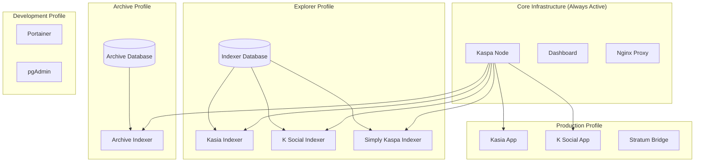

# Kaspa All-in-One Deployment Profiles

This guide explains the different deployment profiles available in the Kaspa All-in-One package and how to use them for various use cases.

## 🏗️ Architecture Overview

The Kaspa All-in-One package is designed with a modular, profile-based architecture that allows you to deploy different combinations of services based on your needs, hardware capabilities, and interests.



## 📋 Available Profiles

### Core Infrastructure (Always Active)
- **Kaspa Node**: Full Kaspa blockchain node
- **Dashboard**: Web-based management interface
- **Nginx**: Reverse proxy and load balancer

### Profile: `prod` (Production Applications)
- **Kasia App**: Decentralized messaging application
- **K Social App**: Social media platform
- **Stratum Bridge**: Mining pool bridge (with `mining` profile)

### Profile: `explorer` (Data Indexing)
- **Kasia Indexer**: Message indexing service
- **K Social Indexer**: Social content indexing
- **Simply Kaspa Indexer**: General blockchain indexing
- **Shared Database**: PostgreSQL for all indexers

### Profile: `archive` (Long-term Storage)
- **Archive Indexer**: Historical data preservation
- **Archive Database**: Separate database for long-term storage

### Profile: `development` (Development Tools)
- **Portainer**: Container management interface
- **pgAdmin**: Database administration tool

### Profile: `mining` (Mining Operations)
- **Stratum Bridge**: Solo mining support

## 🚀 Deployment Scenarios

### Scenario 1: All-in-One Single Machine

**Use Case**: Home user with powerful mini PC wanting full functionality

**Hardware Requirements**:
- CPU: AMD Ryzen 7 or better
- RAM: 32GB
- Storage: 1TB NVMe SSD
- Network: Gigabit internet

**Command**:
```bash
# Deploy everything
docker compose --profile prod --profile explorer --profile development up -d

# Or with mining
docker compose --profile prod --profile explorer --profile mining up -d
```

**Configuration**:
```bash
# .env file
PUBLIC_NODE=true
KASPA_NODE_P2P_PORT=16110
KASPA_NODE_RPC_PORT=16111

# All services use local connections (default)
REMOTE_KASPA_NODE_URL=
REMOTE_KASIA_INDEXER_URL=
REMOTE_KSOCIAL_INDEXER_URL=
```

### Scenario 2: Distributed Node + Explorer

**Use Case**: Two machines - one for node/apps, another for indexing

#### Machine 1: Node + Applications
**Hardware**: Mini PC with 16GB RAM, 500GB SSD

```bash
# Deploy node and applications
docker compose --profile prod up -d
```

**Configuration**:
```bash
# Machine 1 .env
PUBLIC_NODE=true
KASPA_NODE_P2P_PORT=16110
KASPA_NODE_RPC_PORT=16111

# Point apps to remote indexers
REMOTE_KASIA_INDEXER_URL=http://192.168.1.101:3002
REMOTE_KSOCIAL_INDEXER_URL=http://192.168.1.101:3004
```

#### Machine 2: Indexers Only
**Hardware**: Server with 32GB RAM, 1TB SSD

```bash
# Deploy indexers only
docker compose --profile explorer up -d
```

**Configuration**:
```bash
# Machine 2 .env
# Point indexers to remote node
REMOTE_KASPA_NODE_URL=http://192.168.1.100:16111

# Database configuration
POSTGRES_PASSWORD=secure_indexer_password
```

### Scenario 3: Explorer + Archive Setup

**Use Case**: Data analysis and historical research

**Hardware**: High-end server with 64GB RAM, 2TB+ storage

```bash
# Deploy indexers with archive
docker compose --profile explorer --profile archive up -d
```

**Configuration**:
```bash
# .env file
REMOTE_KASPA_NODE_URL=http://remote-node:16111

# Archive configuration
ARCHIVE_RETENTION_DAYS=0  # Keep forever
SIMPLY_INDEXER_MODE=archive
```

### Scenario 4: Development Environment

**Use Case**: Developer working on Kaspa applications

```bash
# Deploy with development tools
docker compose --profile prod --profile explorer --profile development up -d
```

**Access**:
- **Portainer**: http://localhost:9000
- **pgAdmin**: http://localhost:9001
- **Dashboard**: http://localhost:8080

### Scenario 5: Mining-Focused Setup

**Use Case**: Solo mining operation

```bash
# Deploy node with mining
docker compose --profile mining up -d
```

**Configuration**:
```bash
# .env file
PUBLIC_NODE=true
STRATUM_PORT=5555
MINING_ADDRESS=kaspa:your_wallet_address
```

## ⚙️ Configuration Management

### Environment Variables by Profile

#### Core Infrastructure
```bash
# Kaspa Node
PUBLIC_NODE=true
KASPA_NODE_P2P_PORT=16110
KASPA_NODE_RPC_PORT=16111
LOG_LEVEL=info

# Dashboard
DASHBOARD_PORT=8080

# Nginx
HTTP_PORT=80
HTTPS_PORT=443
```

#### Production Profile
```bash
# Application Ports
KASIA_APP_PORT=3001
KSOCIAL_APP_PORT=3003

# Mining (if enabled)
STRATUM_PORT=5555
```

#### Explorer Profile
```bash
# Database
POSTGRES_DB=kaspa_indexers
POSTGRES_USER=indexer
POSTGRES_PASSWORD=secure_password
POSTGRES_PORT=5432

# Indexer Ports
KASIA_INDEXER_PORT=3002
KSOCIAL_INDEXER_PORT=3004
SIMPLY_INDEXER_PORT=3005

# Indexer Configuration
SIMPLY_INDEXER_MODE=full  # full, light, archive
```

#### Archive Profile
```bash
# Archive Database
ARCHIVE_POSTGRES_DB=kaspa_archive
ARCHIVE_POSTGRES_USER=archiver
ARCHIVE_POSTGRES_PASSWORD=archive_password
ARCHIVE_POSTGRES_PORT=5433

# Archive Settings
ARCHIVE_INDEXER_PORT=3006
ARCHIVE_RETENTION_DAYS=0
```

### Remote Connection Configuration

For distributed deployments, configure remote connections:

```bash
# Point to remote Kaspa node
REMOTE_KASPA_NODE_URL=http://192.168.1.100:16111

# Point to remote indexers
REMOTE_KASIA_INDEXER_URL=http://192.168.1.101:3002
REMOTE_KSOCIAL_INDEXER_URL=http://192.168.1.101:3004
```

## 🔧 Management Commands

### Profile-Specific Operations

```bash
# Start specific profiles
docker compose --profile prod up -d
docker compose --profile explorer up -d
docker compose --profile archive up -d

# Stop specific profiles
docker compose --profile prod down
docker compose --profile explorer down

# View logs for specific profile
docker compose --profile explorer logs -f

# Scale services within a profile
docker compose --profile explorer up -d --scale kasia-indexer=2
```

### Health Checks

```bash
# Check all services
./scripts/health-check.sh

# Check specific profile services
docker compose --profile explorer ps
docker compose --profile prod ps
```

### Resource Monitoring

```bash
# Monitor resource usage by profile
docker stats $(docker compose --profile explorer ps -q)
docker stats $(docker compose --profile prod ps -q)
```

## 📊 Resource Requirements

### Minimum Requirements by Profile

| Profile | CPU | RAM | Storage | Network |
|---------|-----|-----|---------|---------|
| Core Only | 4 cores | 8GB | 200GB | 100Mbps |
| + Production | 6 cores | 16GB | 300GB | 500Mbps |
| + Explorer | 8 cores | 24GB | 500GB | 1Gbps |
| + Archive | 12 cores | 32GB | 1TB+ | 1Gbps |
| + Development | +2 cores | +4GB | +50GB | - |

### Recommended Hardware by Use Case

#### Home User (All Profiles)
- **CPU**: AMD Ryzen 7 7735HS
- **RAM**: 32GB DDR5
- **Storage**: 1TB NVMe SSD
- **Network**: Gigabit internet
- **Cost**: ~$400-500

#### Data Center (Explorer + Archive)
- **CPU**: AMD EPYC or Intel Xeon
- **RAM**: 64GB+ ECC
- **Storage**: 2TB+ NVMe SSD
- **Network**: 10Gbps
- **Cost**: $2000+

## 🔒 Security Considerations

### Network Security by Profile

#### Production Profile
- Expose only necessary ports
- Use HTTPS for web interfaces
- Implement rate limiting

#### Explorer Profile
- Restrict database access
- Monitor indexer performance
- Implement backup strategies

#### Archive Profile
- Encrypt long-term storage
- Implement access controls
- Regular security audits

### Firewall Configuration

```bash
# Core infrastructure
sudo ufw allow 16110/tcp  # Kaspa P2P
sudo ufw allow 80/tcp     # HTTP
sudo ufw allow 443/tcp    # HTTPS

# Production profile (local access only)
sudo ufw allow from 192.168.0.0/16 to any port 3001  # Kasia
sudo ufw allow from 192.168.0.0/16 to any port 3003  # K Social

# Mining profile
sudo ufw allow 5555/tcp   # Stratum

# Development profile (local only)
sudo ufw allow from 127.0.0.1 to any port 9000  # Portainer
sudo ufw allow from 127.0.0.1 to any port 9001  # pgAdmin
```

## 🚀 Deployment Best Practices

### 1. Planning Your Deployment

1. **Assess your needs**: What services do you actually need?
2. **Check hardware**: Ensure you meet minimum requirements
3. **Plan network**: Consider bandwidth and latency
4. **Security first**: Plan firewall and access controls

### 2. Staged Deployment

```bash
# Stage 1: Core infrastructure
docker compose up -d

# Stage 2: Add production apps
docker compose --profile prod up -d

# Stage 3: Add indexers
docker compose --profile prod --profile explorer up -d

# Stage 4: Add development tools (if needed)
docker compose --profile prod --profile explorer --profile development up -d
```

### 3. Monitoring and Maintenance

- Set up regular health checks
- Monitor resource usage trends
- Plan for data growth
- Implement backup strategies
- Keep services updated

### 4. Scaling Considerations

- Start with single machine deployment
- Move to distributed as needs grow
- Consider load balancing for high traffic
- Plan for database scaling

## 🔍 Troubleshooting

### Common Issues by Profile

#### Core Infrastructure
- **Node sync issues**: Check network connectivity
- **Dashboard not accessible**: Verify port configuration
- **High resource usage**: Monitor and optimize

#### Production Profile
- **Apps can't connect to indexers**: Check remote URLs
- **Slow response times**: Monitor database performance
- **Mining issues**: Verify stratum configuration

#### Explorer Profile
- **Database connection failures**: Check credentials
- **Indexing lag**: Monitor node sync status
- **High disk usage**: Implement data retention

#### Archive Profile
- **Storage growth**: Plan for expansion
- **Query performance**: Optimize database indexes
- **Backup failures**: Verify backup procedures

### Diagnostic Commands

```bash
# Check profile status
docker compose --profile prod ps
docker compose --profile explorer ps

# View profile logs
docker compose --profile prod logs
docker compose --profile explorer logs

# Test connectivity between services
docker compose exec kasia-app curl http://kasia-indexer:3000/health
docker compose exec kasia-indexer curl http://kaspa-node:16111
```

## 📞 Support

For profile-specific issues:

1. **Check the troubleshooting section above**
2. **Run health checks**: `./scripts/health-check.sh`
3. **Review service logs**: `docker compose logs [service-name]`
4. **Ask for help**:
   - GitHub Issues with profile information
   - Discord with deployment details
   - Include hardware specifications

---

**The profile-based architecture gives you the flexibility to deploy exactly what you need, when you need it! 🚀**