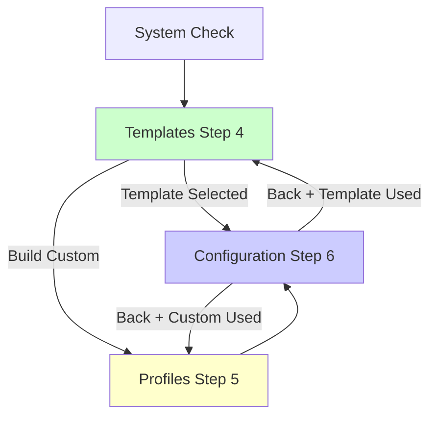
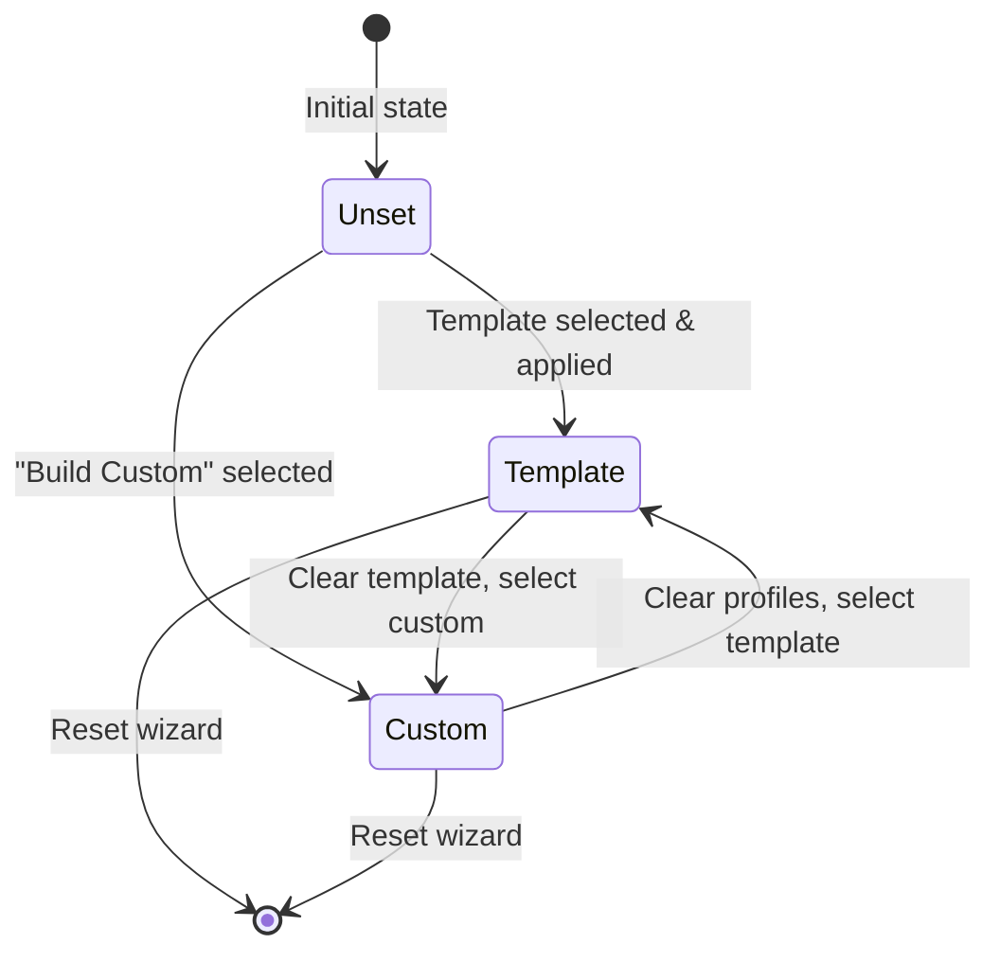

# Wizard Template-Profile Navigation Developer Guide

## Overview

This document provides comprehensive developer documentation for the wizard template-profile navigation fix implementation. The system transforms the wizard from a dual-path (Templates + Profiles) approach to a template-first approach with smart navigation and state management.

## Architecture Overview

### Navigation Flow Architecture

The wizard implements a **template-first navigation flow** with two distinct paths:



#### Primary Path (Template-First)
- **Flow**: System Check → Templates → Configuration → Review → Install → Complete
- **Navigation Path**: `'template'`
- **Step Sequence**: 1 → 2 → 3 → 4 → 6 → 7 → 8 → 9
- **Profile Selection**: Automatic (based on template)

#### Advanced Path (Custom)
- **Flow**: System Check → Templates → Build Custom → Profiles → Configuration → Review → Install → Complete
- **Navigation Path**: `'custom'`
- **Step Sequence**: 1 → 2 → 3 → 4 → 5 → 6 → 7 → 8 → 9
- **Profile Selection**: Manual (user selects individual profiles)

### Core Components

#### 1. Navigation Manager (`navigation.js`)

**Purpose**: Manages wizard step flow and determines correct navigation paths.

**Key Functions**:
```javascript
// Path-aware navigation
export async function nextStep()
export function previousStep()
export function goToStep(stepNumber)

// Step visibility management
export function showProfilesStep()
export function hideProfilesStep()
export function updateStepNumbering()
```

**Navigation Logic**:
- **Template Step (4)**: Routes to Configuration (6) if template applied, or Profiles (5) if "Build Custom" selected
- **Profiles Step (5)**: Routes to Configuration (6) after profile selection
- **Configuration Step (6)**: Smart back navigation based on `navigationPath` state

#### 2. State Manager (`state-manager.js`)

**Purpose**: Centralized state management with navigation path tracking and consistency validation.

**Key State Properties**:
```javascript
{
  // Navigation state
  navigationPath: 'template' | 'custom' | null,
  navigationHistory: number[],
  
  // Template state
  selectedTemplate: string | null,
  templateApplied: boolean,
  
  // Profile state
  selectedProfiles: string[],
  
  // Configuration state
  configuration: object
}
```

**Key Methods**:
```javascript
// Navigation path management
setNavigationPath(path)
getNavigationPath()
isTemplatePathActive()
isCustomPathActive()

// State consistency
validateStateConsistency()
clearConflictingState(newPath)
recoverFromInvalidState()

// Navigation history
addToHistory(stepNumber)
getLastStep()
clearHistory()
```

#### 3. Template Selection Handler (`template-selection.js`)

**Purpose**: Handles template selection, validation, and application with integration to existing profile system.

**Key Methods**:
```javascript
// Template operations
async applyTemplate(templateId)
buildCustomTemplate()
async loadTemplates()

// Error handling
handleTemplateApplicationFailure(templateId, error)
handleTemplateLoadingFailure(errorMessage, useFallback)
enableCustomSetupFallback()
```

**Template Application Flow**:
1. **Validation**: Validate template structure and profile references
2. **API Call**: Apply template via `/api/simple-templates/{id}/apply`
3. **State Update**: Set navigation path, store template data, merge configuration
4. **Navigation**: Skip profiles step, go directly to Configuration (step 6)

#### 4. Backend Template API (`simple-templates.js`)

**Purpose**: Provides template validation, application, and integration with existing profile system.

**Key Endpoints**:
```javascript
GET /api/simple-templates/all          // Get all templates
POST /api/simple-templates/:id/validate // Validate template
POST /api/simple-templates/:id/apply    // Apply template
POST /api/simple-templates/recommendations // Get recommendations
```

**Template Validation**:
- Profile reference validation against `VALID_PROFILES`
- Profile dependency and conflict checking
- Resource requirement validation
- System compatibility checking

## State Management Architecture

### Navigation Path State Machine



### State Consistency Rules

1. **Single Path Active**: Only one navigation path can be active at a time
2. **Template Path Requirements**: 
   - `selectedTemplate` must be set
   - `templateApplied` must be true
   - `selectedProfiles` populated from template
3. **Custom Path Requirements**:
   - `selectedProfiles` manually selected
   - `selectedTemplate` and `templateApplied` cleared
4. **Conflict Resolution**: Switching paths automatically clears conflicting state

### State Validation

The system performs continuous state validation:

```javascript
validateStateConsistency() {
  const errors = [];
  const warnings = [];
  
  // Check for conflicting states
  if (navigationPath === 'template') {
    if (!selectedTemplate) errors.push('Template path but no template');
    if (selectedProfiles.length > 0 && !templateApplied) {
      errors.push('Template path but profiles manually selected');
    }
  }
  
  return { valid: errors.length === 0, errors, warnings };
}
```

## Template Integration with Profile System

### Profile System Compatibility

Templates integrate with the existing profile system by:

1. **Profile Mapping**: Template profiles map to existing profile definitions
2. **Configuration Merging**: Template configurations merge with profile requirements
3. **Service Integration**: Template-selected profiles work with existing service configuration
4. **Docker Compose Generation**: Template profiles generate same docker-compose as manual selection

### Valid Profile References

```javascript
const VALID_PROFILES = [
  'core',                    // Kaspa node with optional wallet
  'kaspa-user-applications', // User-facing apps (Kasia, K-Social, Explorer)
  'indexer-services',        // Local indexers with TimescaleDB
  'archive-node',           // Archive node for historical data
  'mining'                  // Mining pool with stratum server
];
```

### Profile Dependencies and Conflicts

```javascript
const PROFILE_DEPENDENCIES = {
  'mining': ['core', 'archive-node'] // Mining requires node
};

const PROFILE_CONFLICTS = {
  'archive-node': ['core'], // Archive conflicts with core
  'core': ['archive-node']  // Core conflicts with archive
};
```

### Configuration Integration

Templates provide configuration that integrates with the Configuration step:

```javascript
// Template configuration structure
{
  templateId: 'home-node',
  templateName: 'Home Node',
  templateProfiles: ['core', 'kaspa-user-applications'],
  
  // Profile-specific configuration
  KASPA_NODE_RPC_PORT: 16110,
  KASPA_NODE_P2P_PORT: 16111,
  PUBLIC_NODE: false,
  
  // Application configuration
  KASIA_APP_PORT: 3002,
  KSOCIAL_APP_PORT: 3003,
  EXPLORER_PORT: 3008
}
```

## Error Handling and Recovery

### Error Handling Strategy

The system implements comprehensive error handling with fallback options:

#### 1. Template Loading Failures
```javascript
handleTemplateLoadingFailure(errorMessage, useFallback) {
  // Show error with fallback option
  this.showError(
    `Unable to load templates: ${errorMessage}. You can still create a custom setup.`,
    { showFallback: true, fallbackOptions: ['build-custom'] }
  );
  
  // Enable custom setup as primary option
  this.enableCustomSetupFallback();
}
```

#### 2. Template Application Failures
```javascript
handleTemplateApplicationFailure(templateId, error) {
  // Clear failed template state
  stateManager.set('selectedTemplate', null);
  stateManager.set('templateApplied', false);
  
  // Show error with recovery options
  this.showError(
    `Failed to apply template: ${error.message}`,
    { showFallback: true, fallbackOptions: ['build-custom'] }
  );
}
```

#### 3. Navigation State Recovery
```javascript
recoverFromInvalidState() {
  const validation = this.validateStateConsistency();
  
  if (!validation.valid) {
    // Attempt automatic recovery
    if (selectedTemplate && templateApplied) {
      this.setNavigationPath('template');
    } else if (selectedProfiles.length > 0) {
      this.setNavigationPath('custom');
    }
  }
}
```

### Fallback Options

1. **Build Custom**: Always available as fallback when templates fail
2. **Alternative Templates**: Suggest simpler templates if complex ones fail
3. **State Recovery**: Automatic state correction for invalid states
4. **Graceful Degradation**: System continues to work even with API failures

## Smart Back Navigation

### Back Navigation Logic

The system implements context-aware back navigation:

```javascript
export function previousStep() {
  const currentStepId = getStepId(currentStep);
  
  // Smart back navigation from configuration
  if (currentStepId === 'configure') {
    const navigationPath = stateManager.get('navigationPath');
    if (navigationPath === 'template') {
      goToStep(4); // Back to templates
    } else if (navigationPath === 'custom') {
      goToStep(5); // Back to profiles
    } else {
      goToStep(4); // Fallback to templates
    }
    return;
  }
  
  // Back from profiles always goes to templates
  if (currentStepId === 'profiles') {
    goToStep(4);
    return;
  }
  
  // Default back navigation using history
  const history = stateManager.get('navigationHistory') || [];
  if (history.length > 0) {
    const lastStep = history.pop();
    goToStep(lastStep);
  }
}
```

### Navigation History Management

```javascript
// Add step to history when navigating forward
stateManager.addToHistory(currentStep);

// Use history for back navigation
const lastStep = stateManager.getLastStep();

// Clear history when resetting wizard
stateManager.clearHistory();
```

## UI Visibility Control

### Step Visibility Management

The system dynamically shows/hides the Profiles step based on navigation path:

```javascript
export function updateStepNumbering() {
  const navigationPath = stateManager.get('navigationPath');
  
  if (navigationPath === 'template') {
    // Template path: hide profiles step
    hideProfilesStep();
    updateStepNumbers([1, 2, 3, 4, 6, 7, 8, 9]);
  } else if (navigationPath === 'custom') {
    // Custom path: show profiles step
    showProfilesStep();
    updateStepNumbers([1, 2, 3, 4, 5, 6, 7, 8, 9]);
  } else {
    // Default: template-first approach
    hideProfilesStep();
    updateStepNumbers([1, 2, 3, 4, 6, 7, 8, 9]);
  }
}
```

### Progress Indicator Updates

```javascript
export function showProfilesStep() {
  const profilesStep = document.getElementById('profiles-progress-step');
  const profilesLine = document.getElementById('profiles-progress-line');
  
  if (profilesStep) {
    profilesStep.style.display = 'flex';
    profilesStep.classList.add('visible');
  }
}

export function hideProfilesStep() {
  const profilesStep = document.getElementById('profiles-progress-step');
  
  if (profilesStep) {
    profilesStep.style.display = 'none';
    profilesStep.classList.remove('visible');
  }
}
```

## Testing Strategy

### Unit Testing

Test navigation logic, state management, and template application:

```javascript
// Navigation flow tests
describe('Navigation Flow', () => {
  test('template path skips profiles step', () => {
    stateManager.setNavigationPath('template');
    stateManager.set('templateApplied', true);
    
    nextStep(); // From templates (4)
    expect(stateManager.get('currentStep')).toBe(6); // Configuration
  });
  
  test('custom path includes profiles step', () => {
    stateManager.setNavigationPath('custom');
    
    nextStep(); // From templates (4)
    expect(stateManager.get('currentStep')).toBe(5); // Profiles
  });
});

// State management tests
describe('State Management', () => {
  test('validates state consistency', () => {
    stateManager.set('navigationPath', 'template');
    stateManager.set('selectedTemplate', null);
    
    const validation = stateManager.validateStateConsistency();
    expect(validation.valid).toBe(false);
    expect(validation.errors).toContain('Template path active but no template selected');
  });
});
```

### Integration Testing

Test complete workflows and API integration:

```javascript
// Template application integration test
describe('Template Application', () => {
  test('applies template and navigates correctly', async () => {
    const templateSelection = new TemplateSelection();
    await templateSelection.applyTemplate('home-node');
    
    expect(stateManager.get('selectedTemplate')).toBe('home-node');
    expect(stateManager.get('templateApplied')).toBe(true);
    expect(stateManager.get('navigationPath')).toBe('template');
    expect(stateManager.get('currentStep')).toBe(6); // Configuration
  });
});
```

## Troubleshooting Guide

### Common Issues and Solutions

#### 1. Navigation Stuck on Templates Step

**Symptoms**: User can't proceed from Templates step
**Causes**: 
- No template selected or applied
- Navigation path not set
- Template application failed

**Solutions**:
```javascript
// Check state consistency
const validation = stateManager.validateStateConsistency();
console.log('State validation:', validation);

// Check navigation path
console.log('Navigation path:', stateManager.get('navigationPath'));

// Check template application status
console.log('Template applied:', stateManager.get('templateApplied'));

// Recovery
stateManager.recoverFromInvalidState();
```

#### 2. Back Navigation Goes to Wrong Step

**Symptoms**: Back button navigates to unexpected step
**Causes**:
- Navigation path not set correctly
- Navigation history corrupted
- State inconsistency

**Solutions**:
```javascript
// Check navigation path
const navigationPath = stateManager.get('navigationPath');
console.log('Current navigation path:', navigationPath);

// Check navigation history
const history = stateManager.get('navigationHistory');
console.log('Navigation history:', history);

// Fix navigation path
if (stateManager.get('templateApplied')) {
  stateManager.setNavigationPath('template');
} else if (stateManager.get('selectedProfiles').length > 0) {
  stateManager.setNavigationPath('custom');
}
```

#### 3. Template Application Fails

**Symptoms**: Template selection doesn't proceed to configuration
**Causes**:
- API endpoint unavailable
- Template validation failed
- Network connectivity issues

**Solutions**:
```javascript
// Check API availability
try {
  const response = await fetch('/api/simple-templates/all');
  console.log('API status:', response.status);
} catch (error) {
  console.error('API error:', error);
}

// Check template validation
const validation = await fetch(`/api/simple-templates/${templateId}/validate`, {
  method: 'POST'
});
const validationResult = await validation.json();
console.log('Template validation:', validationResult);

// Enable fallback
templateSelection.enableCustomSetupFallback();
```

#### 4. State Inconsistency Errors

**Symptoms**: Console errors about state inconsistency
**Causes**:
- Multiple navigation paths active
- Conflicting template and profile selections
- State corruption

**Solutions**:
```javascript
// Validate current state
const validation = stateManager.validateStateConsistency();
console.log('State validation:', validation);

// Automatic recovery
const recovery = stateManager.recoverFromInvalidState();
console.log('Recovery result:', recovery);

// Manual state cleanup
stateManager.clearConflictingState('template'); // or 'custom'
```

### Debug Tools

#### State Inspector

```javascript
// Add to browser console for debugging
function inspectWizardState() {
  const state = stateManager.getState();
  console.table({
    'Current Step': state.currentStep,
    'Navigation Path': state.navigationPath,
    'Selected Template': state.selectedTemplate,
    'Template Applied': state.templateApplied,
    'Selected Profiles': state.selectedProfiles?.join(', ') || 'None',
    'Navigation History': state.navigationHistory?.join(' → ') || 'Empty'
  });
  
  const validation = stateManager.validateStateConsistency();
  console.log('State Validation:', validation);
}

// Usage: inspectWizardState()
```

#### Navigation Tracer

```javascript
// Add navigation event logging
document.addEventListener('stepEntry', (event) => {
  console.log(`[NAV-TRACE] Entered step ${event.detail.stepNumber} (${event.detail.stepId})`);
  console.log(`[NAV-TRACE] Navigation path: ${stateManager.get('navigationPath')}`);
  console.log(`[NAV-TRACE] History: ${stateManager.get('navigationHistory')?.join(' → ')}`);
});
```

### Performance Considerations

#### State Management Optimization

- State validation is performed only when necessary (before critical operations)
- Navigation history is limited to prevent memory leaks
- Template loading uses caching to avoid repeated API calls

#### UI Update Optimization

- Step visibility updates are batched to prevent layout thrashing
- Progress indicator updates use CSS transitions for smooth animations
- Template rendering uses document fragments for better performance

## API Integration

### Template API Endpoints

#### GET /api/simple-templates/all
Returns all available templates with metadata.

**Response**:
```json
{
  "templates": [
    {
      "id": "home-node",
      "name": "Home Node",
      "category": "beginner",
      "description": "Simple setup for home users",
      "profiles": ["core", "kaspa-user-applications"],
      "resources": {
        "minMemory": 8,
        "minCpu": 4,
        "minDisk": 200
      },
      "config": {
        "KASPA_NODE_RPC_PORT": 16110,
        "PUBLIC_NODE": false
      }
    }
  ]
}
```

#### POST /api/simple-templates/:id/validate
Validates template structure and compatibility.

**Request**:
```json
{
  "systemResources": {
    "memory": 16,
    "cpu": 8,
    "disk": 500
  }
}
```

**Response**:
```json
{
  "valid": true,
  "template": { /* template object */ },
  "errors": [],
  "warnings": ["Below recommended memory"],
  "fallbackOptions": []
}
```

#### POST /api/simple-templates/:id/apply
Applies template configuration.

**Request**:
```json
{
  "baseConfig": {
    "externalIp": "192.168.1.100"
  }
}
```

**Response**:
```json
{
  "success": true,
  "config": {
    "externalIp": "192.168.1.100",
    "KASPA_NODE_RPC_PORT": 16110,
    "templateId": "home-node",
    "templateProfiles": ["core", "kaspa-user-applications"]
  },
  "profiles": ["core", "kaspa-user-applications"]
}
```

## Migration Guide

### Upgrading from Legacy Profile-First Approach

1. **State Migration**: Existing profile-based configurations are automatically compatible
2. **UI Updates**: Progress indicator automatically adapts to show/hide profiles step
3. **Navigation**: Back navigation works correctly for both legacy and new configurations
4. **Fallback**: "Build Custom" provides access to legacy profile selection

### Backward Compatibility

The system maintains full backward compatibility:

- Existing profile-based installations continue to work
- Legacy configuration files are supported
- Profile selection workflow remains available through "Build Custom"
- All existing API endpoints continue to function

## Best Practices

### State Management

1. **Always validate state** before critical operations
2. **Use navigation path** to determine UI behavior
3. **Clear conflicting state** when switching paths
4. **Implement recovery mechanisms** for invalid states

### Error Handling

1. **Provide fallback options** for all failure scenarios
2. **Show clear error messages** with recovery instructions
3. **Enable custom setup** as universal fallback
4. **Log errors** for debugging and monitoring

### Navigation

1. **Use smart back navigation** based on context
2. **Maintain navigation history** for proper back button behavior
3. **Update step visibility** based on navigation path
4. **Validate before proceeding** to next step

### Template Integration

1. **Validate templates** before application
2. **Merge configurations** properly with existing settings
3. **Map profiles correctly** to existing profile system
4. **Handle API failures** gracefully with fallbacks

## Conclusion

The wizard template-profile navigation fix provides a robust, user-friendly template-first approach while maintaining full backward compatibility with the existing profile system. The architecture emphasizes state consistency, error recovery, and seamless integration with existing services.

Key benefits:
- **Simplified user experience** with template-first approach
- **Smart navigation** that adapts to user choices
- **Robust error handling** with comprehensive fallback options
- **Full backward compatibility** with existing installations
- **Comprehensive state management** with consistency validation
- **Seamless integration** with existing profile and configuration systems

The implementation serves as a foundation for future wizard enhancements while maintaining the reliability and flexibility required for production use.