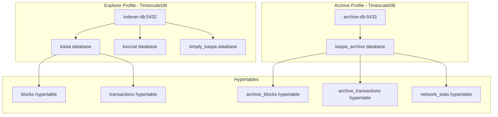

# TimescaleDB Integration Guide

This document explains the TimescaleDB integration in the Kaspa All-in-One package and how it optimizes blockchain data storage and querying.

## 🚀 Why TimescaleDB for Blockchain Data?

TimescaleDB is a time-series database built on PostgreSQL that's perfect for blockchain indexing because:

### **Time-Series Nature of Blockchain Data**
- Blocks are created sequentially over time
- Transactions have timestamps and ordering
- Network statistics change over time
- Perfect fit for time-series optimization

### **Performance Benefits**
- **Automatic Partitioning**: Data is automatically partitioned by time
- **Compression**: Older data is compressed to save space
- **Continuous Aggregates**: Pre-computed views for common queries
- **Parallel Queries**: Efficient querying across time ranges

### **Scalability Features**
- **Hypertables**: Automatically manage partitions as data grows
- **Retention Policies**: Automatically delete old data if needed
- **Compression Policies**: Compress historical data
- **Multi-node Scaling**: Can scale across multiple machines

## 🏗️ Architecture

### Database Structure



### Hypertable Configuration

#### Explorer Database Hypertables
- **blocks**: Partitioned by block timestamp, 1-day chunks
- **transactions**: Partitioned by transaction timestamp, 1-day chunks
- **Automatic indexing**: Block height, hash, transaction references

#### Archive Database Hypertables
- **archive_blocks**: Monthly chunks for long-term storage
- **archive_transactions**: Monthly chunks with full transaction data
- **network_stats**: Weekly chunks for aggregated statistics
- **Compression**: Enabled for data older than 7 days

## 📊 Performance Optimizations

### Automatic Partitioning
```sql
-- Blocks are automatically partitioned by time
SELECT create_hypertable('blocks', 'time', 
    chunk_time_interval => INTERVAL '1 day');

-- Archive uses longer intervals for efficiency
SELECT create_hypertable('archive_blocks', 'time',
    chunk_time_interval => INTERVAL '1 month');
```

### Compression Policies
```sql
-- Compress data older than 7 days to save 90%+ space
SELECT add_compression_policy('archive_blocks', INTERVAL '7 days');
SELECT add_compression_policy('archive_transactions', INTERVAL '7 days');
```

### Continuous Aggregates
```sql
-- Pre-computed daily statistics
CREATE MATERIALIZED VIEW daily_block_stats
WITH (timescaledb.continuous) AS
SELECT 
    time_bucket('1 day', time) AS day,
    COUNT(*) as block_count,
    AVG(difficulty) as avg_difficulty,
    SUM(tx_count) as total_transactions
FROM archive_blocks
GROUP BY day;
```

### Retention Policies (Optional)
```sql
-- Automatically delete data older than 5 years
SELECT add_retention_policy('archive_blocks', INTERVAL '5 years');
```

## 🔧 Configuration

### Environment Variables

```bash
# TimescaleDB Configuration
TIMESCALEDB_TELEMETRY=off  # Disable telemetry for privacy

# Database Settings (same as PostgreSQL)
POSTGRES_DB=kaspa_indexers
POSTGRES_USER=indexer
POSTGRES_PASSWORD=secure_password
```

### Docker Compose Configuration

```yaml
indexer-db:
  image: timescale/timescaledb:latest-pg16
  environment:
    - TIMESCALEDB_TELEMETRY=off
    - POSTGRES_DB=kaspa_indexers
    - POSTGRES_USER=indexer
    - POSTGRES_PASSWORD=secure_password
```

## 📈 Query Examples

### Time-Range Queries (Optimized)
```sql
-- Get blocks from last 24 hours (very fast with time partitioning)
SELECT * FROM blocks 
WHERE time >= NOW() - INTERVAL '24 hours'
ORDER BY time DESC;

-- Get transaction volume by hour for last week
SELECT 
    time_bucket('1 hour', time) AS hour,
    COUNT(*) as tx_count,
    SUM(fee) as total_fees
FROM transactions 
WHERE time >= NOW() - INTERVAL '1 week'
GROUP BY hour
ORDER BY hour;
```

### Aggregation Queries
```sql
-- Network difficulty over time (using continuous aggregate)
SELECT day, avg_difficulty 
FROM daily_block_stats 
WHERE day >= NOW() - INTERVAL '30 days'
ORDER BY day;

-- Real-time network statistics
SELECT 
    time_bucket('5 minutes', time) AS interval,
    COUNT(*) as blocks_per_interval,
    AVG(difficulty) as avg_difficulty
FROM blocks 
WHERE time >= NOW() - INTERVAL '1 hour'
GROUP BY interval
ORDER BY interval;
```

### Advanced Analytics
```sql
-- Transaction patterns by time of day
SELECT 
    EXTRACT(hour FROM time) as hour_of_day,
    COUNT(*) as tx_count,
    AVG(fee) as avg_fee
FROM transactions 
WHERE time >= NOW() - INTERVAL '30 days'
GROUP BY hour_of_day
ORDER BY hour_of_day;

-- Block size trends
SELECT 
    time_bucket('1 day', time) AS day,
    AVG(size_bytes) as avg_block_size,
    MAX(size_bytes) as max_block_size
FROM blocks 
WHERE time >= NOW() - INTERVAL '90 days'
GROUP BY day
ORDER BY day;
```

## 🛠️ Management and Monitoring

### Database Size Monitoring
```sql
-- Check hypertable sizes
SELECT 
    hypertable_name,
    pg_size_pretty(hypertable_size) as size,
    pg_size_pretty(compressed_size) as compressed_size,
    compression_ratio
FROM timescaledb_information.hypertables h
LEFT JOIN timescaledb_information.compression_stats c 
    ON h.hypertable_name = c.hypertable_name;
```

### Chunk Information
```sql
-- View chunk information
SELECT 
    chunk_name,
    range_start,
    range_end,
    pg_size_pretty(chunk_size) as size
FROM timescaledb_information.chunks 
WHERE hypertable_name = 'blocks'
ORDER BY range_start DESC;
```

### Compression Status
```sql
-- Check compression status
SELECT 
    chunk_name,
    compression_status,
    before_compression_bytes,
    after_compression_bytes,
    compression_ratio
FROM timescaledb_information.chunk_compression_stats
WHERE hypertable_name = 'archive_blocks';
```

## 🔍 Troubleshooting

### Common Issues

#### 1. High Memory Usage
```sql
-- Adjust chunk intervals for better memory usage
SELECT set_chunk_time_interval('blocks', INTERVAL '6 hours');
```

#### 2. Slow Queries
```sql
-- Add appropriate indexes
CREATE INDEX idx_blocks_custom ON blocks (block_height, time);

-- Use time_bucket for aggregations
SELECT time_bucket('1 hour', time), COUNT(*) 
FROM transactions 
GROUP BY 1;
```

#### 3. Storage Growth
```sql
-- Enable compression for older data
SELECT add_compression_policy('transactions', INTERVAL '1 day');

-- Set retention policy if needed
SELECT add_retention_policy('transactions', INTERVAL '1 year');
```

### Performance Tuning

#### PostgreSQL Settings for TimescaleDB
```sql
-- Recommended settings for blockchain workloads
ALTER SYSTEM SET shared_preload_libraries = 'timescaledb';
ALTER SYSTEM SET max_connections = 200;
ALTER SYSTEM SET shared_buffers = '256MB';
ALTER SYSTEM SET effective_cache_size = '1GB';
ALTER SYSTEM SET work_mem = '16MB';
ALTER SYSTEM SET maintenance_work_mem = '128MB';
```

#### Chunk Size Optimization
```sql
-- Adjust chunk intervals based on data volume
-- High volume: smaller chunks (1-6 hours)
SELECT set_chunk_time_interval('blocks', INTERVAL '1 hour');

-- Low volume: larger chunks (1-7 days)  
SELECT set_chunk_time_interval('network_stats', INTERVAL '1 week');
```

## 📚 Resources

### TimescaleDB Documentation
- [TimescaleDB Docs](https://docs.timescale.com/)
- [Hypertables Guide](https://docs.timescale.com/getting-started/latest/create-hypertable/)
- [Compression Guide](https://docs.timescale.com/timescaledb/latest/how-to-guides/compression/)
- [Continuous Aggregates](https://docs.timescale.com/timescaledb/latest/how-to-guides/continuous-aggregates/)

### Best Practices
- [Time-Series Best Practices](https://docs.timescale.com/timescaledb/latest/overview/core-concepts/hypertables-and-chunks/)
- [Performance Tuning](https://docs.timescale.com/timescaledb/latest/how-to-guides/configuration/)
- [Monitoring and Alerting](https://docs.timescale.com/timescaledb/latest/how-to-guides/monitoring/)

## 🎯 Benefits for Kaspa Indexing

### Immediate Benefits
- **50-90% storage savings** with compression
- **10-100x faster** time-range queries
- **Automatic partitioning** eliminates manual maintenance
- **Built-in analytics** functions for blockchain analysis

### Long-term Benefits
- **Horizontal scaling** as data grows
- **Automated data lifecycle** management
- **Advanced analytics** capabilities
- **Production-ready** monitoring and alerting

TimescaleDB transforms the Kaspa All-in-One package into a high-performance, scalable blockchain data platform optimized for time-series workloads.