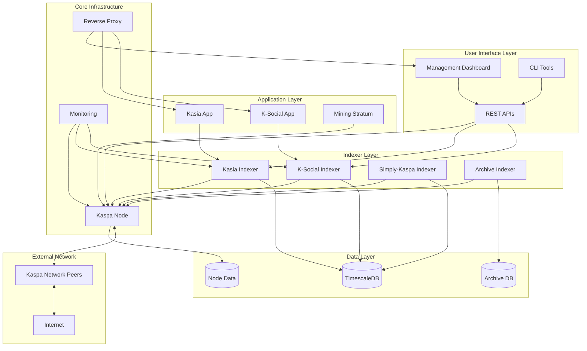

# Kaspa All-in-One Project Design

## Overview

The Kaspa All-in-One project is designed as a modular, profile-based system that provides comprehensive Kaspa blockchain infrastructure through Docker containers. The architecture supports multiple deployment scenarios from development environments to production nodes, with integrated monitoring, testing, and management capabilities.

## Architecture

### System Architecture



### Profile-Based Deployment

The system uses Docker Compose profiles to enable different deployment configurations:

#### Profile Definitions

1. **Core Profile** - Kaspa blockchain node
   - Public or private node configuration
   - Optional wallet integration
   - Can be configured for use by other services
   - Automatic fallback to public network if node fails

2. **Kaspa User Applications Profile** - User-facing applications
   - Kasia, K-Social, Kaspa Explorer
   - Choice of public or local indexer endpoints
   - User-configurable public indexer URLs
   - Depends on Indexer Services if local indexers selected

3. **Indexer Services Profile** - Backend indexing services
   - Kasia-indexer, K-Indexer, Simply-Kaspa Indexer
   - Shared TimescaleDB container with separate databases
   - Optional connection to local Core Profile node
   - Automatic fallback to public Kaspa network

4. **Archive Node Profile** - Non-pruning node
   - Complete blockchain history
   - Higher resource requirements (16GB RAM, 1TB disk)
   - Similar configuration options to Core Profile

5. **Mining Profile** - Mining infrastructure
   - Local mining stratum server
   - Requires Core Profile or Archive Node Profile
   - Wallet integration for mining rewards

6. **Developer Mode** - Cross-cutting feature
   - Not a separate profile, but a toggle for any profile
   - Adds: inspection tools, log access, exposed ports, development utilities
   - Includes Portainer, pgAdmin, enhanced logging

#### Profile Dependencies and Startup Order

**Startup Sequence:**
1. **Kaspa Node** (Core or Archive, if local)
   - Starts immediately
   - Begins blockchain synchronization
   - Can take hours to days for full sync
2. **Indexer Services** (if local indexers selected)
   - Start after node is running (not necessarily synced)
   - Can use public Kaspa network as fallback
   - Begin indexing once node is synced
3. **Kaspa User Applications** (apps that depend on indexers)
   - Start after indexers are running
   - Can use public indexers as fallback
4. **Mining Services** (depends on node)
   - Requires fully synced node
   - Waits for node sync completion

**Dependency Rules:**
- Mining Profile requires Core or Archive Node Profile (fully synced)
- Kaspa User Applications can use public or local indexers
- Indexer Services can use local node or public Kaspa network
- No circular dependencies allowed
- Health checks must pass before dependent services start
- Sync-dependent services wait for synchronization completion

**Synchronization Handling:**
- Node sync can continue in background
- Dependent services can start with fallback to public network
- User notified when sync completes
- Services automatically switch to local node when synced

**Fallback Strategies:**
- If local node fails: Services can use public Kaspa network
- If local indexers unavailable: Apps use public indexer endpoints
- User choice on node failure: Continue with public or troubleshoot

## Components and Interfaces

### Core Infrastructure Components

#### Kaspa Node
- **Purpose**: Core blockchain node providing P2P and RPC services
- **Image**: `kaspanet/rusty-kaspad:latest`
- **Ports**: 16110 (P2P), 16111 (RPC)
- **Configuration**: UTXO indexing enabled, optimized for local access
- **Health Check**: RPC ping endpoint validation

#### Management Dashboard
- **Purpose**: Web-based monitoring and control interface
- **Technology**: Node.js/Express with real-time WebSocket updates
- **Features**: Service status, logs, configuration management
- **API Endpoints**: `/health`, `/services`, `/logs`, `/config`

#### Reverse Proxy (Nginx)
- **Purpose**: SSL termination, load balancing, security headers
- **Configuration**: Automatic service discovery, rate limiting
- **Security**: HTTPS enforcement, security headers, request filtering

### Indexer Services

#### Kasia Indexer
- **Purpose**: Processes Kaspa transactions for messaging applications
- **Technology**: Rust-based with embedded database
- **Data Storage**: Local file system with optional TimescaleDB integration
- **API**: RESTful endpoints for message retrieval and search

#### K-Social Indexer
- **Purpose**: Indexes social media interactions on Kaspa blockchain
- **Technology**: Node.js with PostgreSQL/TimescaleDB
- **Features**: Social graph analysis, content indexing, user profiles

#### Simply-Kaspa Indexer
- **Purpose**: General-purpose blockchain data indexing
- **Technology**: Configurable indexing modes (full, light, archive)
- **Storage**: TimescaleDB with optimized schemas and compression

### Data Management

#### TimescaleDB Integration

**Shared Database Architecture:**
- Single TimescaleDB container for all indexer services
- Separate databases per indexer for data isolation:
  - `kasia_db` - Kasia indexer data
  - `k_db` - K-Social indexer data
  - `simply_kaspa_db` - Simply-Kaspa indexer data

**Configuration:**
```yaml
services:
  timescaledb:
    image: timescale/timescaledb:latest-pg15
    environment:
      POSTGRES_USER: kaspa
      POSTGRES_PASSWORD: ${POSTGRES_PASSWORD}
    volumes:
      - timescaledb-data:/var/lib/postgresql/data
      - ./scripts/init-databases.sql:/docker-entrypoint-initdb.d/init.sql
```

**Database Initialization:**
```sql
-- init-databases.sql
-- Create separate databases for each indexer
CREATE DATABASE kasia_db;
CREATE DATABASE k_db;
CREATE DATABASE simply_kaspa_db;

-- Enable TimescaleDB extension in each database
\c kasia_db
CREATE EXTENSION IF NOT EXISTS timescaledb;

\c k_db
CREATE EXTENSION IF NOT EXISTS timescaledb;

\c simply_kaspa_db
CREATE EXTENSION IF NOT EXISTS timescaledb;
```

**Hypertables and Optimization:**
- **Hypertables**: Automatic partitioning by time for blockchain data
- **Compression**: Automated compression policies for historical data
- **Continuous Aggregates**: Pre-computed metrics and analytics
- **Retention Policies**: Automated data lifecycle management

**Example Schema (per indexer database):**
```sql
-- Example hypertable for transactions
CREATE TABLE transactions (
    time TIMESTAMPTZ NOT NULL,
    block_hash TEXT NOT NULL,
    tx_hash TEXT NOT NULL,
    inputs JSONB,
    outputs JSONB,
    fee BIGINT
);

SELECT create_hypertable('transactions', 'time');

-- Compression policy
SELECT add_compression_policy('transactions', INTERVAL '7 days');

-- Retention policy
SELECT add_retention_policy('transactions', INTERVAL '1 year');
```

## Error Handling

### Service Failure Recovery
- **Health Checks**: Comprehensive health monitoring for all services
- **Restart Policies**: Automatic restart with exponential backoff
- **Circuit Breakers**: Prevent cascade failures between services
- **Graceful Degradation**: Continue operation with reduced functionality

### Data Consistency
- **Transaction Integrity**: ACID compliance for critical operations
- **Backup Strategies**: Automated backups with point-in-time recovery
- **Conflict Resolution**: Handling of blockchain reorganizations
- **Sync Recovery**: Automatic resynchronization after network issues

### Network Resilience
- **Connection Pooling**: Efficient database connection management
- **Retry Logic**: Exponential backoff for failed operations
- **Timeout Handling**: Configurable timeouts for all network operations
- **Fallback Mechanisms**: Alternative data sources during outages

## Testing Strategy

### Test Pyramid Structure

#### Unit Tests
- **Scope**: Individual functions and components
- **Framework**: Jest for JavaScript/TypeScript, Cargo test for Rust
- **Coverage**: Minimum 80% code coverage requirement
- **Mocking**: External dependencies mocked for isolation

#### Integration Tests
- **Scope**: Service-to-service interactions
- **Framework**: Testcontainers for Docker-based testing
- **Scenarios**: Database connections, API integrations, message passing
- **Data**: Realistic test data sets and edge cases

#### End-to-End Tests
- **Scope**: Complete user workflows
- **Framework**: Playwright for browser automation
- **Scenarios**: Installation, configuration, monitoring, troubleshooting
- **Environments**: Multiple OS and hardware configurations

#### Performance Tests
- **Scope**: Load testing and benchmarking
- **Framework**: Artillery for load generation
- **Metrics**: Response times, throughput, resource utilization
- **Baselines**: Performance regression detection

### Continuous Integration

#### Pipeline Stages
1. **Code Quality**: Linting, formatting, static analysis
2. **Security Scanning**: Dependency vulnerabilities, container scanning
3. **Unit Testing**: Fast feedback on code changes
4. **Integration Testing**: Service interaction validation
5. **Performance Testing**: Benchmark comparison
6. **E2E Testing**: Full system validation
7. **Release Preparation**: Artifact signing and publishing

#### Quality Gates
- **Code Coverage**: Minimum 80% for new code
- **Security**: Zero critical vulnerabilities
- **Performance**: No regression beyond 5% baseline
- **Documentation**: All public APIs documented

## Security Considerations

### Container Security
- **Base Images**: Minimal, regularly updated base images
- **Vulnerability Scanning**: Automated scanning with Trivy
- **Runtime Security**: Non-root containers, read-only filesystems
- **Network Policies**: Restricted inter-container communication

### Data Protection
- **Encryption**: TLS for all network communication
- **Access Control**: Role-based access with least privilege
- **Audit Logging**: Comprehensive logging of security events
- **Backup Security**: Encrypted backups with secure key management

### Network Security
- **Firewall Rules**: Minimal exposed ports and services
- **Rate Limiting**: Protection against DoS attacks
- **Input Validation**: Sanitization of all user inputs
- **Security Headers**: HTTPS enforcement and security headers

## Wizard-Dashboard Integration

### System Management Architecture

The All-in-One system uses a two-component approach for lifecycle management:

1. **Installation Wizard** - Configuration and setup (host-based)
2. **Management Dashboard** - Monitoring and status (containerized)

```
┌─────────────────────────────────────────────────────────────┐
│                    Management Flow                           │
├─────────────────────────────────────────────────────────────┤
│                                                               │
│  Initial Setup:                                              │
│  ./install.sh → Wizard (host) → Configuration → Services    │
│                                                               │
│  Ongoing Monitoring:                                         │
│  Dashboard (container) → Service Status → Metrics → Logs    │
│                                                               │
│  Reconfiguration:                                            │
│  Dashboard → "Reconfigure" → Wizard (host) → Apply Changes  │
│                                                               │
│  Updates:                                                    │
│  Dashboard → "Updates" → Wizard (host) → Apply → Verify     │
│                                                               │
└─────────────────────────────────────────────────────────────┘
```

### Wizard Responsibilities

**Configuration Management:**
- Initial system setup and profile selection
- Service configuration and environment generation
- Dependency resolution and validation
- Docker Compose file generation

**Update Management:**
- Check for service updates via GitHub API
- Display available updates with version info
- Apply selective service updates
- Handle update failures with rollback

**Reconfiguration:**
- Load existing configuration
- Modify profiles and settings
- Backup before changes
- Apply configuration changes

### Dashboard Responsibilities

**Monitoring:**
- Real-time service health status
- Resource utilization metrics
- Log aggregation and viewing
- Alert notifications

**Status Display:**
- Service URLs and access information
- Version information
- Uptime and performance metrics
- Error and warning indicators

**Integration Points:**
- Link to wizard for reconfiguration
- Display update notifications
- Provide troubleshooting guidance
- Export diagnostic information

### Update Management System

#### Update Detection

```typescript
interface UpdateMonitor {
  // Check GitHub releases for all services
  async checkForUpdates(): Promise<ServiceUpdate[]> {
    const services = this.getInstalledServices();
    const updates = [];
    
    for (const service of services) {
      const latest = await this.getLatestRelease(service.repository);
      if (this.isNewer(latest.version, service.currentVersion)) {
        updates.push({
          service: service.name,
          currentVersion: service.currentVersion,
          availableVersion: latest.version,
          changelog: latest.changelog,
          breaking: this.detectBreakingChanges(latest),
          releaseDate: latest.publishedAt
        });
      }
    }
    
    return updates;
  }
  
  // Scheduled update checks
  scheduleUpdateChecks(interval: string = '24h'): void {
    setInterval(async () => {
      const updates = await this.checkForUpdates();
      if (updates.length > 0) {
        this.notifyDashboard(updates);
      }
    }, this.parseInterval(interval));
  }
}
```

#### Update Application

```typescript
interface UpdateManager {
  async applyUpdate(service: string, version: string): Promise<UpdateResult> {
    // 1. Backup current configuration
    const backup = await this.backupConfiguration();
    
    // 2. Update docker-compose with new version
    await this.updateServiceVersion(service, version);
    
    // 3. Pull new image
    await this.pullImage(service, version);
    
    // 4. Stop service
    await this.stopService(service);
    
    // 5. Start service with new version
    await this.startService(service);
    
    // 6. Wait for health check
    const healthy = await this.waitForHealthy(service, { timeout: 60000 });
    
    if (!healthy) {
      // Rollback on failure
      await this.rollback(backup);
      return {
        success: false,
        error: 'Service failed health check',
        rollbackPerformed: true
      };
    }
    
    // 7. Service handles its own data migration
    // (Assumption: Each service manages its own upgrade procedures)
    
    // 8. Log update history
    await this.logUpdate(service, version);
    
    return {
      success: true,
      service: service,
      version: version,
      timestamp: new Date().toISOString()
    };
  }
}
```

#### Data Migration Assumptions

The system assumes each service handles its own data migration:

- **Kaspa Node**: Handles blockchain data upgrades internally
- **Indexers**: Run migration scripts on startup if needed
- **Applications**: Manage their own schema updates
- **TimescaleDB**: Backward compatible, no migration needed

**Service Responsibility:**
```yaml
# Each service should include migration logic
services:
  kasia-indexer:
    image: kasia/indexer:${VERSION}
    entrypoint: ["/app/migrate-and-start.sh"]
    # Script checks version, runs migrations, then starts service
```

### Configuration Persistence

**State Files:**
```
.kaspa-aio/
├── installation-state.json    # Current installation state
├── service-versions.json      # Installed service versions
└── update-history.json        # Update log

.kaspa-backups/
├── 2025-11-24T10-30-00/      # Timestamped backups
│   ├── .env
│   ├── docker-compose.yml
│   └── installation-state.json
```

**Installation State:**
```json
{
  "version": "1.0.0",
  "installedAt": "2025-11-24T10:00:00Z",
  "lastModified": "2025-11-24T15:30:00Z",
  "profiles": {
    "selected": ["core", "kaspa-user-applications", "indexer-services"],
    "configuration": {
      "core": {
        "nodeType": "for-other-services",
        "fallbackToPublic": true
      },
      "kaspaUserApplications": {
        "indexerChoice": "local"
      },
      "indexerServices": {
        "selectedIndexers": ["kasia-indexer", "k-indexer"]
      }
    }
  },
  "developerMode": {
    "enabled": true,
    "features": ["debug-logging", "exposed-ports", "portainer"]
  },
  "services": [
    {
      "name": "kaspa-node",
      "version": "0.14.0",
      "status": "running",
      "lastUpdated": "2025-11-24T10:00:00Z"
    }
  ]
}
```

## Deployment Considerations

### Hardware Requirements
- **Minimum**: 4GB RAM, 100GB storage, 2 CPU cores
- **Recommended**: 8GB RAM, 500GB SSD, 4 CPU cores
- **Network**: Stable internet connection with port forwarding capability

### Operating System Support
- **Primary**: Ubuntu 22.04 LTS, Ubuntu 24.04 LTS
- **Secondary**: Debian 12, CentOS Stream 9
- **Container Runtime**: Docker 24.0+, Docker Compose 2.0+

### Scaling Strategies
- **Vertical Scaling**: Resource allocation based on workload
- **Horizontal Scaling**: Multiple indexer instances with load balancing
- **Database Scaling**: Read replicas and connection pooling
- **Caching**: Redis for frequently accessed data

### Monitoring and Observability
- **Metrics**: Prometheus-compatible metrics export
- **Logging**: Structured logging with centralized collection
- **Tracing**: Distributed tracing for complex operations
- **Alerting**: Configurable alerts for critical conditions