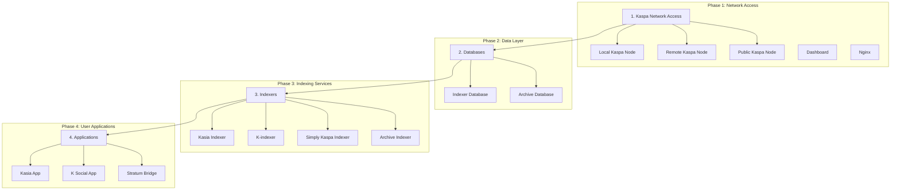

# Kaspa All-in-One Service Dependencies

This document provides comprehensive documentation of service dependencies, startup order requirements, and dependency testing procedures for the Kaspa All-in-One project.

## 🔗 Service Dependency Overview

### Confirmed Dependencies

Based on thorough research and analysis, the following service dependencies have been **CONFIRMED**:

#### ✅ Application → Indexer Dependencies

1. **Kasia App → Kasia Indexer** (ABSOLUTE DEPENDENCY)
   - **Configuration**: `KASIA_INDEXER_URL` environment variable
   - **Dependency Type**: Complete functional dependency
   - **Impact**: Kasia App is completely non-functional without Kasia Indexer
   - **API Calls**: All messaging functionality requires indexer endpoints

2. **K Social App → K-indexer** (ABSOLUTE DEPENDENCY)
   - **Configuration**: `apiBaseUrl` setting (defaults to 'https://indexer.kaspatalk.net')
   - **Dependency Type**: Complete functional dependency
   - **Impact**: K Social App is completely non-functional without K-indexer
   - **API Calls**: Extensive API dependency for ALL core functionality:
     - `get-posts-watching` - Main feed content
     - `get-posts-following` - Following users' content  
     - `get-contents-following` - Comprehensive activity feed
     - `get-users` - User discovery and profiles
     - `get-mentions` - User mentions and notifications
     - `get-notifications` - Real-time notification system
     - `get-post-details` - Individual post data
     - `get-replies` - Post replies and conversations
     - `get-user-details` - User profile information
     - `get-blocked-users` / `get-followed-users` - Social graph management
   - **Real-time Polling**: App continuously polls K-indexer every 10 seconds for updates

#### ✅ Indexer → Kaspa Network Dependencies

All indexer services require **ACCESS TO KASPA NETWORK** (not necessarily the local node):

1. **Kasia Indexer → Kaspa Network**
   - **Connection**: WebSocket to any Kaspa node (configurable via `KASPA_NODE_WBORSH_URL`)
   - **Default**: `ws://kaspa-node:17110` (local node)
   - **Alternative**: Any public Kaspa node with WebSocket support
   - **Dependency Type**: Real-time blockchain data streaming
   - **Impact**: Cannot index without live blockchain data access

2. **K-indexer → Kaspa Network**
   - **Connection**: RPC to any Kaspa node (configurable via `REMOTE_KASPA_NODE_URL`)
   - **Default**: `http://kaspa-node:16111` (local node)
   - **Alternative**: Any public Kaspa node with RPC access
   - **Dependency Type**: Blockchain data access
   - **Impact**: Cannot function without blockchain connectivity

3. **Simply Kaspa Indexer → Kaspa Network**
   - **Connection**: RPC to any Kaspa node (configurable via `REMOTE_KASPA_NODE_URL`)
   - **Default**: `http://kaspa-node:16111` (local node)
   - **Alternative**: Any public Kaspa node with RPC access
   - **Dependency Type**: Comprehensive blockchain indexing
   - **Impact**: Cannot index without network access

#### ✅ Database Dependencies

Database-dependent services require their respective databases:

1. **K-indexer → Indexer Database (TimescaleDB)**
   - **Connection**: PostgreSQL connection string
   - **Dependency Type**: Data persistence
   - **Impact**: Cannot store or retrieve social data without database

2. **Simply Kaspa Indexer → Indexer Database (TimescaleDB)**
   - **Connection**: PostgreSQL connection string
   - **Dependency Type**: Blockchain data storage
   - **Impact**: Cannot persist indexed data without database

3. **Archive Indexer → Archive Database (TimescaleDB)**
   - **Connection**: PostgreSQL connection string
   - **Dependency Type**: Long-term data storage
   - **Impact**: Cannot archive historical data without database

## 📋 Service Startup Order Requirements

### Flexible Startup Sequence

The following startup order is **RECOMMENDED** but not strictly required due to Kaspa's decentralized nature:



### Detailed Startup Phases

#### Phase 1: Network Access (Flexible Options)
- **Local Kaspa Node**: Optional - provides low-latency access but not required
- **Remote Kaspa Node**: Alternative - can use any accessible Kaspa node
- **Public Kaspa Nodes**: Fallback - connect to community-operated nodes
- **Dashboard**: Can start independently
- **Nginx**: Can start independently

#### Phase 2: Data Layer (Database Dependencies)
- **Indexer Database**: Required for database-dependent indexers
- **Archive Database**: Required for archive indexer
- **Wait Condition**: Databases must be ready to accept connections

#### Phase 3: Indexing Services (Network + Database Dependencies)
- **Kasia Indexer**: Requires Kaspa network access (WebSocket) - no database dependency
- **K-indexer**: Requires Kaspa network access (RPC) + indexer database
- **Simply Kaspa Indexer**: Requires Kaspa network access (RPC) + indexer database
- **Archive Indexer**: Requires Kaspa network access (RPC) + archive database
- **Wait Condition**: Indexers must be synced and serving API requests

#### Phase 4: User Applications (Indexer Dependencies)
- **Kasia App**: Requires Kasia Indexer to be fully synced and serving requests
- **K Social App**: Requires K-indexer to be fully synced and serving requests
- **Stratum Bridge**: Requires Kaspa network access (can use local or remote node)

## 🌐 Decentralized Network Architecture

### Kaspa Network Flexibility

Kaspa is a **decentralized blockchain network** with thousands of nodes worldwide. Services in the Kaspa All-in-One package can connect to **any accessible Kaspa node**, not just the local one. This provides several advantages:

#### Benefits of Decentralized Architecture
1. **High Availability**: If local node fails, services can connect to remote nodes
2. **Reduced Resource Requirements**: Can run indexers without local node
3. **Network Resilience**: Distributed across multiple network endpoints
4. **Deployment Flexibility**: Mix and match local/remote components

#### Network Connection Options

**Local Node (Default)**:
- **Pros**: Lowest latency, full control, contributes to network
- **Cons**: Requires resources, sync time, maintenance
- **Use Case**: Full-featured deployments, public node operators

**Remote Node**:
- **Pros**: No sync time, reduced resources, instant startup
- **Cons**: Network dependency, potential latency
- **Use Case**: Distributed deployments, resource-constrained environments

**Public Nodes**:
- **Pros**: Community-operated, high availability, no maintenance
- **Cons**: Shared resources, potential rate limiting
- **Use Case**: Development, testing, lightweight deployments

### Configuration Examples

#### Using Remote Kaspa Node
```bash
# .env configuration for remote node
REMOTE_KASPA_NODE_URL=http://kaspa-public-node.example.com:16111
KASPA_NODE_WBORSH_URL=ws://kaspa-public-node.example.com:17110

# Start only indexers and applications (no local node)
docker compose --profile explorer --profile prod up -d
```

#### Mixed Deployment
```bash
# Machine 1: Local node + applications
REMOTE_KASPA_NODE_URL=  # Use local node
docker compose --profile prod up -d

# Machine 2: Indexers using remote node
REMOTE_KASPA_NODE_URL=http://machine1.local:16111
docker compose --profile explorer up -d
```

#### Public Node Deployment
```bash
# Use community public nodes
REMOTE_KASPA_NODE_URL=http://public-kaspa-node.community:16111
KASPA_NODE_WBORSH_URL=ws://public-kaspa-node.community:17110

# Deploy without local node
docker compose --profile prod --profile explorer up -d
```

## 🔧 Docker Compose Dependencies

### Service Dependencies Configuration

The following `depends_on` configurations ensure proper startup order while respecting Kaspa's decentralized nature:

```yaml
# Core Infrastructure (Optional - can use remote nodes)
kaspa-node:
  # No dependencies - optional service

dashboard:
  depends_on:
    kaspa-node:
      condition: service_healthy
      # Only when using local node

nginx:
  depends_on:
    - dashboard

# Data Layer (Independent of Kaspa node)
indexer-db:
  # No Kaspa node dependency - can start independently

archive-db:
  # No Kaspa node dependency - can start independently

# Indexing Services (Network access required, not local node)
kasia-indexer:
  # No local node dependency - uses KASPA_NODE_WBORSH_URL
  # Can connect to any Kaspa node with WebSocket support

k-indexer:
  depends_on:
    indexer-db:
      condition: service_healthy
  # No local node dependency - uses REMOTE_KASPA_NODE_URL

simply-kaspa-indexer:
  depends_on:
    indexer-db:
      condition: service_healthy
  # No local node dependency - uses REMOTE_KASPA_NODE_URL

archive-indexer:
  depends_on:
    archive-db:
      condition: service_healthy
  # No local node dependency - uses REMOTE_KASPA_NODE_URL

# User Applications (Indexer dependencies only)
kasia-app:
  depends_on:
    kasia-indexer:
      condition: service_healthy

k-social:
  depends_on:
    k-indexer:
      condition: service_healthy

kaspa-stratum:
  # No local node dependency - uses REMOTE_KASPA_NODE_URL
  # Can connect to any Kaspa node with RPC access
```

### Health Check Requirements

For proper dependency management, all services must implement health checks:

#### Kaspa Node Health Check
```yaml
healthcheck:
  test: ["CMD", "curl", "-f", "http://localhost:16111", "-X", "POST", "-H", "Content-Type: application/json", "-d", '{"method":"ping","params":{}}']
  interval: 30s
  timeout: 10s
  retries: 3
  start_period: 60s
```

#### Database Health Checks
```yaml
# Indexer Database
healthcheck:
  test: ["CMD-SHELL", "pg_isready -U ${POSTGRES_USER:-indexer} -d ${POSTGRES_DB:-kaspa_indexers}"]
  interval: 30s
  timeout: 10s
  retries: 3

# Archive Database
healthcheck:
  test: ["CMD-SHELL", "pg_isready -U ${ARCHIVE_POSTGRES_USER:-archiver} -d ${ARCHIVE_POSTGRES_DB:-kaspa_archive}"]
  interval: 30s
  timeout: 10s
  retries: 3
```

#### Indexer Health Checks
```yaml
# Kasia Indexer
healthcheck:
  test: ["CMD", "curl", "-f", "http://localhost:8080/health"]
  interval: 30s
  timeout: 10s
  retries: 3
  start_period: 60s

# K-indexer and Simply Kaspa Indexer
healthcheck:
  test: ["CMD", "curl", "-f", "http://localhost:3000/health"]
  interval: 30s
  timeout: 10s
  retries: 3
  start_period: 60s
```

## 🧪 Dependency Testing Procedures

### Automated Dependency Validation

#### Test Script: `test-service-dependencies.sh`

```bash
#!/bin/bash

# Test service dependencies and startup order
echo "🔍 Testing Kaspa All-in-One Service Dependencies"

# Test 1: Kaspa Node Accessibility
test_kaspa_node() {
    echo "Testing Kaspa Node accessibility..."
    if curl -s -X POST -H "Content-Type: application/json" \
       -d '{"method":"ping","params":{}}' \
       http://localhost:16111 > /dev/null; then
        echo "✅ Kaspa Node is accessible"
        return 0
    else
        echo "❌ Kaspa Node is not accessible"
        return 1
    fi
}

# Test 2: Database Connectivity
test_databases() {
    echo "Testing database connectivity..."
    
    # Test indexer database
    if docker compose exec -T indexer-db pg_isready -U indexer -d kaspa_indexers > /dev/null 2>&1; then
        echo "✅ Indexer Database is ready"
    else
        echo "❌ Indexer Database is not ready"
        return 1
    fi
    
    # Test archive database (if running)
    if docker compose ps archive-db | grep -q "Up"; then
        if docker compose exec -T archive-db pg_isready -U archiver -d kaspa_archive > /dev/null 2>&1; then
            echo "✅ Archive Database is ready"
        else
            echo "❌ Archive Database is not ready"
            return 1
        fi
    fi
}

# Test 3: Indexer API Endpoints
test_indexers() {
    echo "Testing indexer API endpoints..."
    
    # Test Kasia Indexer
    if curl -s -f http://localhost:3002/health > /dev/null; then
        echo "✅ Kasia Indexer is serving requests"
    else
        echo "❌ Kasia Indexer is not responding"
        return 1
    fi
    
    # Test K-indexer (if running)
    if docker compose ps k-indexer | grep -q "Up"; then
        if curl -s -f http://localhost:3004/health > /dev/null; then
            echo "✅ K-indexer is serving requests"
        else
            echo "❌ K-indexer is not responding"
            return 1
        fi
    fi
    
    # Test Simply Kaspa Indexer (if running)
    if docker compose ps simply-kaspa-indexer | grep -q "Up"; then
        if curl -s -f http://localhost:3005/health > /dev/null; then
            echo "✅ Simply Kaspa Indexer is serving requests"
        else
            echo "❌ Simply Kaspa Indexer is not responding"
            return 1
        fi
    fi
}

# Test 4: Application Dependencies
test_applications() {
    echo "Testing application dependencies..."
    
    # Test Kasia App dependency on Kasia Indexer
    if docker compose ps kasia-app | grep -q "Up"; then
        if curl -s -f http://localhost:3001/health > /dev/null; then
            echo "✅ Kasia App is accessible"
            
            # Verify it can reach its indexer
            if docker compose exec -T kasia-app curl -s -f http://kasia-indexer:3000/health > /dev/null; then
                echo "✅ Kasia App can reach Kasia Indexer"
            else
                echo "❌ Kasia App cannot reach Kasia Indexer"
                return 1
            fi
        else
            echo "❌ Kasia App is not responding"
            return 1
        fi
    fi
    
    # Test K Social App dependency on K-indexer
    if docker compose ps k-social | grep -q "Up"; then
        if curl -s -f http://localhost:3003/health > /dev/null; then
            echo "✅ K Social App is accessible"
            
            # Verify it can reach its indexer
            if docker compose exec -T k-social curl -s -f http://k-indexer:3000/health > /dev/null; then
                echo "✅ K Social App can reach K-indexer"
            else
                echo "❌ K Social App cannot reach K-indexer"
                return 1
            fi
        else
            echo "❌ K Social App is not responding"
            return 1
        fi
    fi
}

# Test 5: End-to-End Dependency Chain
test_dependency_chain() {
    echo "Testing end-to-end dependency chain..."
    
    # Test: Node → Indexer → App chain for Kasia
    if docker compose ps kasia-app | grep -q "Up" && docker compose ps kasia-indexer | grep -q "Up"; then
        echo "Testing Kaspa Node → Kasia Indexer → Kasia App chain..."
        
        # Check if Kasia Indexer can reach Kaspa Node
        if docker compose exec -T kasia-indexer curl -s -f http://kaspa-node:16111 > /dev/null; then
            echo "✅ Kasia Indexer → Kaspa Node connection verified"
        else
            echo "❌ Kasia Indexer cannot reach Kaspa Node"
            return 1
        fi
        
        # Check if Kasia App can reach Kasia Indexer
        if docker compose exec -T kasia-app curl -s -f http://kasia-indexer:3000/health > /dev/null; then
            echo "✅ Kasia App → Kasia Indexer connection verified"
        else
            echo "❌ Kasia App cannot reach Kasia Indexer"
            return 1
        fi
        
        echo "✅ Complete Kasia dependency chain verified"
    fi
    
    # Test: Node → Database → Indexer → App chain for K Social
    if docker compose ps k-social | grep -q "Up" && docker compose ps k-indexer | grep -q "Up"; then
        echo "Testing Kaspa Node → Database → K-indexer → K Social App chain..."
        
        # Check database connectivity from K-indexer
        if docker compose exec -T k-indexer pg_isready -h indexer-db -U indexer -d ksocial > /dev/null 2>&1; then
            echo "✅ K-indexer → Database connection verified"
        else
            echo "❌ K-indexer cannot reach database"
            return 1
        fi
        
        echo "✅ Complete K Social dependency chain verified"
    fi
}

# Run all tests
main() {
    echo "Starting dependency validation tests..."
    echo "========================================"
    
    test_kaspa_node || exit 1
    test_databases || exit 1
    test_indexers || exit 1
    test_applications || exit 1
    test_dependency_chain || exit 1
    
    echo "========================================"
    echo "🎉 All dependency tests passed!"
    echo ""
    echo "Service dependency validation complete."
    echo "All services are properly connected and functional."
}

main "$@"
```

### Manual Dependency Testing

#### Test Procedure 1: Startup Order Validation

```bash
# 1. Start only core infrastructure
docker compose up -d kaspa-node dashboard nginx

# 2. Verify core services are healthy
docker compose ps
./scripts/health-check.sh

# 3. Add databases
docker compose --profile explorer up -d indexer-db
docker compose --profile archive up -d archive-db

# 4. Verify databases are ready
docker compose exec indexer-db pg_isready -U indexer -d kaspa_indexers
docker compose exec archive-db pg_isready -U archiver -d kaspa_archive

# 5. Add indexers
docker compose --profile explorer up -d

# 6. Verify indexers are syncing
curl http://localhost:3002/health  # Kasia Indexer
curl http://localhost:3004/health  # K-indexer
curl http://localhost:3005/health  # Simply Kaspa Indexer

# 7. Add applications
docker compose --profile prod up -d

# 8. Verify applications can reach their indexers
curl http://localhost:3001/health  # Kasia App
curl http://localhost:3003/health  # K Social App
```

#### Test Procedure 2: Dependency Failure Simulation

```bash
# Test 1: Stop indexer, verify app fails gracefully
docker compose stop kasia-indexer
curl http://localhost:3001/  # Should show connection error

# Test 2: Stop database, verify indexer fails gracefully
docker compose stop indexer-db
curl http://localhost:3004/health  # Should show database error

# Test 3: Stop node, verify indexers fail gracefully
docker compose stop kaspa-node
curl http://localhost:3002/health  # Should show node connection error

# Restart services in proper order
docker compose up -d kaspa-node
docker compose up -d indexer-db
docker compose up -d kasia-indexer k-indexer
docker compose up -d kasia-app k-social
```

## 🚨 Troubleshooting Dependency Issues

### Common Dependency Problems

#### Problem 1: Application Cannot Reach Indexer
**Symptoms**: App loads but shows no data or connection errors
**Diagnosis**:
```bash
# Check if indexer is running and healthy
docker compose ps kasia-indexer
curl http://localhost:3002/health

# Check network connectivity from app to indexer
docker compose exec kasia-app curl http://kasia-indexer:3000/health
```
**Solution**: Ensure indexer is started before app and is fully synced

#### Problem 2: Indexer Cannot Connect to Node
**Symptoms**: Indexer shows connection errors or sync failures
**Diagnosis**:
```bash
# Check node health
curl -X POST -H "Content-Type: application/json" \
     -d '{"method":"ping","params":{}}' \
     http://localhost:16111

# Check network connectivity from indexer to node
docker compose exec kasia-indexer curl http://kaspa-node:16111
```
**Solution**: Ensure node is fully synced and RPC is accessible

#### Problem 3: Database Connection Failures
**Symptoms**: Indexers cannot start or show database errors
**Diagnosis**:
```bash
# Check database health
docker compose exec indexer-db pg_isready -U indexer -d kaspa_indexers

# Check database logs
docker compose logs indexer-db
```
**Solution**: Ensure database is fully initialized before starting indexers

### Dependency Recovery Procedures

#### Automatic Recovery
Services with proper health checks will automatically restart when dependencies become available.

#### Manual Recovery
```bash
# 1. Stop all services
docker compose down

# 2. Start in proper order
docker compose up -d kaspa-node
sleep 30  # Wait for node to start

docker compose --profile explorer up -d indexer-db archive-db
sleep 15  # Wait for databases

docker compose --profile explorer up -d
sleep 30  # Wait for indexers to sync

docker compose --profile prod up -d
```

## 📊 Dependency Monitoring

### Health Check Dashboard

The management dashboard provides real-time dependency monitoring:

- **Service Status**: Shows health of all services
- **Dependency Graph**: Visual representation of service dependencies
- **Connection Tests**: Automated testing of inter-service connectivity
- **Alerts**: Notifications when dependencies fail

### Monitoring Commands

```bash
# Check all service health
docker compose ps

# Monitor service logs for dependency issues
docker compose logs -f kasia-app | grep -i "connection\|error"
docker compose logs -f kasia-indexer | grep -i "kaspa\|node"

# Test specific dependencies
curl http://localhost:3001/health  # Kasia App
curl http://localhost:3002/health  # Kasia Indexer
```

## 🔄 Dependency Updates

### Configuration Changes

When updating service dependencies:

1. **Update Environment Variables**: Modify `.env` file with new connection strings
2. **Update Docker Compose**: Modify `depends_on` configurations if needed
3. **Test Dependencies**: Run dependency validation tests
4. **Rolling Update**: Update services in dependency order

### Version Compatibility

Maintain compatibility matrices for:
- **Node Version** ↔ **Indexer Versions**
- **Database Schema** ↔ **Indexer Versions**
- **API Versions** ↔ **Application Versions**

---

**This comprehensive dependency documentation ensures reliable service startup and operation across all deployment scenarios! 🔗**
</text>
</invoke>