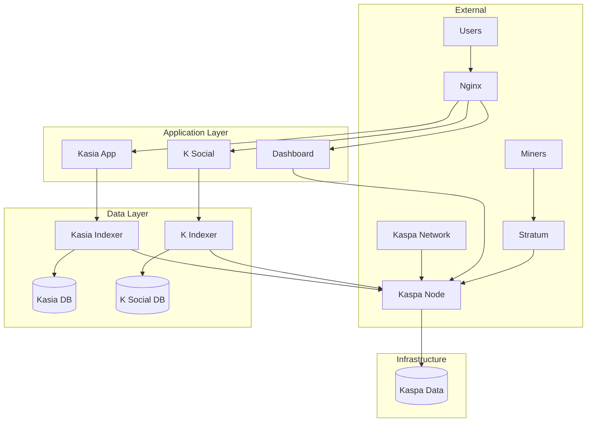

# Kaspa All-in-One Project Structure

This document provides an overview of the project structure and explains the purpose of each component.

## 📁 Root Directory Structure

The root directory has been kept clean with only essential files:

```
kaspa-aio/
├── README.md                    # Main project documentation
├── CONTRIBUTING.md              # Contribution guidelines
├── LICENSE                      # MIT License
├── QUICK_START.md              # Quick start guide
├── .env.example                 # Environment configuration template
├── docker-compose.yml           # Main service definitions
├── docker-compose.override.yml  # Development overrides
├── install.sh                   # Interactive installer script
├── .gitignore                   # Git ignore rules
├── .kiro/                       # Kiro IDE specifications
│   └── specs/                   # Feature specifications
│       ├── kaspa-all-in-one-project/
│       │   ├── requirements.md
│       │   ├── design.md
│       │   ├── tasks.md
│       │   └── TEST_RELEASE_TASKS.md
│       ├── web-installation-wizard/
│       ├── testing-documentation-framework/
│       └── documentation-organization/
├── config/                      # Configuration files
├── services/                    # Service-specific files
├── scripts/                     # Management and utility scripts
│   ├── health-check.sh
│   ├── manage.sh
│   └── doc-organizer/          # Documentation organization tools
└── docs/                        # Documentation (see below)
```

### Essential Root Files

Only the following documentation files remain at the root level:
- **README.md**: Main project overview and getting started guide
- **CONTRIBUTING.md**: Guidelines for contributing to the project
- **LICENSE**: MIT License file
- **QUICK_START.md**: Quick start guide for new users

All other documentation has been organized into the `docs/` directory structure.

## 🐳 Docker Configuration

### docker-compose.yml
Profile-based service orchestration file with modular architecture:

**Core Infrastructure (Always Active):**
- **kaspa-node**: Official Kaspa node container with public P2P access
- **dashboard**: Management web interface with profile awareness
- **nginx**: Reverse proxy and load balancer with security headers

**Production Profile (`prod`):**
- **kasia-app**: Messaging application
- **k-social**: Social media platform

**Explorer Profile (`explorer`):**
- **indexer-db**: Shared PostgreSQL database for all indexers
- **kasia-indexer**: Message indexing service
- **k-indexer**: Social content indexer
- **simply-kaspa-indexer**: General blockchain indexer

**Archive Profile (`archive`):**
- **archive-db**: Separate PostgreSQL for long-term storage
- **archive-indexer**: Historical data preservation

**Mining Profile (`mining`):**
- **kaspa-stratum**: Mining stratum bridge

**Development Profile (`development`):**
- **portainer**: Container management interface
- **pgadmin**: Database administration tool

### docker-compose.override.yml
Development-specific overrides:
- Debug logging enabled
- Volume mounts for logs
- Portainer for container management
- Development environment variables

## 🔧 Configuration Directory

```
config/
├── nginx.conf                   # Nginx reverse proxy configuration
├── ssl/                         # SSL certificates (optional)
│   ├── cert.pem
│   └── key.pem
└── postgres/                    # Database initialization scripts
    ├── init/                    # Explorer profile database setup
    │   └── 01-create-databases.sql
    └── archive-init/            # Archive profile database setup
        └── 01-create-archive-database.sql
```

### nginx.conf Features
- Rate limiting for API endpoints
- WebSocket support for real-time features
- Security headers and HTTPS redirect
- Service routing and load balancing
- Health check endpoints

## 🚀 Services Directory

```
services/
├── dashboard/                   # Management dashboard (Core)
│   ├── Dockerfile
│   ├── package.json
│   ├── server.js               # Express.js backend with profile awareness
│   └── public/                 # Frontend assets
│       ├── index.html
│       ├── styles.css
│       └── script.js
├── kaspa-stratum/              # Mining stratum bridge (Mining Profile)
│   └── Dockerfile
├── kasia/                      # Messaging application (Production Profile)
│   └── Dockerfile
├── kasia-indexer/              # Message indexer (Explorer Profile)
│   ├── Dockerfile
│   └── wait-for-db.sh
├── k-social/                   # Social platform (Production Profile)
│   └── Dockerfile
├── k-indexer/                  # Social indexer (Explorer Profile)
│   ├── Dockerfile
│   └── wait-for-db.sh
└── simply-kaspa-indexer/       # General blockchain indexer (Explorer Profile)
    ├── Dockerfile
    └── wait-for-db.sh
```

### Service Architecture
- **Multi-stage builds** for optimized container sizes
- **Non-root users** for security
- **Health checks** for monitoring
- **Wait scripts** for database dependencies
- **Signal handling** with dumb-init

## 📜 Scripts Directory

```
scripts/
├── health-check.sh             # Comprehensive health monitoring
└── manage.sh                   # Service management utility
```

### health-check.sh Features
- Docker container status verification
- HTTP endpoint health checks
- System resource monitoring
- JSON and text output formats
- Configurable timeouts and verbosity

### manage.sh Features
- Service lifecycle management (start/stop/restart)
- Log viewing and following
- Backup and restore operations
- System updates and cleanup
- Health check integration

## 📚 Documentation Structure

The documentation has been reorganized into a logical structure to improve discoverability and maintainability:

```
docs/
├── DOCUMENTATION_INDEX.md       # Master index of all documentation
├── deployment-profiles.md       # Profile-based deployment guide
├── public-node-setup.md        # Public node configuration and networking
├── troubleshooting.md          # Common issues and solutions
├── maintenance.md              # System maintenance procedures
├── quick-reference.md          # Quick reference guide
├── implementation-summaries/    # Feature implementation documentation
│   ├── wizard/                 # Web installation wizard
│   ├── dashboard/              # Dashboard features
│   ├── testing/                # Testing framework
│   ├── rollback/               # Rollback features
│   ├── integrations/           # Service integrations
│   ├── infrastructure/         # Infrastructure changes
│   └── tasks/                  # Task completion summaries
├── work-logs/                  # Development session summaries
│   ├── SESSION_SUMMARY_*.md
│   └── WORK_SUMMARY_*.md
├── quick-references/           # Quick reference cards
│   ├── CHECKLIST_PAGE_QUICK_REFERENCE.md
│   ├── ERROR_REMEDIATION_QUICK_REFERENCE.md
│   ├── INSTALLATION_GUIDES_QUICK_REFERENCE.md
│   ├── POST_INSTALLATION_TOUR_QUICK_REFERENCE.md
│   ├── ROLLBACK_QUICK_START.md
│   ├── ROLLBACK_RECOVERY_QUICK_START.md
│   ├── SAFETY_SYSTEM_QUICK_REFERENCE.md
│   ├── TESTING_QUICK_REFERENCE.md
│   └── TESTING_QUICK_START.md
└── future-enhancements/        # Planned features and roadmap
```

### Documentation Categories

**Implementation Summaries** (`docs/implementation-summaries/`):
- Organized by feature area (wizard, dashboard, testing, rollback, integrations, infrastructure, tasks)
- Contains detailed documentation of completed work
- Includes technical decisions and implementation notes

**Work Session Logs** (`docs/work-logs/`):
- Historical records of development sessions
- Chronological summaries of work completed
- Useful for tracking project evolution

**Quick Reference Guides** (`docs/quick-references/`):
- Fast-access documentation for common procedures
- Step-by-step guides for specific tasks
- Troubleshooting and recovery procedures

**Master Index** (`docs/DOCUMENTATION_INDEX.md`):
- Comprehensive listing of all documentation files
- Organized by category with descriptions
- Direct links to each document

## 🏗️ Profile-Based Architecture

The system uses Docker Compose profiles to enable modular deployment:

### Profile Definitions
```yaml
# Core Infrastructure (always active)
services:
  kaspa-node: {}      # Kaspa blockchain node
  dashboard: {}       # Management interface
  nginx: {}          # Reverse proxy

# Production Profile
services:
  kasia-app:         # profiles: [prod]
  k-social:          # profiles: [prod]

# Explorer Profile  
services:
  indexer-db:        # profiles: [explorer]
  kasia-indexer:     # profiles: [explorer]
  k-indexer:         # profiles: [explorer]
  simply-kaspa-indexer: # profiles: [explorer]

# Archive Profile
services:
  archive-db:        # profiles: [archive]
  archive-indexer:   # profiles: [archive]

# Mining Profile
services:
  kaspa-stratum:     # profiles: [mining]

# Development Profile
services:
  portainer:         # profiles: [development]
  pgadmin:          # profiles: [development]
```

### Deployment Flexibility
- **Single Machine**: All profiles on one powerful mini PC
- **Distributed**: Node on mini PC, indexers on server
- **Specialized**: Mining-only, explorer-only, or development setups
- **Scalable**: Add profiles as needs grow

## 🔍 Kiro IDE Specifications

```
.kiro/
└── specs/
    └── testing-documentation-framework/
        ├── requirements.md      # Testing framework requirements
        ├── design.md           # Architecture and design
        └── tasks.md            # Implementation tasks
```

### Specification Features
- Comprehensive testing strategy
- CI/CD pipeline design
- Documentation automation
- Open source governance
- Security and compliance

## 🔐 Security Considerations

### Container Security
- Non-root user execution
- Minimal base images (Alpine Linux)
- Security scanning integration
- Signed image verification

### Network Security
- Service isolation with Docker networks
- Rate limiting on public endpoints
- HTTPS/TLS encryption support
- Firewall-friendly port configuration

### Data Security
- Encrypted data volumes
- Secure database connections
- Backup encryption support
- Audit logging capabilities

## 🔄 Data Flow Architecture



## 📊 Monitoring and Observability

### Health Monitoring
- Container health checks
- Service endpoint monitoring
- Database connectivity verification
- System resource tracking

### Logging Strategy
- Centralized log collection
- Structured logging format
- Log rotation and retention
- Error alerting and notification

### Metrics Collection
- Performance metrics
- Resource utilization
- Network statistics
- Business metrics (transactions, users)

## 🚀 Deployment Strategies

### Single Node Deployment
- All services on one mini PC
- Docker Compose orchestration
- Local data persistence
- Suitable for home/small office use

### High Availability Setup
- Multiple node deployment
- Load balancing and failover
- Distributed data storage
- Enterprise-grade reliability

## 🔧 Development Workflow

### Local Development
1. Clone repository
2. Copy `.env.example` to `.env`
3. Run `docker-compose up -d`
4. Access services via localhost

### Testing
1. Unit tests for individual components
2. Integration tests for service communication
3. End-to-end tests for user workflows
4. Performance and load testing

### Deployment
1. Automated CI/CD pipeline
2. Security scanning and validation
3. Staged deployment process
4. Rollback capabilities

## 📈 Scalability Considerations

### Horizontal Scaling
- Service replication support
- Load balancer configuration
- Database clustering options
- Cache layer integration

### Vertical Scaling
- Resource limit configuration
- Performance optimization
- Memory and CPU tuning
- Storage optimization

## 🔮 Future Enhancements

### Planned Features
- Kubernetes deployment support
- Advanced monitoring dashboards
- Mobile application support
- Multi-language documentation

### Community Contributions
- Plugin architecture
- Custom service integration
- Theme and UI customization
- Additional blockchain support

## 🆕 Recent Updates: TimescaleDB Integration and Personal Indexer

### TimescaleDB Database Enhancement
The project has been significantly enhanced with TimescaleDB integration, replacing standard PostgreSQL for all indexers:

**Performance Improvements:**
- **10-100x faster** time-range queries for blockchain and social data
- **50-90% storage reduction** with automatic compression
- **Real-time analytics** with continuous aggregates
- **Optimized for Kaspa's 10bps rate** with proper chunk sizing

**Database Configuration Updates:**
```yaml
# Enhanced TimescaleDB configuration
indexer-db:
  image: timescale/timescaledb:latest-pg16  # Changed from postgres:17-alpine
  shm_size: 4G  # Increased shared memory
  command: >
    -c shared_preload_libraries=timescaledb,pg_stat_statements
    -c timescaledb.max_background_workers=8
    -c work_mem=256MB
    -c shared_buffers=2GB
```

### Personal Indexer Concept
New user-centric indexing approach with:
- **User-specific data patterns** and retention policies
- **Customizable chunk sizing** based on activity patterns
- **Flexible compression schedules** for individual users
- **Personalized performance optimization**

### Enhanced Database Schemas

**K-Social Indexer (config/postgres/init/02-k-social-timescaledb.sql):**
- Hypertables for k_posts, k_votes, k_user_profiles with 1-6 hour chunks
- Continuous aggregates for hourly post stats and daily user activity
- Compression policies for 90%+ space savings on historical data
- Optimized for social media activity patterns

**Simply Kaspa Indexer (config/postgres/init/03-simply-kaspa-timescaledb.sql):**
- Hypertables for blocks, transactions with 15-30 minute chunks
- Real-time blockchain metrics with 15-minute aggregates
- Network statistics and address activity monitoring
- Optimized for 864,000 blocks/day processing

### Updated Task Priorities
1. **Phase 4.5**: TimescaleDB Integration (NEW PRIORITY)
   - Database infrastructure migration to TimescaleDB
   - K-Social indexer TimescaleDB enhancements
   - Simply Kaspa indexer optimizations
   - Personal Indexer implementation

2. **Phase 5**: Service Integration with TimescaleDB
   - Enhanced K-Social platform integration
   - Performance-optimized Simply Kaspa indexer
   - TimescaleDB-aware testing and validation

### Performance Monitoring
New monitoring capabilities include:
- Chunk compression statistics
- Hypertable performance metrics
- Real-time blockchain processing rates
- Personal indexer usage statistics

### Migration Strategy
- Backward-compatible migration scripts
- Zero-downtime deployment procedures
- Performance validation and benchmarking
- Rollback capabilities for safety

---

This enhanced structure provides enterprise-grade database performance and user-centric indexing capabilities, making it a production-ready, scalable, and maintainable Kaspa ecosystem deployment optimized for Kaspa's unique 10 blocks/second blockchain characteristics.